# 도메인 주도 개발 시작하기
## 목차
1. 도메인 모델 시작하기
2. 아키텍처 개요
3. 애그리거트
4. 레포지토리와 모델 구현
5. 스프링 데이터 JPA를 이용한 조회 기능
6. 응용서비스와 표현 영역
7. 도메인 서비스
8. 애그리거트 트랜잭션 관리
9. 도메인 모델과 바운디드 컨텍스트
10. 이벤트
11. CQRS

### 1. 도메인 모델 시작하기

#### 도메인이란?

- 도메인을 설명하자면 예를 들어, 온라인 서점을 소프트웨어로 구현할 때, 상품 조회, 구매, 결제, 배송 추적, 주문 등의 기능을 제공해야 한다. 여기서 소프트웨어로 해결해야할 문제영역을 도메인이라고 한다.
- 온라인 서점이라는 도메인 은 주문, 회원, 배송, 결제, 카탈로그라는 하위 도메인으로 구분된다. 모든 하위 도메인을 위한 소프트웨어 기능을 구현을 안해도 된다. 
  - 예를들면 yes24같은 상점에서 책을 판매까지만 하지 배송은 직접 하지 않는다. 그저 배송 추적에 대한 기능을 구현한다. 이렇게 단순하게 추적하는 기능만 넣어도 문제 없다.


#### 도메인 전문가와 개발자간 지식 공유

- 각 도메인(즉 문제영역)마다 해당 비즈니스에 대한 전문가가 존재한다. 이들은 그들의 지식과, 경험을 통해 본인들이 원하는 소프트웨어 기능에 대하여 요구한다.
- 개발자는 도메인 전문가의 요구사항을 분석하고, 설계하여 소프트웨어에 기능을 구현한다. 이과정에서 요구사항을 분석하는 첫 단추가 매우 중요하다. <br>만약 도메인 전문가와 소통이 원할하지 않아, 그들이 원하는 기능이 아닌 이상한 기능이 구현될 수 있다. 그리고 기능이 구현됬을 때 다시 고치려 하려면 `다시 원래대로 돌아가는 시간` + `요구사항에 맞는 기능을 구현하는 시간` 을 허비해야 할 것이다. <br>개발자가 아닌 비즈니스를 진행하는 사람들에게 시간은 금이다. 그러니 처음부터 그들과 원할한 소통을 진행하여, 첫 단추를 잘 못 꿰는일이 없도록 해야한다.


#### 도메인 모델

**도메인 모델이란?**

- 난 여태까지 도메인과 도메인 모델은 동일하게 생각했다. 엄연히 보면 도메인이라는 범위 안에 도메인 모델이 속해있는 것이다.
- 도메인 모델은 특정 도메인을 개념적으로 표현한 것이다.
  - 주문 도메인을 떠올려보자, 주문 도메인은 주문 번호, 총 주문 금액등을 속성으로 가지고, 배송지 입력, 주문 취소같은 기능을 가진다.
- 도메인 모델의 종류
  - 객체 도메인 모델
  - 상태 다이어그램 등

- 도메인 모델은 도메인 전문가와 커뮤니케이션을 하기위해 필요하다.


도메인 모델 패턴 <-> 트랜잭션 스크립트 패턴

트랜잭션 스크립트 패턴: 도메인은 그냥 단순하게 속성값만 저장하고, 모든 로직을 서비스에 구현한다.


#### 도메인 모델 패턴

일반적인 ddd 아키텍쳐의 패턴은

~~~
			표현
-----------------
			응용
-----------------
		 도메인
-----------------
   인프라스트럭쳐
~~~

위와 같이 나뉘어 진다.

**아키텍처 구성**

| 영역                                | 설명                                                         |
| ----------------------------------- | ------------------------------------------------------------ |
| 사용자 인터페이스 - UI, Presentaion | 사용자의 요청을 처리하고 사용자에게 정보를 보여준다. 여기서는 사용자가 단순 사람뿐 아니라 웹프론트엔드, 안드로이드같은 클라이언트 애플리케이션이 될 수 있다(API로 응답 제공). |
| 응용  - Application                 | 사용자가 요청한 기능을 실행한다. 업무로직을 직접 구현하지 않으며 도메인 계층을 조합해서 기능을 실행한다. |
| 도메인 - Domain                     | 시스템이 제공할 도메인 규칙을 구현한다.                      |
| 인프라 스트럭쳐 - Infrastructure    | 데이터베이스나 메시징 시스템과 같은 외부 시스템과의 연동을 처리한다. |

**도메인 계층**

- 도메인 계층은 도메인의 핵식 규칙을 구현한다. 주문 도메인의 경우 "출고 전에 배송지를 변경할 수 있다"라는 규칙과, "주문 취소는 출고 전에 할 수 있다."라는 규칙을 구현한 코드가 도메인 계층에 위치하게 된다.
- 핵심 규칙을 구현한 코드는 도메인 모델에만 위치하기 때문에 규칙이 바뀌거나 규칙을 확정해야 할 때, 다른 코드에 영향을 덜 주고 변경 내역을 모델에 반영할 수 있게된다.
  - 응용 영역은 도메인의 메소드만 조합하여 구현한다.
- hashCode를 구현하는 이유?
  - Hash를 이용하는 자료구조 예를 들어 HashSet, HashMap과 같은 자료구조에서 key를 해시를 이용하여 저장하기때문에 hashCode를 구현해야 한다. -> 이펙티브 자바 책을 읽으면 알 수 있음


#### 유비 쿼터스 언어

개발자는 도메인과 코드사이에서 불필요한 해석을 줄이기 위해 유비쿼터스 언어를 쓰면 좋다.

예를 들면 주문 상태에 대한 enum을 구현할 때 STEP1, STEP2, STEP3로 구현하는 것이 아니라 PAYMENT_WATING, PREPARING, SHIPPED와 같이 바로 해석이 가능할 수 있게 코딩을 한다.


### 2. 아키텍처 개요

#### 4 개의 영역

'표현', '응용', '도메인', '인프라스트럭처'는 아키텍처를 설계할 때 출현하는 전형적인 4가지 영역이다.

- 4영역 중 표현 영역은 사용자의 요청을 받아 응용 영역에 전달하고 응용 영역의 처리 결과를 다시 사용자에게 보여주는 역할을 한다.
- **표현 영역**
  - Spring MVC가 표현 영역을 위한 기술에 해당된다.
  - 웹 애플리케이션에서 표현 영역의 사용자는 웹 브라우저를 사용하는 사람일 수 도 있고, REST API를 호출하는 외부 시스템일 수 있다.
  - 

- **응용 영역**

  - 표현 영역을 통해 사용자의 요청을 전달받은 응용 영역은 시스템이 사용자에게 제공해야할 기능을 구현하는데 `'주문 등록', '주문 취소', '상품 상세 조회'`와 같은 기능 구현을 예로 들 수 있다.

  - 응용 영역은 기능을 구현하기 위해 도메인 영역의 도메인 모델을 사용한다.

    ~~~java
    @Service
    @RequiredArgsConstructor
    public class CancelOrderService {
    
      private final OrderRepository orderRepository;
    
      @Transactional
      public void cancelOrder(Long orderId) {
        Optional<Order> optionalOrder = orderRepository.findById(orderId);
        optionalOrder.ifPresent(Order::cancel);
      }
    }
    ~~~

  - 응용 서비스는 로직을 직접 수행하기보다는 도메인 모델에 로직 수행을 위임한다. <br>이와 반대되는 아키텍처는 1장에 영철님께서 설명해주신 트랜잭션 스크립트 패턴이다.(서비스 에서 모든 로직을 다 구현함.)
  - 

- **도메인 영역**
  - 도메인 영역은 도메인 모델을 구현한다. 1장에서 봤던 Order, OrderLine, ShippingInfo와 같은 도메인 모델이 이 영역에 위치한다.
  - 도메인 모델은 도메인의 핵심 로직을 구현한다.
    - ex) 주문 도메인 - 배송지 변경, 결제 완료, 주문 취소, ...
    - ex) 라스트마일 주문 도메인 - 주문 생성, 주문 변경, 주문 취소, ...
- **인프라 스트럭쳐 영역**
  - 인프라 스트럭쳐 영역은 구현 기술에 대한 것을 다룬다.
  - 이 영역은 RDBMS 연동 처리, 메시징 큐에 메시지를 전송하거나 수신하는 기능을 구현한다. 몽고 DB나 Redis와의 데이터 연동을 처리한다.
  - 인프라 스트럭쳐 영역은 논리적인 개념을 표현하기 보다는 실제 구현을 다룬다.
  - 


- **도메인 영역, 응용 영역, 표현 영역은 구현 기술을 사용한 코드를 직접 말드지 않는다. 대신 인프라스트럭처 영역에서 제공하는 기능을 사용해서 필요한 기능을 개발한다. **
  - 예를 들어 응용 영역에서 DB에 보관된 데이터가 필요하면 인프라스트럭처 영역의 DB 모듈을 사용하여 데이터를 읽어온다.


#### 계층 구조 아키텍처

- 4영역을 구성할 때 많이 사용하는 아키텍처과 아래의 그림과 같은 계층 구조이다.
- 표현 영역과 응용 영역은 도메인 영역을 사용하고, 도메인 영역은 인프라스트럭처 영역을 사용하므로 계층 구조를 적용하기에 적당해 보인다.

  - 아래의 DIP에 설명이 되어 있겠지만, 아래의 그림은 런타임 의존성에 대한 구조이다.

- 도메인의 복잡도에 따라 응용과 도메인을 분리하기도 하고, 한계층으로 합치는 경우도 존재한다.
  - 

- 계층 구조는 특성상 상위 계층에서 하위 계층으로의 의존만 존재하고 하위 계층은 상위 계층에 의존하지 않는다.

  - 예를 들면 표현 영역은 응용영역에 의존하지만 응용영역은 반대로 표현영역에 의존하지 않거나, 응용 영역이 도메인 영역에 의존하지만 도메인 영역은 응용영역에 의존하지 않는다.

  - 계층 구조를 엄격하게 적용한다면 상위 계층은 바로 아래의 계층에만 의존을 가져가야 하지만, 구현의 편리함을 위해 약간의 유연성과 융통성을 적용할 수있다. 

    - 예를 들면 응용영역은 인프라스트럭처 영역을 의존하면 않되지만 외부시스템과의 연동을 위해 도메인보다 더 아래 계층인 인프라 스트럭처 영역을 의존하기도 한다.

  - 

  - 하지만 이렇게 되면, 응용 계층과 도메인 계층은 인프라스트럭처 계층에 종속이 된다.

  - CalculateDiscountService에서 DroolsEngine을 통해 할인가격을 구하는 기능을 구현해 보았다.

    ~~~java
    @Service
    @RequiredArgsConstructor
    public class CalculateDiscountService {
    
      private final DroolsRuleEngine droolsRuleEngine;
      private final CustomerRepository customerRepository;
    
      public void calculateDiscount(List<OrderLine> orderLines, Long customerId) {
        Optional<Customer> optionalCustomer = customerRepository.findById(customerId);
        Customer customer = optionalCustomer.orElseThrow(NoSuchElementException::new);
    
        List<?> facts = Arrays.asList(customer, new Money());
        droolsRuleEngine.evalutate("discountCalculate", facts);
      }
    }
    
    =====================================================================================
    
    @Slf4j
    @Component
    public class DroolsRuleEngine {
    
      public void evalutate(String sessionName, List<?> facts) {
        //간략하게 함
        log.info(sessionName + " 세션에서 할인 금액을 계산합니다.");
      }
    }
    ~~~

  - 위 코드의 문제점은 CalculateDiscountService가 Drools 자체에 의존하지 않는다고 생각할 수 있지만, "discountCalculate"는 Drools의 세션을 의미한다. 만약 DroolsRuleEngine의 세션이 변경되면 CalculateDiscountSerivce의 코드 변경이 불가피 할 것이다.
  - 이렇게 인프라스트럭처에 의존하면 '테스트 어려움'과 '기능 확장의 어려움'이라는 두 가지 문제가 발생하는 것을 알 수 있다. 이러한 문제를 하기 위해서는 DIP를 이용하면 된다.


#### DIP (Dependency Inversion Principle) 의존성 역전 원칙

- 가격할인 계산을 하려면 아래의 그림과 같이 고객 정보를 구하고, 구한 고객의 정보와 주문 정보를 이용해서 룰을 실행해야 한다.


- 여기서 CalculateDiscountService는 고수준 모듈이다. 고수준 모듈은 의미 있는 단일 기능을 제공하는 모듈로 CalculateDiscountService는 가격 할인 계산이라는 기능을 구현한다.
  - 고수준 모듈을 기능을 구현하려면 여러 하위 기능이 필요하다. 가격 할인 계산 기능을 구현하려면 고객 정보를 구해야 하고 룰을 실행해야 하는데 이 두기능이 하위 기능이다. (고위 기능: 가격 할인 계산, 하위 기능: 고객 정보 구하기, 할인 룰 실행)
  - 저수준 모듈은 위에 서술해놓은 하위 기능을 실제로 구현한 것이다. 그림과 같이 JPA를 이용해서 고객 정보를 읽어오는 모듈과 Drools로 룰을 실행하는 모듈이 저수준 모듈이 된다.
- 고수준 모듈이 제대로 동작하려면 저수준 모델을 사용해야 한다. 그런데 고수준 모듈이 저수준 모듈을 사용하면 구현 변경과 테스트가 어렵다는 문제에 직면한다.
- DIP는 이문제를 해결하기 위해 저수준 모듈이 고수준 모듈에 의존하도록 바꾼다.

~~~java
public class CalculateDiscountService {

  private final CalculateRuleEngine calculateRuleEngine;
  private final CustomerRepository customerRepository;

  public void calculateDiscount(List<OrderLine> orderLines, Long customerId) {
    Optional<Customer> optionalCustomer = customerRepository.findById(customerId);
    Customer customer = optionalCustomer.orElseThrow(NoSuchElementException::new);

    List<?> facts = Arrays.asList(customer, new Money());
    calculateRuleEngine.evalutate(facts);
  }
}

=====================================================================================

public interface CalculateRuleEngine {

  public void evalutate( List<?> facts);
}

=====================================================================================

@Slf4j
@Component
public class DroolsRuleEngine implements CalculateRuleEngine{

  public void evalutate(List<?> facts) {
    final String session = "droolsRuleSession";
    log.info(session + "를 이용하여 할인 금액을 계산합니다.");
  }
}
~~~

- CalculateDiscountService에서 DroolsEngine에 대해 의존하는 코드가 사라졌다. DroolsEngine을 추상화한 CalculateRuleEngine를 의존하고 있다. 실제로는 런타임때 DroolsEngine이 실행된다.

- 의존 구조가 아래의 그림과 같이 변경 되었다.

  

- 해당 구조를 보면 CalculateDiscountService는 더이상 구현 기술인 Drools에 의존하지 않고 추상화한 CalculateRuleEngine을 의존한다.
  - 룰을 이용한 할인 금액 계산은 고수준 모듈의 개념이므로 CalculateRuleEngine 인터페이스는 고수준 모듈에 속한다.
  - DroolsRuleEngine은 고수준 모듈인 CalcualteRuleEngine을 구현한 것이므로 저수준 모듈에 속한다.(저는 책과 다르게 이해하였습니다.)
    - 책에는 "DroolsRuleEngine은 고수준의 하위 기능인 CalcualteRuleEngine를 구현한 것이므로 저수준 모듈에 속한다." 이렇게 적혀있습니다.
  - 테스트를 진행할 때는, Mock 객체와, Stub을 사용할 수 있다면 Stub을 좀 더 사용하는 방향으로 나아가는 것이 더 좋을 것이다.

#### 도메인 영역의 주요 구성 요소

| 요소                            | 설명                                                         |
| ------------------------------- | ------------------------------------------------------------ |
| 엔티티<br>ENTITY                | 고유의 식별자를 갖는 객체로 자신의 라이프 사이클을 갖는다. Order, 회원, 상품과 같이 도메인의 고유한 개념을 표현한다.<br>도메인 모델의 데이터를 포함하며 해당 데이터와 관련된 기능을 함께 제공한다. |
| 밸류<br>VALUE                   | 고유의 실벼자를 갖지 않는 객체로 주로 개념적으로 하나인 값을 표현할 때 사용된다. <br>예를 들면 Address나 구매 금액을 위한 Money 와 같은 타입이 밸류 타입이다. <br>엔티티의 속성으로 사용할 뿐만아니라 다른 밸류 타입의 속성으으로도 사용된다. |
| 애그리거트AGGREGATE             | 애그리거트는 연관덴 엔티티와 밸류 객체를 개념적으로 하나로 묶은 것이다. <br>예를 들면 주문과 관련된 Order 엔티티, OrderLine 밸류, Orderer 밸류 객체를 주문 애그리거트로 묶을 수 있다. |
| 레포지토리REPOSITORY            | 도메인 모델의 영속성을 처리한다.                             |
| 도메인 서비스<br>DOMAIN SERVICE | 특정 엔티티에 속하지 않은 도멘인 로직을 제공한다.<br> 할인 금액 계산은 상품, 쿠폰, 회원 등급, 구매 금액 등 다양한 조건을 이용해서 구현하게 되는데, 이렇게 도메인 로직이 여러 엔티티와 밸류를 필요로 하면 도메인 서비스에서 로직을 구현하면 된다. |

- 책과 같이 나도 처음에는 "DB의 엔티티"와 "도메인 모델의 엔티티"가 같다고 생각했다. 책을 읽으면서 이해했을 때 "DB의 엔티티"와 "도메인 모델의 엔티티"의 차이점으로는 "도메인 모델의 엔티티"는 속성값 뿐만 아니라 도메인 기능을 함께 제공해준다는 것이다.
- 또 다른 차이점으로는 도메인 모델은 두개 이상의 개념적으로 하나인 데이터를 Value 타입으로 표현할 수 있다.
  - 배송지를 나타내는 Address, 주문자를 나타내는 Orderer 등,,

**밸류 타입**

- 밸류 타입은 불변으로 구현할 것이 권장된다. 이는 엔티티의 밸류 타입 데이터를 변경할 때는 객체 자체를 완전히 교체한다는 것을 의미한다.(REST API로 치면은 PUT?과 동일한 것 같다.)
  - 예를 들면 배송지 정보를 변경할 때 시, 구, 동 정보를 각각 변경하는 것이 아닌 한번에 Address 객체 자체로 변경한다.

**애그리거트**

- 도메인 모델이 복잡해지면 개발자가 전체 구조가 아닌 한 개 엔티티와 밸류에만 집중할 수 있는 상황이 발생한다. 이때 상위 수준에서 모델을 관리하지 않고 개별 요소에만 초점을 맞추다 보면, 큰 수준에서 모델을 이해하지 못해 큰 틀에서 모델을 관리할 수 없는 상황에 빠질 수 있다.
- 그래서 상위 수준에서 모델을 볼 수 있어야 전체 모델의 관계와 개별 모델을 이해하는데 도움이 된다. 도메인 모델에서 전체 구조를 이해하는데 도움이 되는 것이 바로 `애그리거트`이다.

**애그리거트는 관련 객체를 하나로 묶은 군집이다.**

- 애그리거트의 대표적인 예가 주문이다.
  - 주문이라는 도메인 개념은 `주문`, `배송지 정보`, `주문자`, `주문 목록`, `총 결제 금액`등의 하위 모델로 구성된다. 이 하위 개념을 표현한 모델을 하나로 묶어서 "주문"이라는 상위 개념으로 표현할 수 있다.
- 애그리 거트는 군집에 속한 객체를 관리하는 루트 엔티티를 갖는다. 루트 엔티티는 애그리거트에 속해 있는 엔티티와 벨류 객체를 이용해서 애그리거트가 구현해야 할 기능을 제공한다.


**레포지토리**

- 도메인 객체를 지속적으로 사용하려면 RDB, NoSQL, 로컬 파일과 같은 물리적인 저장소에 도메인 객체를 보관해야 한다. 이를 위한 도메인 모델이 레포지토리이다.
- 레포지토리는 애그리거트 단위로 도메인 객체를 저장하고 조회하는 기능을 정의한다.

#### 인프라스트럭처 개요

- 인프라스트럭처는 표현 영역, 응용 영역, 도메인 영역을 지원한다. 도메인 객체의 영속성 처리, 트랜잭션, SMTP 클라이언트, REST 클라이언트 등 다른 영역에서 필요로 하는 프레임워크, 구현 기술, 보조 기능을 지원한다.
- 도메인 영역과, 응용 영역에서 인프라스트럭쳐를 직접 의존하기 보단, 상위 두영역(도메인, 응용)영역에서 정의한 인터페이스를 인프라 스트럭처 영역에서 구현하는 것이 시스템적으로 더 유연하고 테스트를 작성하기 쉬운 이점을 가져갈 수 있다.
  - 허나 구현의 편리함은 DIP가 주는 다른 장점(변경의 유연함, 테스트가 쉬움)만큼 중요하기 때문에 DIP의 장점을 해치지 않는 범위에서 응용 영역과 도메인 영역에서 구현기술에 대한 의존을 가져가는 것이 나쁘지 않다. - 책의 필자

#### 모듈 구성

- 아키텍처의 각 영역은 별도 패키지에 위치한다. 패키지 구성 규칙에 정답이 존재하는 것은 아니지만 아래의 그림들과 같이 책의 필자는 예시를 정리하였다.
  - 책의 필자는 한 패키지에 10 ~ 15개정도의 타입 개수를 유지하는 것을 권장했다.
- 그 중에서 나는 2.21을 참고하여 이번 프로젝트를 구현해보았다.


// 고려 사항: 카탈로그에도 Product가 포함되고 주문에도 Product가 포함되는데, 어떻게 가져가야 할지?

### 3. 애그리거트

#### 3.1 애그리거트


상단의 그림과 같이 상위 수준에서 모델을 정리하면 도메인 모델의 복잡한 관계를 이해하는데 도움이 된다.

- 백개 이상의 테이블을 한 장의 ERD에 모두 표시하면 개별 테이블간의 관계를 파악하느라 큰 틀에서 데이터 구조를 이해하는데 어려움을 겪게 되는 것처럼, 도메인 객체 모델이 복잡해지면 개별 구성요소 위주로 모델을 이해하게 되고 전반적인 구조나 큰 수준에서 도메인 간의 관계를 파악하기 어려워진다.
  - 상위 수준에서 모델이 어떻게 엮여 있는지 알아야 전체 모델을 망가뜨리지 않으면서 추가 요구사항을 모델에 반영할 수 있는데, 세부적인 모델만 이해한 상태로는 코드를 수정하는 것이 꺼려워 진다.

- 복잡한 도메인을 이해하고 관리하기 쉬운 단위로 만들려면 상위 수준에서 모델을 조망할 수 있는 방법이 필요한데, 그 방법이 

  애그리거트

  다.

  - `애그리거트는 관련된 객체를 하나의 군으로 묶어 준다. 수많은 객체를 애그리거트로 묶어서 바라보면 상위 수준에서 도메인 모델간의 관계를 파악할 수 있다. `

- 애그리거트는 모델을 이해하는 데 도움을 줄 뿐만아니라 일관성을 관리하는 기준도 된다. 모델을 보다 잘 이해할 수 있고 애그리거트 단위로 일관성을 관리하기 때문에
  - 애그리거트는 복잡한 도메인을 단순한 구조로 만들어준다. 복잡도가 낮아지는 만큼 도메인 기능을 확장하고 변경하는데 필요한 노력도 줄어든다.

- 애그리거트는 관련된 모델을 하나로 모았기 때문에 한 애그리거트에 속한 객체는 유사하거나 동일한 라이프 사이클을 갖는다.


**애그리거트의 경계**

- 애그리거트는 경계를 갖는다. 한 애그리거트에 속한 객체는 다른 애그리거트에 속하지 않는다. 애그리거트는 독립된 객체 군이며 각 애그리거트는 자기 자신을 관리할 뿐 다른 애그리거트를 관리하지 않는다.
  - 예를 들면 주문 애그리거트는 배송비를 변경하거나 주문 상품 개수를 변경하는 등 자기 자신을 관리하지만, 회원의 비밀번호를 변경하거나 상품의 가격을 변경하지는 않는다.

- 경계를 설정할 때 기본이 되는 것은 도메인 규칙과 요구사항이다. 도메인 규칙에 따라 함께 생성되는 구성요소는 한 애그리거트에 속할 가능성이 높다.

- 흔히 `A가 B를 갖는다.`로 설계할 수 있는 요구사항이 있다면 A와 B를 한 애그리거트로 묶어서 생각하기 쉽다. 주문의 경우 Order가 ShippingInfo와 Orderer를 가지므로 이는 어느정도 타당해보인다.

  - 허나 `A가 B를 갖는다.` 로 해설할 수 있는 요구사항이 있다고 하더라도 이것이 반드시 A와 B가 한 애그리거트에 속한다는 것을 의미하는 것은 아니다.

  - 예를 들면 상품과 리뷰다. 상품 상세페이지에 들어가면 상품 상세 정보와 함께 리뷰 내용을 보여줘야 한다는 요구사항이 있을 때 Product 엔티티와 Review 엔티티가 한 애그리거트에 속한다고 생각할 수 있다. 
    - 하지만 Product와 Review는 함께 생성되지 않고, 함께 변경되지도 않는다. 게다가 Product를 변경하는 주체가 상품 담당자라면 Review를 생성하고 변경하는 주체는 고객이다.

  

  - 처음 도메인 모델을 만들기 시작하면 큰 애그리거트로 보이는 것들이 많지만, 도메인에 대한 경험이 생기고 도메인 규칙을 제대로 이해할수록 애그리거트의 실제 크기는 줄어든다.

  

#### 3.2 애그리거트 루트

- 애그리거트는 여러객체로 구성되기 때문에 한 객체만 상태가 정상이면 안 된다. 도메인 규칙을 지키려면 애그리거트에 속한 모든 객체가 정상 상태를 가져야 한다. 주문 애그리거트에서는 OrderLine을 변경하면 Order의 totalAmounts도 다시 계산해서 총 금액이 맞아야 한다.

- 애그리거트에 속한 모든 객체가 일관된 상태를 유지하려면, 애그리거트 전체를 관리할 주체가 필요한데, 이 책임을 지는 것이 바로 애그리거트의 루트 엔티티이다.
  - 애그리거트 루트 엔티티는 애그리거트의 대표 엔티티다. 애그리거트에 속한 객체는 애기럭트 루트 엔티티에 직접 또는 간접적으로 속하게 된다.


#### 3.2.1 도메인 규칙과 일관성

- 애그리거트 루트가 단순히 애그리거트에 속한 객체를 포함하는 것으로 끝나는 것은 아니다. 에그리거트 루트의 핵심 역할은 애그리거트의 일관성이 깨지지 않도록 하는 것이다.

- 이를 위해 애그리거트 루트는 애그리거트가 제공해야 할 도메인 기능을 구현한다.
  - 예를 들면 주문 애기르거트는 배송지 변경, 상품 변경과 같은 기능을 제공하고, 애그리거트 루트인 Order에서 이 기능을 구현한다.

- 애그리거트 루트가 제공하는 메서드는 도메인 규칙에 따라 애그리거트에 속한 객체의 일관성이 깨지지 않도록 구현해야 한다.

- 도메인 규칙과 일관성을 지키기 위해 두가지를 습관적으로 사용해야 한다.
  - 단순히 필드를 변경하는 set 메서드를 공개(public)범위로 만들지 않는다.
    - 예를 들면 배송지 정보를 변경할 때, `public void setShippingInfo()`가 아닌 `public void changeShippingInfo()`로 구현해야한다.
  - 밸류 타입은 불변으로 구현한다.


#### 3.2.2 애그리거트 루트의 기능 구현

- 애그리거트 루트는 애그리거트 내부의 다른 객체를 조합해서 기능을 완성한다.
  - 쉽게 설명하자면 응용 서비스에서 여러개의 애그리거트를 조합해서 기능을 구현하는 것처럼, 애그리거트 루트도 애그리거트의 내부의 엔티티를 다른 객체를 조합해서 기능을 구현한다.


#### 3.2.3 트랜잭션 범위

- 트랜잭션 범위는 작을수록 좋다.

- 한 트랜잭션이 1개의 테이블을 수정하는 것과 3개의 태이블을 수정하는 것을 비교하면 성능에서 차이가 발생한다. 여러개의 테이블을 수정하면 잠금 대상이 많아진다는 것인데, 잠금대상이 많아지면 동시성이 떨어진다.

- 만약 두개의 애그리거트를 수정하게 된다면 하나의 애그리거트 내부에서 수정하는 것이 아니라, 두개의 애그리거트를 응용서비스에서 수정을 하도록 구현한다.

  ~~~java
  // 주문의 배송지를 변경하면서, 회원의 주소도 같이 변경하는 기능
  // 안좋은 예
  public class Order {
    Order orderer
    
    public void changeShippinInfo(ShippingInfo shippingInfo, boolean useNewShippingAddrAsMemberAddr) {
      verifyNotYetShipped();
      setShippingInfo(shippingInfo);
      if(useNewShippingAddrAsMemberAddr) {
        //다른 애그리거트 내부에서 변경하면 안됨.
        orderer.getMember().changeAddress(shippingInfo.getAddress());
      }
    }
  }
  
  // 방안 예
  public class ChangeOrderSerivce {
    @Transactional
    public void changeShippinInfo(Long orderId, ShippingInfo shippingInfo, boolean useNewShippingAddrAsMemberAddr) {
      Order order = orderRepository.findById(orderId);
      order.changeShippinInfo(shippingInfo);
      if(useNewShippingAddrAsMemberAddr) {
        Member member = memberRepository.findByOrdererId(order.getOrderer.getId)
        member.changeAddress(shippingInfo.getAddress);
      }
  }
  ~~~

- 도메인 이벤트를 사용하면 한 트랜잭션에서 한개의 애그리거트를 수정하면서도 동기나 비동기로 다른 애그리거트를 수정할 수 있다.
- 한 트랜잭션에서 한 개의 애그리거트를 변경하는 것을 권장하지만, 다음 경우에는 한 트랜잭션에서 두개 이상의 애그리거트를 변경하는 것을 고려할 수 있다.
  - 팀 표준
  - 기술 제약: 예를 들면 기술적 제약으로 이벤트 같은 기능을 도입하지 못함.
  - UI 구현의 편리


#### 3.3 리포지토리와 애그리거트

- 애그리거트는 개념적으로 하나이므로 레포지토리는 애그리거트 전체를 저장소에 영속화 해야한다.

  - 예를 들어 Order 애그리거트와 관련된 테이블이 세개라면(ex: OrderLine 등등) Order 애그리거트를 저장할 때 애그리거트 루트와 매핑되는 테이블뿐만 아니라 애그리거트에 속한 모든 구성요소에 매팅된 테이블에 데이터를 저장해야한다.

    ~~~java
    //레포지토리에서 save를 호출할 때, 루트엔티티인 order만 저장하는 것이 아닌 애그리거트 내부의 모든 엔티티를 저장해야한다.
    orderRepository.save(order);
    ~~~

- 동일하게 애그리거트를 구하는 레포지터리 메서드는 완전하 애그리거트를 제공해야 한다.
- 저장소로 사용하는 RDBMS, NOSQL에 상관 없이 애그리거트 상태가 변경되면 모든 변경을 원자적으로 저장소에 반영해야 한다.
  - 애그리거트의 두개의 객체를 변경하였는데, 그중 한가지만 적용이 된다면 데이터의 일관성이 깨지므로 문제가 된다.


#### 3.4 ID를 이용한 애그리거트 참조

- ORM을 통해 애그리거트간의 참조는 필트들 통해 쉽게 구현할 수 있다. 
  - 예를 들어 주문 애그리거트에 속해있는 Orderer는 주문의 회원을 참조하기 위해 Member를 필드로 참조할 수 있다.
  - 필드를 이용해서 다른 애그리거트를 직접 참조하는 것은 개발자에게 구현의 편리함을 제공한다.
  - 하지만 필드를 이요한 애그리거트 참조는 3가지의 문제를 야기할 수 있다.
    - 편한 탐색 옹요
    - 성능에 대한 고민 -> 예를 들어 Order를 조회할 때, 회원정보 조회는 필요없는데 필드르 참조된 모든 연관된 객체의 쿼리가 발생한다.
    - 확장 어려움
  - 애그리거트를 직접 참조할 때 발생할 수 있는 가장 큰 문제는 편리함을 오용할 수 있다는 것이다.
    - 한 애그리거트 내부에서 다른 애그리거트 객체에 접근할 수 있으면 다른 애그리거트의 상태를 쉽게 변경할 수 있게된다.
    - 한 애그리거트에서 다른 애그리거트의 상태를 변경한느 것은 애그리거트 간의 의존 결합도를 높여서 결과적으로 애그리거트의 변경을 어렵게 만든다.
- **위 문제들을 완화하기 위해 사용할 수 있는 것이 ID를 이용해서, 다른 애그리거트를 참조하는 것이다. DB테이블에서 외래키로 참조하는 것과 비슷하게 생각하면 된다.**
  - ID 참조를 사용하면 모든 객체가 참조로 연결되지 않고 한 애그리거트에 속한 객체들만 참조로 연결된다.
  - 이는 애그리거트의 경계를 명확히하고 애그리거트 간 물리적인 연결을 제거하기때문에 모델의 복잡도를 낮춰준다. -> 즉 애그리거트간의 결합도를 낮춰준다.
  - ID를 이용한 참조방식을 상요하면 복잡도를 낮추는 것과 함께 한 애그리거트에서 다른 애그리거트를 수정하는 것이 불가능해 진다.
  - 애그리거트별로 당른 구현기술을 사용하는 것도 가능해진다. ID로만 참조하기 때문에 결합이 없기 때문이다.
    -  예를 들면 주문 애그리거트는 중요한 정보이니, RDBMS에 저장하고, 조회 성능이 중요한 상품 애그리거트는 NoSQL로 저장할 수 있다.


#### 3.4.1 ID를 이요한 참조와 조회 성능

- 다른 애그리거트를 ID로 참조하면 참조하는 여러 애그리거트를 읽을 때 조회 속도가 문제될 수 있다.

  - 예를 들면 주문 목록을 보여주려면 상품 애그리거트와 회원 애그리거트를 함께 읽어와야 하는데, 이를 처리할 때 각 주문마다 상품과 회원 애그리거트를 읽어 온다고하면 N+1문제가 발생한다.

    ~~~java
    Member member = memberRepository.findByOrdererId(ordererId);
    List<Order> order = orderRepository.findByOrdererId(ordererId);
    List<OrderView> dtos = order.stream()
    	.map(order -> {
    		Long productId = order.getOrderLines().get(0).getProductId();
    		//각 주문마다 첫번째 주문 상품 정보 로딩을 위한 쿼리 실행 -> N + 1 문제 발생
    		Product product = productRespository.findById(productId);
    		return new OrderView(order, member, product);
    	}).collcet(toList());
    ~~~

  - ID참조 방식을 사용하면서 N+1 같은 문제가 발생하지 않도록 하려면 조회 전용 쿼리를 사용하면 된다. 

    - 데이터 조회를 위한 별도의 DAO를 만들고 조회 메서드에 해당 id들을 조인 하여 한번의 쿼리로 필요한 데이터를 가져오면 된다.

- 애그리거트마다 서로 다른 저장소를 사용하면 한번의 쿼리로 관련 애그리거트를 조회할 수 없다. 이 때는 조회 성능을 높이기 위해 캐시를 적용하거나, 조회 전용 저장소를 따로 구성한다.
  - 특히 한대의 DB 장비로 대응할 수 없는 수준의 트래픽이 발생하는 경우 캐시나 조회 전용 저장소는 필수로 선택해야 하는 기법이다.


#### 3.5 애그리거트 간 집합 연관

- 애그리거트 간 1-N과 M-N 연관이 존재한다.
  - 연관관계를 맺을 때, 1-N 연관이 있더라도 1에 속해있는 N의 데이터가 수만개 수준으로 많다면 이 코드를 실행할 때마다 실행속도가 급격히 느려져 성능에 심각한 문제를 일으킬 수 있다.
  - 1에 속한 N을 구할 필요가 있다면 N의 입장에서 1에 속한 정보를 찾는 N-1 연관관계로 구현하면 된다.


#### 3.6 애그리거트를 팩토리로 사용하기

- 고객이 특정 상점을 여러 차례 신고해서 해당 상점이 더 이상 물건을 등록하지 못하도록 차단한 상태라고 해보자.

- 상품 등록 기능을 구현한 응용 서비스는 다음과 같이 상점 계정이 차단 상태가아닌 경우에만 상품을 생성하도록 구현할 수 있다.

  ~~~java
  public class RegisterProdcutService {
  	public Long registerProduct(NewProductRequest req) {
  		Store store = storeRepository.findById(req.getStoreId);
      checkNull(store);
      if (store.isBlocked()) {
        throw new StoreBlockedException();
      }
      
      Product product = new Product(store.getId, ...);
      productRepository.save(product);
      return product.getId();
  	}
  }
  ~~~

  - 위 코드의 문제점은 상점이 차단된 상태인지 확인하고, 해당 상점이 상품을 등록할 수 있는 것은 논리적으로 하나의 기능인데, 이 도메인 로직이 응용서비스에 노출 되어 있다.

- 이 도메인 기능을 넣기 위한 별도의 도메인 서비스나 팩토리 클래스를 만들 수도 있지만 이기능을 Store 애그리거트에 구현할 수 있다.

  ```java
  public Product createProduct(ProductInfo productInfo) {
    if (isStoreBlocked()) {
      throw new StoreBlockedException();
    }
    Product product = new Product(productInfo.getName(), productInfo.getAmount(),
        productInfo.getCategoryId(), this);
    products.add(product);
    return product;
  }
  ```

  - Store 애그리거트의 createProduct()는 Product 애그리거트를 생성하는 팩토리 역할을 한다. 팩토리 역할을 하면서도 중요한 도메인 로직을 구현하고 있다. 
  - 팩토리 기능을 구현했으므로, 응용서비스에서는 해당 함수만 호출하여 상품을 생성하면된다.

- 영철님의 설명을 듣고, 난 위의 기능 보다는 도메인 서비스에서 그냥 조합해서 생성하는 것도 좋은 방향이라고 생각하지만, 나중에 실무를 진행하면서 기회가 있다면 위와 같이 한번 시도를 해보고, PR의 리뷰를 맡기겠다.... :)


### 4. 레포지토리 모델구현

#### 4.1 JPA를 이용한 레포지토리 구현

- 애그리거트를 어떤 저장소에 저장햐느냐에 따라 레포지토리를 구현하는 방법이 다르다.
  - 나는 이번장을 쌩 JPA가 아닌 Spring data jpa를 이용해 구현을 진행할 것이다.


#### 4.1.1 모듈 위치

- 레포지토리 인터페이스는 애그리거트와 같이 도메인 영역에 속하고, 리포지토리를 구현한 클래스는 인프라스트럭처 영역에 속한다.

  

- Spring Data JPA는 JpaRepository<Entity, Id>를 extends하면, 자동으로 구현 객체를 생성해준다.


#### 4.1.2 레포지토리

- 레포티조티라 제공하는 기본기능은 다음 두가지이다.
  - ID로 애그리거트 조회하기
  - 애그리거트 저장하기

- 레포지토리 인터페이스는 애그리거트 루트를 기준으로 작성한다.
  - 예를 들면 주문 애그리거트는 Order인 루트 엔티티의 레포지토리만 생성한다.
    - 다른 내부 엔티티인 OrderLine, Orderer, ShippingInfo등의 객체애 대해서는 생성하지 않는다.
  - Spring Data JPA는 `ID로 조회, 저장, 삭제` 기능을 모두 제공한다.

- JPA를 사용하면 수정한 결과를 저장소에 반영하는 메서드를 추가할 필요가 없다.

  - JPA는 트랜잭션 범위에서 변경한 데이터를 자동으로 DB에 반영한다 -> 더티 체킹

    ~~~java
    @Transactional
      public void changeShippingInfo(ChangeOrderShippingInfoCommand changeOrderShippingInfoCommand) {
        Optional<Orders> optionalOrder = orderRepository.findById(
            changeOrderShippingInfoCommand.getOrderId());
        Orders order = optionalOrder.orElseThrow(NoOrderException::new);
        ShippingInfo newShippingInfo = changeOrderShippingInfoCommand.getShippingInfo();
        order.changeShippingInfo(newShippingInfo);
    
        if (changeOrderShippingInfoCommand.isUseNewShippingAddressAsMemberAddress()) {
          Optional<Member> optionalMember = memberRepository.findById(order.getOrderer().getMemberId());
          Member member = optionalMember.orElseThrow(NoSuchElementException::new);
          member.changeAddress(newShippingInfo.getAddress());
        }
      } //메서드가 끝날때 commit을 하면서 더티체킹하여 Update쿼리가 자동으로 반영된다.
    ~~~

- JPA는 ID가 아닌 다른 조건으로 검색할 때, findBy프로퍼티로 조회할 수 있다.

  ~~~java
  public interface OrderRepository extends JpaRepository<Orders, Long> {
  	List<Orders> findByOrdererId(Long ordererId);
  }
  ~~~

  - ID외에 다른조건으로 애그리거트를 조회할 떄 JPA Crietria(비추)나, JPQL 또는 QueryDsl을 사용할 수 있다.

>  Tip. 삭제 기능
>
> 삭제 요구사항이 있더라도 데이터를 실제 삭제하는 경우는 많지 않다. 관리자 기능에서 삭제한 데이터를 조회해야 하는 경우도 있고, 데이터 원복을 위해 일정기간동안 보관해야할 때도 있기 때문이다. 이런경우에는 삭제플래그를 두어 사용자에게 해당 데이터를 보여주지 않는다.


#### 4.2 스프링 데이터 JPA를 이용한 레포지토리 구현

- 4.1에서 설명한바와 같이 스프링 데이터 JPA는 지정한 규칙에 맞게 레포지토리 인터페이스를 정의하면 레포지토리를 구현한 객체를 알아서 만들어 스프링 빈으로 등록해준다.

- 스프링 데이터 JPA는 다음 규칙에 따라 작성한 인터페이스를 찾아서 인터페이스를 구현한 스프링 빈 객체를 자동으로 등록한다.

  - org.springframework.data.jpa.repository<T, ID>
  - T는 엔티티 타입을 지정하고, ID는 식별자 타입을 지정한다.

    - 예) Order 엔티티를 위한 OrderRepository

      ~~~java
      //엔티티
      @Entity(name = "order")
      @Getter
      public class Orders {
      
        @Id
        @GeneratedValue(strategy = GenerationType.IDENTITY)
        private Long id;
        private String orderNumber;
        @Enumerated(value = EnumType.STRING)
        private OrderState orderState;
        @Embedded
        @AttributeOverrides({
            @AttributeOverride(name = "receiver.name",
                column = @Column(name = "receiver_name")),
            @AttributeOverride(name = "receiver.phoneNumber",
                column = @Column(name = "receiver_phone_number"))
        })
        private ShippingInfo shippingInfo;
        @OneToMany(mappedBy = "order", cascade = CascadeType.ALL)
        List<OrderLine> orderLines;
        @Embedded
        @AttributeOverride(name = "value", column = @Column(name = "total_amounts"))
        private Money totalAmounts;
        @Embedded
        private Orderer orderer;
      	
        ....
      }
      
      ===================================================
      
      //레포지토리
      public interface OrderRepository extends JpaRepository<Orders, Long> {
      	List<Orders> findByOrdererId(Long ordererId);
      }
      ~~~

      

#### 4.3 매핑 구현

#### 4.3.1 엔티티와 밸류 기본 매핑 구현

- 애그리거트와 JPA 매핑을 위한 기본 규칙은 다음과 같다.
  - 애그리거트 루트는 엔티티이므로 @Entity로 매핑 설정한다.
- 한 테이블에 엔티티와 밸류 데이터가 같이 있다면
  - 밸류는 @Embeddable로 매핑 설정한다.
  - 밸류 타입 프로퍼티는 @Embedded로 매핑 설정한다.

- 주문 애그리거트를 예로 들어보자면 루트 엔티티는 Order이고, 이 애그리거트에 속한 Orderer, Money, ShippingInfo는 밸류이다.

  - 루트 엔티티와 루트 엔티티에 속한 밸류는 한테이블에 매핑할 때가 많다.

  

  - 주문 애그리거트에서 루트 엔티티인 Order는 @Entity로 매핑한다.

  ~~~java
  //엔티티
  @Entity(name = "order")
  @Getter
  public class Orders {
  ...
  }
  ~~~

  - Order에 속하는 Orderer는 밸류이므로 @Embeddable로 매핑한다.

  ~~~java
  @Getter
  @Embeddable
  @AllArgsConstructor
  @NoArgsConstructor
  public class Orderer {
  
    private Long memberId;
    private String name;
    private String phoneNumber;
    private String email;
  }
  ~~~

  - Orderder의 MemberId는 Member 애그리거트를 id로 참조한다.

  > 책에서는 Orderer의 memberId를 orderer_id로 설정하고 Member의 Id를 orderer_id로 했으나, 나는 그렇게 까지 바꿀 필요성이 있나라는 생각이 들어서 책과 같이 구현하지 않았다. Orderer의 meberId를 orderer_id로 바꾸는 것 까지는 가능하다고 생각한, Member는 회원정보등이 포함되어있는데, 단순히 orderer_id라고 하기에는 의미가 애매해서 그렇게 결정했다.

   - Order의는 ShippingInfo 밸류의 Receiver 밸류의 name, phone_number 컬럼의 의미 전달을 위해 @AttributeOverride를 통해 컬럼이름을 커스터마이징 해주었다.

     ~~~java
     @Entity(name = "order")
     @Getter
     public class Orders { 
       //...
       @Embedded
       @AttributeOverrides({
           @AttributeOverride(name = "receiver.name",
               column = @Column(name = "receiver_name")),
           @AttributeOverride(name = "receiver.phoneNumber",
               column = @Column(name = "receiver_phone_number"))
       })
       private ShippingInfo shippingInfo;
     }
     ~~~


#### 4.3.2 기본 생성자

- 엔티티와 밸류의 생성자는 객체를 생성할 때 필요한 것을 전달받는다.

  - 예를 들면 Receiver 밸류 타입은 생성시점에 수취인 이름과 전화번호를 생성자 파라미터로 전달받는다.

    ~~~java
    @AllArgsConstructor //lombok을 이용한 모든 파라미터를 받는 생성자
    @NoArgsConstructor //lombok을 이용한 기본 생성자
    public class Receiver {
      private String name;
      private String phoneNumber;
    }
    ~~~

  - Receiver가 불변 타입이면 생성 시점에 필요한 값을 모두 전달받으므로 값을 변경하는 set 메서드를 제공하지 않는다.
  - 하지만 JPA에서 @Entity와 @Embeddable로 클래스를 매핑하려면 기본 생성자를 제공해야한다.
    - DB에서 데이터를 읽어와 매핑된 객체를 생성할 때 기본생성자를 사용해서 객채를 생성하기 때문이다.


#### 4.3.3 필드 접근 방식 사용

- JPA는 필드와 메서드의 두가지 방식으로 매핑을 처리할 수 있다. 메서드 방식을 사용하려면 프로퍼티를 위한 get/set 메서드를 구현해야한다.
  - 엔티티에 프로퍼티를 위한 공개 get/set 메서드를 추가하면 도메인의 의도가 사라지고 객체가 아닌 데이터 기반으로 엔티티를 구현할 가능성이 높아진다. 
  - 특히 set 메서드는 내부 데이터를 외부에서 변경할 수 있는 수단이 되기 때문에 캡슐화를 깨는 원인이 될 수 있다.
  - 엔티티가 객체로서 제 역할을 하려면 외부에서 set 메서드 대신 의도가 잘 드러나는 기능을 제공한다.
    - 예를 들면 setShippingInfo() 보단 배송지를 변경한다는 의미의 changeShippinInfo가 더 알맞을 것이다.


#### 4.3.4 AttributeConverter를 이용한 밸류 매핑 처리

- Int, long, String, LocalDate와 같은 타입은 DB 테이블의 한 개 칼럼에 매핑된다. 이와 비슷하게 밸류 타입의 프로퍼티를 한 개 컬럼에 매핑해야할 때도 있다.

  - 예를 들면 Money가 돈의 값과 통화라는 두 프로퍼티를 갖고 있는데 DB 테이블에 한 개 컬럼에 "1000₩, 1000$" 와 같은 형식을 저장할 수 있다.

    ~~~java
    public class Money {
    	private int amount;
    	private String currency;
    }
    
    // DB 저장시 "1000₩, 1000$"로 저장 -> money varchar(20)
    ~~~

  - 두개 이상의 프로퍼티를 가진 밸류 타입을 한 개 컬럼에 매핑하려면 @Embeddable 애노테이션으로 처리할 수 없다. 이럴 때 사용하는 것이 AttributeConverter이다.

- AttributeConverter는 다음과 같이 밸류 타입과 컬럼 데이터간의 변환을 처리하기 위한 기능을 정의하고 있다.

```
package javax.persistence;

public interface AttributeConverter<X,Y> {


    public Y convertToDatabaseColumn (X attribute);


    public X convertToEntityAttribute (Y dbData);
}
```

- 타입 파라미터 X는 벨류타입이고, Y는 DB 타입이다. 
  - convertToDatabaseColumn() 메서드는 밸류 타입을 DB 컬럼 값으로 변환하는 기능을 구현한다.
  - convertToEntityAttribute() 메서드는 DB 컬럼값을 밸류 타입으로 변환하는 기능을 구현한다.


```java
package com.example.ddd_start.infrastructure.money.moeny_converter;

import com.example.ddd_start.common.domain.Money;
import javax.persistence.AttributeConverter;
import javax.persistence.Converter;

@Converter(autoApply = ture)
public class MoneyConverter implements AttributeConverter<Money, Integer> {

  @Override
  public Integer convertToDatabaseColumn(Money money) {
    return money == null ? null : money.getValue();
  }

  @Override
  public Money convertToEntityAttribute(Integer value) {
    return value == null ? null : new Money(value);
  }
}
```

> 이패키지가 인프라스트럭쳐에 있는 것이 맞는것인가?? 특정 기술에 대한 구현체여서 맞는것 같기도 하고, 또 도메인에만 종속되서 아닌 것 같기도 하다.

- AttributeConverter 인터페이스를 구현한 클래스는 @Converter 애너테이션을 적용한다.

- AutoApply 속성값을 보면 이 속성이 true로 지정하면 모델에 출현하는 모든 Money 타입의 프로퍼티에 대해 MoneyConverter를 자동으로 적용한다.

  - 예) Order의 Money

    ~~~java
    @Entity(name = "order")
    @Getter
    public class Orders {
    	@Column(name = "total_amounts")
    	@Convert(converter = MoneyConverter.class) // autoApply값이 true이면 자동으로 @Convert를 지정하지 않아도 MoneyConverter를 적용해서 값 변환
    	private Money money;
    }
    ~~~


#### 4.3.5 밸류 컬렉션: 별도 테이블 매핑

- Order 엔티티는 한 개 이상의 OrderLine을 가질 수 있다. OrderLine에 순서가 있다면 다음과 같이 List타입을 이용해서 컬렉션을 프로퍼티로 지정할 수 있다.
- 나는 처음 설계를 할 때 부터 OrderLine은 엔티티로 매핑을 하였다. 허나 책에서는 테이블로 매핑을 하였다.

​	

- 밸류 컬렉션을 저장하는 ORDER_LINE 테이블은 외래키를 이용해서 엔티티에 해당하는 ordersId를 참조한다. 이 외래키는 컬렉션이 속할 엔티티를 의미한다.
- 밸류 컬렉션을 별도 테이블로 매핑할 때는 @ElmentCollection과 @CollectionTable을 함께 사용한다.
- List 타입은 자체적으로 인덱스를 가지고 있다.
  - @OrderColumn 애너테이션을 이용해서 지정한 칼럼에 리스트의 인덱스 값을 설정할 수 있다.
  - @CollectionTable은 밸류를 저장할 테이블을 지정한다. name 속성은 테이블 이름을 지정하고 joinColumns 속성은 외부키로 사용할 컬럼을 지정한다. 두개 이상인 경우 @JoinColumn의 배열을 이용해서 외부키 목록을 지정한다.


#### 4.3.6 밸류 컬렉션: 한 개 컬럼 매핑

- 밸류 컬렉션을 별도 테이블이 아닌 한 개 컬럼에 저장해햐 할 때가 있다. 
  - 예를 들어 도메인 모델에는 이메일 주소목록을 Set으로 보관하고 DB에는 한개 컬럼에 콤마로 구분해서 저장해야 할때가있다.
  - 이 때 AttributeConverter를 사용하면 밸류 컬렉션을 한개 컬럼에 쉽게 매핑할 수 있다. 단 AttributeConverter를 사용하려면 밸류 컬렉션을 표현하는 새로운 밸류타입을 추가해야 한다.


#### 4.3.7 밸류를 이용한 ID 매핑

- 식별자라는 의미를 부각시키기 위해 실별자 자체를 밸류타입으로 만들 수도 있다.

  - 밸류 타입을 식별자로 매핑하면 @Id 대신 @EmbeddedId 애너테이션을 사용한다.

    ~~~java
    public class OrderLine {
    	@EmbeddedId
      private OrderProductId orderProductId;
    }
    
    public class OrderProductId implements Serializable{ 
      Long orderId;
      Long productId;
    }
    ~~~

  - JPA에서 식별자 타입은 Serializable 타입이어야 하므로 식별자로 사용할 밸류타입은 Serializable 인터페이스를 상속 받아야 한다.

  - 밸류 타입으로 식별자를 구현할 때 얻을 수 있는 장점은 실벼자에 기능을 추가할 수 있다는 점이다.

    - 예시
    - 1세데 시스템과 2세대 시스템의 주문번호를 구분할 때 주문번호의 첫글자를 이용할 경우


#### 4.3.8 별도 테이블에 저장하는 밸류 매핑

- **애그리거트에서 루트 엔티티를 뺀 나머지 구성요소는 대부분 밸류이다. 루트 엔티티외에 다른 엔티티가 있다면 진짜 엔티티인지 의심해봐야 한다.** 

  - 단지 별도 테이블에 데이터를 저장한다고 해서 엔티티인 것은 아니다. 주문 애그리거트도 OrderLine을 별도 테이블에 저장하지만 OrderLine 자체는 엔티티가 아니라 밸류이다.

- **밸류가 아니라 엔티티가 확실하다면 해당 엔티티가 다른 애그리거트는 아닌지 확인해야 한다.**

  - 특히 자신만의 독자적인 라이플 사이클을 갖는다면 구분되는 애그리거트일 가능성이 높다.

  - 상품과 리뷰가 대표적인데 상품 상세화면을 보여줄 때 고객 리뷰가 포함된다고 생각할 수 있다.

    - 하지만 Product와 Reivew는 함께 생성되지 않고 함께 변경되지도 않는다.
    - 또한 두개의 객체를 생성하는 주체가 Product = 상점, Review = 고객으로 다르다.
    - 그러므로 Review는 엔티티가 맞지만 리뷰 애그리거트에 속한 엔티티이지 상품에 속한 엔티티가 아니다.

  - 애그리거트에 속한 객체가 밸류인지 엔티티인지 구분하는 방법은 고유 식별자는 갖는지 확인하는 것이다.

  - 하지만 식별자를 찾을 때 매핑되는 테이블의 식별자를 애그리거트 구성요소의 식별자와 동일한 것으로 착각하면 안된다.

    - Article과 ArticleContent를 보면 알 수 있듯이 ArticleContent의 식별자는 그저 Article에 속해있는 것을 표현하기에 단순히 밸류로 보는게 더 맞을 것이다.

    - 관계를 정확하게 맞으면 아래와 같이 맺어질 것이다.

      

  - 이런 경우 ArticleContent를 다른 테이블로 저장하고 싶다면 @SencondaryTable을 이용한다.

    - name 속성은 밸류를 저장할 테이블을 지정한다.

    - pkJoinColumns 속성은 밸류 테이블에서 엔티티 테이블로 조인할 때 사용할 컬럼을 지정한다.

    - @AttriubuteOverride를 이용하여 해당 밸류 데이터가 저장될 테이블 이름을 지정하면 된다.

      ~~~java
      @SecondaryTable(name ="밸류를 저장할 테이블 이름")
      public class Atricle{
      
      @Embedded
      @AttriubuteOverride(
      name = "content",
      column = @Column(table = "article_content", name = "content"))
      private ArticleContent articleContent;
      }
      ~~~


    - 허나 게시글 목록을 보일 땐 Article만 보이면 되는데, @SeconderyTable을 사용하면 조인 해서 가져온다. 이럴 때는 밸류를 엔티티로 설정하고 지연 로딩 방식을 설정할 수 있다고 하는데, 책에서는 비추를 한다.


#### 4.3.9 밸류 컬렉션을 @Entity로 매핑하기

- 개념젹으로 밸류인데 구현 기술의 한계나 팀 표준에 의해 @Entity를 사용해야할 때가 있다.

- JPA는 @Embeddable 타입의 클래스 상속 매핑을 지원하지 않는다.

  

  - 상속 구조를 갖는 밸류타입을 사용하려면 @Embeddable 대신 @Entity를 이용해서 상속 매핑으로 처리해야 한다.

  - 밸류 타입을 @Entity로 매핑으로 식별자 매핑을 위한 필드도 추가해야 한다.

    

  - 한 테이블에 Image와 그 하위 클래스를 매핑하므로 Image 클래스에 다음 설정을 사용한다.

    - @Inheritance 에너테이션 적용
    - strategy 값으로 SINGLE_TABLE 사용
    - @DiscriminatorColumn 애너테이션을 이용하여 타입 구분용으로 사용할 칼럼 지정

  - 상위 클래스인 Image를 추상 클래스로 구현

  ```java
  @Entity
  @Inheritance(strategy = InheritanceType.SINGLE_TABLE)
  @DiscriminatorColumn(name = "image_type")
  @NoArgsConstructor(access = AccessLevel.PROTECTED)
  @Table(name = "image")
  public abstract class Image {
  
    @Id
    @GeneratedValue(strategy = GenerationType.IDENTITY)
    @Column(name = "image_id")
    Long id;
  
    @Column(name = "image_path")
    private String path;
    
  	@Temporal(TemporalType.TIMESTAMP)
      private Instant uploadTime;
  ```

    public Image(String path, Instant uploadTime) {
      this.path = path;
      this.uploadTime = uploadTime;
    }
      
    protected String getPath() {
      return path;
    }
      
    public Instant getUploadTime() {
      return uploadTime;
    }
      
    public abstract String getURL();
      
    public abstract boolean hasThumbnail();
      
    public abstract String getThumbnailURL();
     - Image를 상속받는 InternalImage와 ExternalImage를 구현하였다.
  
      }
  
  ```


  ```java
  @Entity
  @DiscriminatorValue("II")
  @NoArgsConstructor
  public class InternalImage extends Image {
  
    private String thumbnailURL;
  
    public InternalImage(String path, Instant uploadTime, String thumbnailURL) {
      super(path, uploadTime);
      this.thumbnailURL = thumbnailURL;
    }
  
    @Override
    public String getURL() {
      return this.getURL();
    }
  
    @Override
    public boolean hasThumbnail() {
      return thumbnailURL != null;
    }
  
    @Override
    public String getThumbnailURL() {
      if (hasThumbnail()) {
        return this.thumbnailURL;
      }
      throw new NoSuchElementException();
    }
  }
  ```

  ```java
  @Entity
  @DiscriminatorValue("DI")
  @NoArgsConstructor
  public class ExternalImage extends Image {
  
    private String thumbnailURL;
  
    public ExternalImage(String path, Instant uploadTime, String thumbnailURL) {
      super(path, uploadTime);
      this.thumbnailURL = thumbnailURL;
    }
  
    @Override
    public String getURL() {
      return this.getPath();
    }
  
    @Override
    public boolean hasThumbnail() {
      return thumbnailURL != null;
    }
  
    @Override
    public String getThumbnailURL() {
      if (hasThumbnail()) {
        return this.thumbnailURL;
      }
      throw new NoSuchElementException();
    }
  }
  ```

  - Image가 @Entity 이므로 목록을 담고 있는 Product는 @OneToMany를 이용해서 매핑을 처리하며, 상품이 저장될 때나 삭제될 때 영속성이 전이 되게 persist와 remove를 활성화 해주고, 상품이 삭제되면 이미지는 고아객체가 되므로 고아객체 제거를 허용하기 위해 orphanRemoval를 true로 설정해준다.

    ```java
    @Entity
    @Getter
    @NoArgsConstructor
    public class Product {
    	...
    
      @OneToMany(cascade = {CascadeType.PERSIST, CascadeType.REMOVE},
          orphanRemoval = true,
      mappedBy = "product")
      private List<Image> images = new ArrayList<>();
    
      public void changeImages(List<Image> newImages) {
        images.clear();
        images.addAll(newImages);
      }
    }
    ```

  - @Entity의 List의 clear를 호출할 때 select쿼리로 대상 엔티티를 로딩하고, 각 개별 엔티티에 대해 delete 쿼리를 실행한다.

    - 이미지가 4개라고 가정하면 상품 정보를 가져올 때 쿼리가 한번 호출되고, clear를 호출할 때 이미지 4개에 대한 쿼리가 각각 호출되어 성능에 문제가 생길 수 있다.

  - 대신 @Embeddable 타입에 대한 컬렉션의 clear() 메서드를 호출하면 컬렉션에 속한 객체를 로딩하지 않고 한번의 delete 쿼리로 삭제처리를 수행한다.

    - 따라서 애그리거트의 특성을 유지하면서 이문제를 해소하려면 결국 상속을 포기하고 @Embeddable로 매핑된 단일 클래스로 구현해야 한다.

    - 예시

      ~~~
      @Embeddable
      public class Image{
      	private String imageType;
      	private String path;
      	@Temporal(TemporalType.TIMESTAMP)
      	private Instant uploadTime;
      	
      	public boolean hasThumbnail(){
      		return this.imageType.equals("II");
      	}
      }
      ~~~

    - 코드 유지보수와 성능의 두가지 측면을 고려해서 구현방식을 선택해야 한다.


#### 4.3.10 ID참조와 조인 테이블을 이용한 단방향 M-N 매핑

- 애그리거트 간 집합 연관은 성능 상의 이유로 피해야한다.

  - 그럼에도 불구하고 요구사항을 구현하는데 집합 연관을 사용하는 것이 유리하다면 ID 참조를 이용한 단방향 집합 연관을 적용해 볼 수 있다.

    ~~~java
    @Entity
    public class Product {
    	@Id
      @GeneratedValue(strategy = GenerationType.IDENTITY)
    	private Long id;
    	
    	@ElementCollection
    	@CollectionTable(name = "product_category", 
    	joinColumns = @JoinColumn(name = "product_id"))
    	private Set<CategoryId> categoryIds;
    }
    ~~~

    - 위 코드는 Product에서 Category로 단방향 M-N 연관을 ID 참조 방식으로 구현한 것이다.
    - ID 참조를 이용한 애그리거트 간 단방향 M-N 연관은 밸류 컬렉션 매핑과 동일한 방식으로 설정되었다.
    - 차이점이 있다면 집합의 값에 밸류 대신 연관을 맺는 식별자가 온다.
    - @ElementCollection을 이용하기 때문에 Product를 삭제할 때 매핑에 사용한 조인테이블의 데이터도 함께 삭제된다.


#### 4.4 애그리거트 로딩 전략

- 매핑을 설정할 때 애그리거트에 속한 객체가 모두 모여야 완전한 하나가 된다.
  - 애그리거트 루트를 로딩하면 루트에 속한 모든 객체가 완전한 상태여야 함을 의미한다.

- 조회 시점에서 애그리거트를 완전한 상태가 되도록 하면 즉시로딩을 하면 된다.
  - @ManyToOne(fetch = FetchType.EAGER)
  - 즉시 로딩 방식을 설정하면 애그리거트 루트를 로딩하는 시점에 모두 로딩할 수 있어 좋지만 장점만 있지 않다.
    - 예상치 못한 쿼리가 발생할 수 있다.
    - 예를 들자면 @OneToMany가 걸려있는 연관관계의 데이터를 즉시 가져올 때 카타시안 조인이 발생하면서 객체의 개수가 많으면 쿼리의 개수가 객체수 만큼 곱해진다. (상품 1개, 이미지 10개, 옵션 10개 = 1 * 10 * 10 = 100)
    - 이렇듯 데이터의 개수가 많아지면 성능(실행 빈도, 트래픽, 지연 로딩시 실행속도 등)을 검토해봐야 한다.

- 애그리거트는 개념적으로 하나여야 한다. 하지만 루트 엔티티를 로딩하는 시점에 애그리거트에 속한 객체 모두를 로딩해야 하는 것은 아니다.

  - 애그리거트가 완전해야 하는 이유

    - 상태를 변경하는 기능을 실행할 때 애그리거트 상태가 완전해야한다.
    - 표현 영역에서 애그리거트의 상태 정보를 보여줄 때 필요하다.
      - 별도의 조회 전용 기능과 모델을 구현하는 방식(VO?, DTO?)을 사용하는 것이 더 유리하다.

  - 애그리거트의 완전한 로딩과 관련된 문제는 상태변경과 더 관련이 있다. 

  - 상태변경 기능을 실행하기 위해서는 완전한 로딩 상태가 필요없다. 왜냐하면 JPA는 트랜잭션 범위 내에서 지연 로딩을 허용한다.

    ~~~java
    @Service
    @RequiredArgsConstructor
    public class DeleteProductService {
    
      private final ProductRepository productRepository;
    
      public void removeOptions(Long productId, int optIdx) {
        //Option은 LAZY로 즉시 로딩 안됨.
        Product product = productRepository.findById(productId)
            .orElseThrow(NoSuchElementException::new);
        //여기서 지연로딩이 된다.
        product.removeOption(optIdx);
      }
    }
    ~~~

  - 지연로딩의 장점은 동작 방식이 항상 동일하기 때문에 경우의 수를 따질 필요가 없다.

  - 지연 로딩은 즉시로딩보다 쿼리 실행횟수가 많아질 가능성이 더 높다(N+1) -> 이럴 땐 fetchJoin을 해서 즉시로딩 하면 되는데, 보통 성능을 튜닝 할 때는 지연로딩으로 설정하고 튜닝을 진행한다.

  - 각 상황에 알맞게 로딩방식을 사용하면 될 것 같다.


#### 4.5 애그리거트 영속성 전파

- 애그리거트가 완전한 상태여야 한다는 것은 애그리거트를 조회할 때 뿐 아니라 저장 및 삭제할 때도 하나로 처리해야함을 의미한다.
  - 저장 메서드는 애그리거트 루트 포함 애그리거트에 속해있는 모든 객체가 저장되어야 한다.
  - 삭제 메서드는 애그리거트 루트 포함 애그리거트에 속해있는 모든 객체가 삭제되어야 한다.
- @Embeddable 매핑 타입은 함께 저장되고 삭제되므로 cascde 설정을 하지 않아도 된다.
- 반면에 @Entity 타입에 대한 매핑은 cascade를 통해 영속성 전파를 설정해줘야 한다.
  - CascadeType.PERSIST(저장), CascadeType.REMOVE(삭제)
  - orphanRemoval = true -> true이면 고아객체도 삭제한다를 의미


#### 4.6 식별자 생성 기능

- 식별자는 크게 세가지 방식중 하나로 생성한다.
  - 사용자가 직접 생성 (이메일 주소)
  - 도메인 로직으로 생성 (orderNumber)
  - DB를 이용한 일련번호 사용(오토 인크리먼트, (오라클, 포스트그레) - 시퀀스)
- 식별자 생성 규칙이 있다면 엔티티를 생성은 도메인 규칙이므로 별도의 도메인 서비스로 분리한다.
  - 특정값을 조합하는 식별자도 포함된다 -> orderNumber 또는 날짜를 조합해서 만드는 번호 등
  - 식별자 생성 규칙을 구현하기에 적합한 또 다른 장소는 레포지토리이다.
    - 레포지토리 인터페이스에 식별자를 생성하는 메서드를 추가하고 리포지토리 구현 클래스에 알맞게 구현하면된다.(Spring Data JPA를 사용하면 딱히 쓸일은 없을 것 같다.)
  - DB 자동 증가 칼럼은 @GeneratedValue(strategy = GenerationType.IDENTITY(오토 인크리먼트), GenerationType.SEQUENCE(시퀀스))
    - 자동 증가 컬럼은 식별자를 DB insert 쿼리를 실행할 때 생성되므로 레포지토리에 객체를 저장이후에 알 수 있다.


#### 4.7 도메인 구현과 DIP

- 이장에서 구현된 리포지토리는 DIP 원칙을 어기고 있다.

  - 엔티티에서는 구현기술인 JPA에 특화된 @Entity, @Table, @Id, @Column등의 애너테이션을 사용한다.

  - DIP에 따르면 @Entity, @Table은 구현기술에 속하므로 도메인 모델은 구현모델인 JPA에 의존하지 말아야 한다.

  - Repository 인터페이스도 JPA의 구현기술인 JpaRepository를 상속받는다. 

  - 구현 기술에 의존 없이 도메인을 순수하게 유지하려면 아래의 그림과 같이 구현해야 한다.

    

  - 위의 사진의 구조처럼 구현한다면 도메인이 받는 영향을 최소화 할 수 있다.
  - DIP를 적용하는 주된 이유는 저수준 구현이 변경되더라도 고수준이 영향을 받지 않도록 하기 위함이다. 하지만 레포지토리와 도메인 모델의 구현기술은 거의 바뀌지 않는다.
  - 개발의 편의성과 실용성을 가져가기 위해 기술에 따른 구현 제약이 낮다면 합리적인 선택이 될 수 있다.


### 5. 스프링 데이터 JPA를 이용한 조회 기능

#### 5.1 시작에 앞서

- CQRS는 명령(Command) 모델과 조회(Query)모델을 분리하는 패턴이다.
  - 명령 모델은 상태를 변경하는 기능을 구현할 때 사용한다.
    - 예) 회원 가입, 암호 변경 등 처럼 상태(데이터)를 변경하는  기능
  - 조회 모델은 데이터를 조회하는 기능을 구현할 때 사용한다.
    - 예) 주문 목록 조회, 주문 상세 조회(테이터)를 조회하는 기능
- 엔티티, 애그리거트, 레피지토리 등의 모델은 상태를 변경할 때 주로 사용된다. 즉 도메인 모델은 명령 모델로 주로 사용된다.


#### 5.2 검색을 위한 스펙

- 검색 조건이 고정되어 있고 단순하면 특정 조건으로 조회하는 기능을 만들면 된다.

  ~~~java
  @Repository
  public interface OrderRepository extends JpaRepository<Orders, Long> {
  
    List<Orders> findAllByIdAndCreatedAtBetween(Long id, Instant startAt, Instant endedAt);
  }
  ~~~

- 목록 조회와 같은 기능은 다양한 검색 조건을 조합해야 할 때가 있다. 필요한 조합마다 find 메서드를 정의할 수도 있지만 이것은 좋은 방법이 아니다. 조합이 증가할수록 정의해야 할 find 메서드도 함께 증가한다.

  > 책에서는 Spectificaiton을 쓰는 방법을 통해 동적으로 조건을 거는 법을 서술했으나, 나는 Querydsl을 써서 구현할 예정이다.

- 레포지토리나 DAO는 검색 대상을 걸러내는 용도로 스펙을 사용한다. 레포지토리가 스펙을 이용해서 검색 대상을 걸러주므로 특정 조건을 충족하는 애그리거트를 찾고 싶으면 스펙을 생성해서 레포지토리에 전달해주기만 하면 된다.
- 하지만 실제 스펙은 이렇게 구현하지 않는다. 모든 애그리거트 객체를 메모리에 보관하기도 어렵고, 설사 메모리에 다 보관할 수 있다 하더라도 조회 성능에 심각한 문제가 발생한다.
  - 실제 스펙은 사용하는 기술에 맞춰 구현하게 된다.


#### 5.3 스프링 데이터 JPA를 이용한 스펙 구현

- 책에서는 Criteria를 사용해서 구현하는데 이것은 개발을 진행하는데 비추되므로 QueryDsl을 사용해서 구현할 것이다.

  - ordererId를 이용한 orderDto조회

  ~~~java
  public class OrderCustomRepositoryImpl implements OrderCustomRepository {
  
    private final JPAQueryFactory queryFactory;
  
    public OrderCustomRepositoryImpl(EntityManager em) {
      this.queryFactory = new JPAQueryFactory(em);
    }
  
    @Override
  
    public List<OrderDto> findOrderByOrdererId(OrderSearchCondition orderSearchCondition) {
      List<OrderDto> result = queryFactory.query()
          .select(Projections.constructor(OrderDto.class,
              order.orderNumber,
              order.orderState,
              order.shippingInfo,
              order.totalAmounts,
              order.orderer.name,
              order.createdAt
          ))
          .from(order)
          .where(ordererIdEq(orderSearchCondition.getOrdererId()))
          .fetch();
  
      return result;
    }
  
    private BooleanExpression ordererIdEq(Long ordererId) {
      return ordererId == null ? null : order.orderer.memberId.eq(ordererId);
    }
  }
  ~~~
  
  

#### 5.4 레포지토리/DAO에서 스펙 사용하기

- 스펙을 충족하는 엔티티를 검색하고 싶다면 findAll()메소드를 사용하면 된다.
  - findAll()메서드는 스펙 인터페이스를 파라미터로 갖는다.


#### 5.5 스펙 조합

- 스프링 데이터 JPA가 제공하는 스펙 인터페이스는 스펙을 조합할 수 있는 메소드를 제공한다(and와 or 제공). 허나 Querydsl도 where절에 and(), or()메소드를 제공하고 있다.

- Querydsl의 and(), or()메소드

  ~~~java
  @Override
  public List<OrderDto> findOrderByOrdererIdAndOrderStateShipping(
    OrderSearchCondition orderSearchCondition) {
    List<OrderDto> result = queryFactory.query()
      .select(Projections.constructor(OrderDto.class,
  				order.orderNumber,
  				order.orderState,
  				order.shippingInfo,
          order.totalAmounts,
          order.orderer.name,
          order.createdAt))
      .from(order)
      .where(ordererIdEq(orderSearchCondition.getOrdererId())
             .and(orderStateEq(OrderState.SHIPPED)))
      .fetch();
  
    return result;
  }
  ~~~

  

#### 5.6 정렬 지정하기

- 스프링 데이터 JPA는 두 가지 방법을 사용해서 정렬을 지정할 수 있다.

  - 메서드 이름에 OrderBy를 사용해서 정렬 기준 지정

  - Sort를 인자로 전달

- 특정 프로퍼티로 조회하는 find 메서드 이름 뒤에 OrderBy를 사용해서 정렬 순서를 지정할 수 있다.

  ~~~java
  List<Order> findOrderByIdOrderByCreatedAtDesc(Long id);
  ~~~

  - Id 프로퍼티 값을 기준으로 검색조건 지정
  - createdAt 프로퍼티 값 역순으로 정렬 (최신 데이터부터 출력함)

- 두개 이상의 프로퍼티에 대한 정렬 순서를 지정할수도 있다.

  ~~~java
  List<Order> findOrderByIdOrderByCreatedAtDescTotalAmountsDesc(Long id);
  ~~~

  - createdAt 프로퍼티값 역순, 주문 총금액 역순으로 정렬

- 메서드 이름에 OrderBy를 사용하는 방법은 간단하지만 정렬 기준 프로퍼티가 두 개 이상이면 메서드 이름이 길어지는 단점이 있다.

  - 또한 메서드 이름으로 정렬 순서가 정해지기 때문에 상황에 따라 정렬 순서를 변경할 수도 없다.
  - 이럴때는 Sort 타입을 사용하면 된다.

- 스프링 데이터 JPA는 정렬 순서를 지정할 때 사용할 수 있는 Sort 타입을 제공한다.

  ~~~java
  List<Order> findOrderByOrdererId(@Param("OrdererId") Long id, Sort sort);
  ~~~

  - sort 단일 및 다중 설정하는 방법

  ~~~java
  // 단일
  Sort sort = Sort.by("createdAt").ascending();
  
  // 다중
  Sort sort1 = Sort.by("createdAt").ascending();
  Sort sort2 = Sort.by("totalAmounts").ascending();
  Sort sort = sort1.and(sort2);
  	// 또는
  Sort sort = Sort.by("createdAt").descending().and(Sort.by("totalAmounts").ascending());
  ~~~

**Querydsl의 정렬 방법**

- orderBy(): 정렬 메소드

- 정렬하고 싶은 필드를 파라미터로 넘기면 된다

   `.orderBy(member.age.desc())`

   `.orderBy(member.age.asc())`


#### 5.7 페이징 처리하기

- 목록을 보여줄 때 전체 데이터 중 일부만 보여주는 페이징처리는 기본이다.

- 스프링 데이터 JPA는 페이징 처리를 위해 Pageable 타입을 이요한다. Sort 타입과 마찬가지로 findAll()메서드에 Pageable 타입 파라미터를 사용하면 페이징을 자동으로 처리해준다.

  ~~~java
  public interface MemberRepository extends JpaRepository<Member, Long> {
  
    List<Member> findMemberByNameLike(String name, Pageable pageable);
  
  }
  ~~~

  - findByNameLike() 메서드의 마지막 파라미터로 Pageable 타입을 갖는다.
  - Pageable 타입은 인터페이스로 실제 Pageable 타입 객체는 PageRequest 클래스를 이용해서 생성한다.
  - findMemberByNameLike() 메서드를 호출하는 예

  ~~~java
  // 첫번째 파라미터는 page, 두번째 파라미터는 size
  // 아래의 함수는 0번째 page 부터 10개씩 가져온다는 것을 의미한다.
  PageRequest pageRequest = PageRequest.of(0, 10);
  List<Member> memberByNameLike = memberRepository.findMemberByNameLike(name, pageRequest);
  ~~~

- PageReuqest와 Sort를 사용하면 정렬 순서를 지정할 수 있다.

  ~~~java
  Sort sort = Sort.by("id").descending();
  PageRequest pageRequest = PageRequest.of(0, 10, sort);
  ~~~

- Page 타입을 사용하면 데이터 목록뿐만 아니라 조건에 해당하는 전체 개수도 구할 수 있다.

  ~~~java
  Page<Member> findPageMemberByNameLike(String name, Pageable pageable);
  ~~~

  - Pageable을 사용하는 메서드의 리턴 타입이 Page일 경우 스프링 데이터 JPA는 목록 조회 쿼리와 함께 COUNT 쿼리도 실행해서 조건에 해당하는 데이터 개수를 구한다.
  - Page는 전체 개수, 페이지 개수 등 페이징 처리에 필요한 데이터도 함께 제공한다.

- findAll() 메서드도 Pageable을 사용할 수 있다.

- 처음부터 N개의 데이터가 필요하다면 Pageable을 사용하지않고 findFirstN 형식의 메서드를 사용할 수도 있다.

  ~~~java
  List<Member> findFirst3ByNameLikeOrderByName(String name);
  ~~~

  - First대신 Top을 사용해도 문제 없다. Fisrt나 Top 뒤에 숫자가 없으면 한개 결과만 리턴한다.

  ~~~java
  List<Member> findTop3ByNameLikeOrderByName(String name);
  ~~~


**Querydsl의 페이징**

~~~java
from(Entity)
 .offset(pageable.getOffset())
 .limit(pageable.getPageSize())
~~~

- 조회 메서드를 추가할때 offset은 몇번째 데이터부터 가져올지를 결정하고, limit은 몇개의 데이터를 가져올지를 정한다.


#### 5.8 스펙 조합을 위한 스펙 빌더 클래스

- criteria부분은 스킵하고, Querydsl에서의 BooleanBuilder를 생성하는 법을 정리해 두겠다.

~~~java
 @Override
  public List<OrderDto> searchMyStateOrders(
      OrderSearchCondition orderSearchCondition) {
    //builder 생성
    BooleanBuilder builder = new BooleanBuilder();
    if (orderSearchCondition.getOrdererId() != null) {
      builder.and(ordererIdEq(orderSearchCondition.getOrdererId()));
    }
    if (orderSearchCondition.getOrderState() != null) {
      builder.and(orderStateEq(orderSearchCondition.getOrderState()));
    }
    //builder 생성 완료

    List<OrderDto> result = queryFactory
        .select(Projections.constructor(OrderDto.class,
            order.orderNumber,
            order.orderState,
            order.shippingInfo,
            order.totalAmounts,
            order.orderer.name,
            order.createdAt
        ))
        .from(order)
        .where(builder)
        .fetch();

    return result;
  }
~~~

- BooleanBulider를 통해 builder를 생성하여 미리 where절에 들어갈 조건을 생성하였다
- 코드를 보면 기존의 where절에 조건을 넣는것보다 미리 빌더를 생성하니 더 깔끔해졌다.


#### 5.9 동적 인스턴스 생성

- JPA는 쿼리 결과 값을 임의의 객체를 동적으로 생성할 수 있다.

~~~java
@Query(value =
       //아래의 select 구문을 보면 new를 통해 dto 생성자를 호출한다.
      "select new com.example.ddd_start.order.domain.dto.OrderResponseDto(o, m, p) "
          + "from orders o join o.orderLines ol, Member m, Product p "
          + "where o.orderer.memberId = :memberId "
          + "and o.orderer.memberId = m.id "
          + "and ol.product_id = p.id")
  List<OrderResponseDto> findOrdersByMemberId(@Param("memberId") Long memberId);
~~~


- Querydsl은 쿼리 결과에서 임의의 객체를 동적으로 생성할 수 있다.

~~~java
 @Override
  public List<OrderDto> searchMyStateOrders(
      OrderSearchCondition orderSearchCondition) {
    BooleanBuilder builder = new BooleanBuilder();
    if (orderSearchCondition.getOrdererId() != null) {
      builder.and(ordererIdEq(orderSearchCondition.getOrdererId()));
    }
    if (orderSearchCondition.getOrderState() != null) {
      builder.and(orderStateEq(orderSearchCondition.getOrderState()));
    }

    List<OrderDto> result = queryFactory
      	//Proejctions.construector()를 통해 OrderDto의 생성자를 아래의 파라미터로 호출한다.
        .select(Projections.constructor(OrderDto.class,
            order.orderNumber,
            order.orderState,
            order.shippingInfo,
            order.totalAmounts,
            order.orderer.name,
            order.createdAt
        ))
        .from(order)
        .where(builder)
        .fetch();

    return result;
  }
~~~

- **JPQL 이든 Querydls이든 동적으로 인스턴스를 생성하면 가져갈 수 있는 이점은 조회전용 모델을 만들기 때문에 표현영역을 통해 사용자에게 적합한 데이터를 보여줄 수 있다.**

#### 5.10은 스킵


### 6. 응용 서비스와 표현 영역

#### 6.1 표현 영역과 응용 영역

- 도메인 영역을 잘 구현하지 않으면 사용자의 요구를 충족하는 제대로 된 소프트웨어를 만들지 못한다.
- 하지만 도메인 영역만 잘 만든다고 끝이 아니다. **도메인이 제 기능을 하려면 사용자와 도메인을 연결해주는 매개체가 필요하다.**
- 응용 영역과 표현 영역이 사용자와 도메인을 연결해주는 매개체 역할을 한다.


- **표현 영역은 사용자의 요청을 해석한다.**

  - 사용자가 웹 브라우저에서 폼에 ID와 암호를 입력한 뒤에 전송 버튼을 클릭하면 요청 파라미터를 포함한 HTTP요청을 표현 영역에 전달한다.
  - 요청 받은 표현 영역은 URL, 요청 파라미터, 쿠키, 헤더 등을 이용해서 사용자가 실행하고 싶은 기능을 판별하고 그 기능을 제공하는 응용서비스를 실행한다.

- **응용 영역의 서비스는 실제 사용자가 원하는 기능을 제공한다.**

  - 사용자가 회원 가입을 요청했다면 실제 그 요청을 위한 기능을 제공하는 주체는 응용 서비스에 위치한다.

  - 응용 서비스는 기능을 실행하는 데 필요한 입력 값을 메서드 인자로 받고 실행 결과를 리턴한다.

  - 응용 서비스의 메서드가 요구하는 파미터와 표현영익 사용자로부터 전달받은 데이터는 형식이 일치하지 않기 때문에 표현 영역은 응용 서비스가 요구 하는 형식으로 사용자 요청을 변환한다.

    - 예를 들면 표현영역의 코드는 다음과 같이 폼에 입력한 요청 파라미터값을 사용해서 응용 서비스가 요구하는 객체를 생성 한뒤, 응용 서비스의 메서드를 호출한다.

    ~~~java
    @PostMapping("/members/join")
      public ResponseEntity join(@RequestBody JoinMemberRequest req) {
        String email = req.getEmail();
        String password = req.getPassword();
        String name = req.getName();
        AddressRequest addressReq = req.getAddressReq();
    
        joinResponse joinResponse = memberService.joinMember(
            new joinRequest(email, password, name, addressReq));
    
        return new ResponseEntity<MemberResponse>(
            new MemberResponse(
                joinResponse.getMemberId(), joinResponse.getName(), "회원가입을 축하드립니다."),
            HttpStatus.ACCEPTED);
      }
    ~~~

    - 응용 서비스를 실행한 뒤에 표현영역은 실행결과를 사용자에게 알맞은 형식으로 응답한다.
      - ex) HTML, JSON

  - 사용자와 상호작용은 표현영역이 처리하기때문에, 응용서비스는 표현영역에 의존하지 않는다, 단지 기능 실행에 필요한 입력 값을 받고 실행결과만 리턴하면 된다.


#### 6.2 응용 서비스의 역할

- **응용 서비스는 사용자가 요청한 기능을 실행한다. 응용 서비스는 사용자의 요청을 처리하기 위해 레포지토리에서 도메인 객체를 가져와야 한다.**

- 응용 서비스의 주요 역할 은 도메인 객체를 사용해서 사용자의 요청을 처리하는 것이므로 표현 영역 입장에서 보았을 때 응용 서비스는 도메인 영역과 표현 영역을 연결해주는 창구 역할을 한다.

- 응용 서비스는 주로 도메인 객체 간의 흐름을 제어하기 때문에 단순한 형태를 갖는다.

  ~~~java
  public Result doSomeFunc(SomeReq req){
  	//1. 레포지토리에서 애그리거트를 구한다.
   	SomeAgg agg = someAggRepository.findById(req.getId());
   	checkNull(agg);
   	
   	//2. 애그리거트의 도메인 기능을 실행한다.
   	add.doFunc(req.getValue());
   	
   	//3. 결과를 리턴한다.
   	reutrn createSuccessResult(agg);
  }
  ~~~

- 새로운 애그리거트를 생성하는 응용 서비스 역시 간단하다.

  ~~~java
  public Result doSomeCreation(CreateSomeReq req){
  	//1. 데이터 중복 등 데이터가 유효한지 검사한다.
  	validate(req);
   	
   	//2. 애그리거트를 생성한다.
   	SomeAgg newAgg = createSome(req);
   	
   	//3. 레포지토리에서 애그리거트를 저장한다.
   	someAggRepository.save(newAgg);
   	
   	//4. 결과를 리턴한다.
   	reutrn createSuccessResult(agg);
  }
  ~~~

- 응용 서비스가 복잡하다면 응용서비스에서 도메인 로직의 일부를 구현하고 있을 가능성이 높다.

  - 응용 서비스가 도메인 로직을 일부 구현하면 코드 중복, 로직 분산등 코드 품질에 안좋은 영향을 줄 수 있다.

- 응용 서비스는 트랜잭션 처리도 담당한다. 응용 서비스는 도메인의 상태 변경을 트랜잭션으로 처리한다.

  ~~~java
  @Transactional
  public void blockMembers(Long[] blockingIds) {
     if (blockingIds == null | blockingIds.length == 0) {
       return;
     }
      
    List<Member> members = memberRepository.findByIdIn(blockingIds);
    members.forEach(
      Member::block
    );
  }
  ~~~

  - 상단의 메소드가 트랜잭션 범위에서 실행되지 않는다고 가정할 때, member 객체의 block() 메서드를 실행중에 문제가 발생하면 일부 Member만 차단되어, 데이터 일관성이 깨진다. 이런 상황이 발생하지 않으려면 트랜잭션 범위에서 롤백을 하여 전체 데이터가 아예 반영이 안되도록 하여 원자성을 지켜야 한다.

#### 6.2.1 도메인 로직 넣지 않기

- 도메인 로직은 도메인 영역에 위치하고 응용 서비스는 도메인 로직을 구현하지 않는다.

- 암호 변경 기능을 위한 응용 서비스느 Member 애그리거트와 관련된 레포지토리를 이용해서 도메인 객체간의 실행 흐름을 제어한다.

  ~~~java
  public class ChangePasswordService{
  	public void changePassword(Long memberId, String oldPw, String newPw){
  		Member member = memberRepository.findById(memberId);
  		checkMemberExists(member);
  		member.changePassword(oldPw, newPw)
  	}
  }
  ~~~

- Member 애그리거트는 암호를 변경하기전에 기존 암호를 올바르게 입력했는지 확인하는 로직을 구현한다.

  ~~~java
  {
  	if(this.pw.match(oldPw)) throw new BasPasswordException();
  }
  ~~~

- 기존 암호를 올바르게 입력했는지를  확인하는 것은 도메인의 핵심 로직이기 때문에 응용서비스에서 이 로직을 구현하면 안된다.
- 도메인 로직을 도메인 영역과 응용 서비스에서 분산해서 구현하면 코드 품질에 문제가 발생한다.
  - 문제점은 아래와 같다.
    - 코드의 응집성이 떨어진다. 
      - 도메인 데이터와 그 데이터를 조작하는 도메인 로직이 한 영역에 위치하지 않고 서로 다른 영역에 위치한다는 것은 도메인 로직을 파악하기 위해 여러 영역을 분석해야 한다는 것을 의미한다.
    - 여러 응용 서비스에서 동일한 도메인 로직을 구현할 가능성이 높아진다.
- 코드 중복을 막기 위해 응용 서비스 영ㅇ역에 별도의 보조 클래스를 만들 수 있지만, 애초에 도메인 영역에 암호 확인 기능을 구현했으면 응용 서비스는 그 기능을 사용만 하면 된다.
- 응용 서비스에서는 도메인이 제공하는 기능을 사용하면 응용 서비스가 도메인 로직을 구현하면서 발생하는 코드 중복 문제를 발생하지 않는다.
- 일부 도메인 로직이 응용 서비스에 출현하면서 발생하는 두가지 문제(응집도가 떨어지고, 코드 중복 발생)은 결과적으로 코드 변경을 어렵게 만든다.
  - 소프트웨어가 가져야할 중요한 경쟁 요소중 하나는 변경 용이성인데, 변경이 어렵다는 것은 그만큼 소프트웨어의 가치가 떨어진다는 것을 으미한다.
  - 소프트웨어의 가치를 높이려면 도메인 로직을 도메인 영역에 모아서 코드 중복을 줄이고 응집도를 높여야 한다.

#### 6.3 응용 서비스의 구현

- 응용 서비스는 표현 영역과 도메인 영역을 연결하는 매개체 역할을 하는데 이는 디자인 패턴에서 파사드와 같은 역할을 한다. 응용 서비스 자체는 복잡한 로직을 수행하지 않기 때문에 응용 서비스의 구현은 어렵지 않다. 

#### 6.3.1 응용 서비스의 크기

- 응용 서비스를 구현할 때, 응용 서비스의 크기를 고려해야 한다.

  - 회원 도메인을 예로 들 때, 회원 가입하기, 회원 탈퇴하기, 회원 암호 변경하기, 비밀번호 초기화하기와 같은 기능을 구현하기 위해 도메인 모델을 사용하게 된다.

  - 이 경우 응용 서비스는 다음 두가지 방법중 한가지 방식으로 구현한다.

    - **한 응용 서비스 클래스에 회원 도메인의 모든 기능 구현하기**
    - **구분되는 기능별로 응용 서비스 클래스를 따로 구현하기**

  - 회원과 관련된 기능을 한클래스에서 모두 구현하면 다음과 같은 모습을 갖는다. 각 메서드를 구현하는데 필요한 레포지토리나 도메인 서비스는 필드로 추가한다.

    ~~~java
    @Slf4j
    @Service
    @RequiredArgsConstructor
    public class MemberService {
    
      private final MemberRepository memberRepository;
      private final PasswordEncryptionEngine passwordEncryptionEngine;
    
      @Transactional
      public joinResponse joinMember(joinRequest req) {...}
      @Transactional
      public void changePassword(Long id, String curPw, String newPw) {...}
      @Transactional
      public void initalizePassword(Long id) {...}
      @Transactional
      public void leave(Long id, String curPw) {...}
      ...
    }
    ~~~

  - 한 도메인과 관련된 기능을 구현한 코드가 한클래스에 위치하므로 각 기능에서 동일 로직에 대한 코드 중복을 제거할 수 있다는 장점이 있다.

    ~~~java
    private Notirifer notifier;
    @Transactional
    public void changePassword(Long id, String curPw, String newPw) {
      findExistMember(id);
      ...
    }
    @Transactional
    public void initalizePassword(Long id) {
      findExistMember(id);
      ...
      notifier.notifyNewPassword(member, newPassword);
    }
    
    
    private Member findExistMember(Long memberId){
    	Member member = memberRepository.findById(memberId);
    	if(member == null) throw new NoMemberException(memberId);
      return member;
    }
    ~~~

  - 위 코드와 같이 member가 존재하는지 확인하는 중복된 로직을 하나의 메서드로 쉽게 제거할 수 있다.

- 각 기능에서 동일한 로직을 위한 코드 중복을 제거하기 쉽다는 것이 장점이라면 한 서비스 클래스의 크기(코드 줄 수)가 커진다는 것은 이 방식의 단점이다.

- 코드 크기가 커지면 연관성이 적은 코드가 한 클래스에 함께 위치할 가능성이 높아지게 되는데 결과적으로 관련 없는 코드가 뒤섞여 코드를 이해하는데 방해가 된다.

  - 예를 들어 위코드에서 암호 초기화 기능을 구현한 initalizePassword() 메서드는 암호 초기화 후에 신규 암호를 사용자에게 통지하기 위해 Notifier를 사용하는데, 이 Notifier는 암호 변경 기능을 구현한 changePassword()에서는 필요하지 않는 기능이다.
  - 하지만 Notifier가 필드로 존재하기 때문에 이 Notifier가 어떤 기능 때문에 필요한지 확인하려면 각 기능을 구현한 코드를 뒤져야 한다.
  - 게다가 한 클래스에 코드가 모이기 시작하면 엄연히 분리하는 것이 좋은 상황임에도 습관적으로 기존에 존재하는 클래스에 억지로 끼워 넣게 된다. -> 이건은 코드를 점점 얽히게 만들어 코드 품질을 낮추는 결과를 초래한다.(스파게티 코드?)

- 구분되는 기능 별로 서비스 클래스를 구현하는 방식은 한 응용 서비스 클래스에서 한 개내지 2~3개의 기능을 구현한다.

  ~~~java
  public class ChangePasswordService {
  
    private MemberRepository memberRepository;
  
    public void changePassword(Long id, String curPw, String newPw) throws NoMemberFoundException {
      Member member = memberRepository.findById(id).orElseThrow(NoMemberFoundException::new);
      member.changePassword(curPw, newPw);
    }
  }
  ~~~

  - 이 방식을 사용하면 클래스 개수는 많아지지만 한 클래스에 관련 기능을 모두 구현하는 것과 비교해서 코드 품질을 일정 수준으로 유지하는 데 도움이 된다. 
  - 또한 각 클래스 별로 필요한 의존 객체만 포함하므로 다른 기능을 구현한 코드에 영향을 받지 않는다.

- 각 기능 마다 동일한 로직을 구현할 경우 하나의 Helper 또는 Support 클래스를 두어, 해당 클래스에서 공통 로직을 구현하게 하면 된다.

  ~~~java
  public class MemberServiceHelper{
  	public static Member findExistMember(MemberRepository memberRepository, Long memberId) {
      Member member = memberRepository.findById(memberId);
      if(member == null) throw new NoMemberException(memberId);
      return member;
  	}
  }
  ~~~

- 책의 필자는 한 클래스가 여러 역할을 갖는 것보다 각 클래스마다 구분되는 역할을 갖는것을 선호한다고 한다.

  - SOLID 의 SRP(단일 책임 원치)랑 비슷한것 같다. 하나의 클래스는 하나의 역할을 가져야 한다.

- 한 도메인과 관련된 기능을 하나의 응용 서비스 클래스에서 모두 구현하는 방식보다, 구분되는 기능을 별도의 서비스 클래스로 구현하는 방식을 사용한다.

#### 6.3.2 응용 서비스의 인터페이스와 클래스

- 응용 서비스를 구현할 때 인터페이스가 필요한지에 대해 논의 한다.
- 인터페이스가 필요한 몇가지 상황이 있다.
  - 구현 클래스가 여러개인 경우
    - 구현클래스가 다수 존재하거나 런타임에 구현 객체를 교체해야 할 때 인터페이스를 유용하게 사용할 수 있다.
    - 그런데 응용 서비스는 런타임에 교체하는 경우가 거의 없고 한 응용 서비스의 구현 클래스가 두개인 경우도 드물다.
    - 이렇듯 인터페이스와 클래스를 따로 구현하면 소스 파일만 많아지고 구현 클래스에 대한 간접 참조가 증가해서 전체 구조가 복잡해진다.
  - 테스트 주도 개발 (Test Driven Development)를 즐겨하고 표현 영역부터 개발을 시작한다면, 미리 응용 서비스를 구현할 수 없으므로 응용 서비스의 인터페이스부터 작성하게 될 것이다.
    - 미리 응용 서비스를 구현할 수 없으므로 응용 서비스의 인터페이스부터 작성하게 될 것이다.
  - 표현 영역이 아닌 도메인 영역이나 응용 영역의 개발을 먼저 시작하면 응용 서비스 클래스가 먼저 만들어진다.
    - 표현 영역의 단위 테스트를 진행할 때, 책이 이해가 안되지만 응용 서비스 객체를 생성해도 되고, 또는 Mock을 이용하여 테스트용 대역 객체를 만들 수 있다.
    - 이는 결과적으로 응용 서비스에 대한 인터페이스 필요성을 약화시킨다.


#### 6.3.3 메서드 파라미터와 값 리턴

- 응용 서비스가 제공하는 메서드는 도메인을 이용해서 사용자가 요구한 기능을 실행하는데 필요한 값을 파라미터로 전달받아야 한다.

  - 예를 들어 암호 변경 응용 서비스는 암호 변경 기능을 구현하는데 필요한 회원ID, 현재 암호, 변경할 암호를 파라미터로 전달받는다.

    ~~~java
    @Transactional
    //암호 변경 기능 구현에 필요한 값을 파라미터로 전달받음
    public void changePassword(Long id, String curPw, String newPw) {
      findExistMember(id);
      ...
    }
    ~~~

  - 위 코드처럼 필요한 각 값을 개별 파라미터로 전달 받을 수 있고, 다음 코드처럼 값 전달을 위한 별도 데이터 클래스를 만들어 전달 받을 수 있다.

    ~~~java
    @Getter
    @RequiredArgsConstructor
    public class ChangePasswordRequest {
    
      private final Long memberId;
      private final String curPw;
      private final String newPw;
    }
    ~~~

  - 응용 서비스는 파라미터로 전달 받은 데이터를 사용해서 필요한 기능을 구현하면 된다.

    ~~~java
    public void changePassword(ChangePasswordRequest req) throws NoMemberFoundException {
        Member member = memberRepository.findById(req.getMemberId())
            .orElseThrow(NoMemberFoundException::new);
        member.changePassword(req.getCurPw(), req.getNewPw());
    }
    ~~~

  - 스프링 MVC와 같은 웹 프레임워크는 웹 요청 파라미터를 자바 객체로 변환하는 기능을 제공하므로 응용 서비스에 데이터로 전달할 요청 파라미터가 두 개 이상 존재하면 데이터 전달을 위한 별도 클래스를 사용하는 것이 편리하다.

    ~~~java
    @GetMapping("/members/change-password")
    public ResponseEntity changePassword(ChangePasswordRequest req) throws NoMemberFoundException {
      changePasswordService.changePassword(
        new ChangePasswordCommand(
          req.getMemberId(),
          req.getCurPw(),
          req.getNewPw()));
    
      return new ResponseEntity<>(HttpStatus.ACCEPTED);
    }
    ~~~

  - 응용 서비스의 결과를 표현 영역에서 사용해야 하면 응용 서비스 메서드의 결과로 필요한 데이터를 리턴한다. 

  - 결과 데이터가 필요한 대표적인 예가 식별자다.

    - 온라인 쇼핑몰은 주문 후 주문 상세 내역을 볼 수 있는 링크를 바로 보여준다. 이링크를 제공하려면 방금 요청한 주문의 번호를 알아야 한다. 이 요구를 충족하려면 주문 응용 서비스는 주문 요청 처리 후에 주문번호를 결과로 리턴해야 한다.

      ~~~java
      @Transactional
      public Long placeOrder(PlaceOrderCommand placeOrderCommand) {
        Order order = new Order(placeOrderCommand.getOrderLines(), placeOrderCommand.getShippingInfo(),
        placeOrderCommand.getOrderer());
        orderRepository.save(order);
          //응용 서비스 실행 후 표현 영역에서 필요한 값 리턴
        return order.getId();
      }
      ~~~

    - 위 코르를 사용하는 표현 영역 코드는 응용 서비스가 리턴한 값을 사용해서 사용자에게 알맞은 결과를 보여줄 수 있게 된다.

  - 응용 서비스에서 애그리거트 객체를 그대로 리턴할 수 있다. 허나 나는 비추한다.

    - 왜냐하면 표현영역에서 도메인에 대한 의존이 생겨버려 코드의 품질이 떨어진다.

  - 응용서비스에서 애그리거트 자체를 리턴하면 코딩은 편할 수 있지만, 도메인 로직 실행을 응용서비스와 표현 영역 두 곳에서할 수 있게 된다. 이것은 기능 실행 로직을 응용 서비스와 표현 영역에 분산시켜 코드의 응집도를 낮추는 원인이 된다.

- **응용 서비스는 표현 영역에서 필요한 데이터만 리턴하는 것이 기능 실행 로직의 응집도를 높이는 확실한 방법이다**.


#### 6.3.4 표현 영역에 의존하지 않기

- **응용 서비스 파라머티 타입을 결정할 때 주의할 점은 표현 영역과 관련된 타입을 사용하면 안된다.**

  - 예를 들어 표현영역의 HttpServletRequest나 Session을 응용 서비스 파라미터로 전달하면 안도니다.

  ~~~java
  @PostMapping
  public String submti(HttpServletRequest req){
  	//절대 응용 서비스에 파라미터로 넘기면 안된다!
  	changePasswordService.changPassword(request);
  }
  ~~~

- 응용 서비스에서 표현 영역에 대한 의존이 발생하면 응용 서비스 단독으로 테스트하기가 어려워 진다.

  - 게다가 표현 영역의 구현이 변경되면 응용 서비스의 구현도 함께 변경해야 하는 문제도 발생한다.

- 위의 문제 보다 더 심각한 것은 응용 서비스가 표현 영역의 역할까지 대신하는 상황이 벌어질 수 있다.

  - 예를 들어 응용 서비스에 파라미터로 HttpServletRequest를 전달했는데 응용 서비스에서 HttpSession을 생성하고 세션에 인증과 관련된 정보를 담는다고 해보자

    ~~~java
    public void authenticate(HttpServletRequest request) {
     	String id = request.getParmater("id");
     	String password = request.getPassword("password");
     	if(checkIdPasswordMatching(id, password)) {
     		// 응용 서비스에서 표현 영역의 상태 처리
     		HttpSession session = request.getSession();
     		session.setAttribute("auth", new Authentication(id));
     	}
    }
    ~~~

  - HttpSession이나 쿠키는 표현 영역의 상태에 해당하는데 이 상태를 응용 서비스에서 변경해버리면 표현 영역의 코드만으로 표현 영역의 상태가 어떻게 변경되는지 추적하기 어렵다.
  - 즉 표현 영역의 응집도가 깨지는 것이다. 이것은 결과적으로 코드 유지보수 비용을 늘리고, 품질을 떨어뜨린다.

- 문제가 발생하지 않도록 하려면 철저하게 응용 서비스가 표현 영역의 기술을 사용하지 않도록 해야한다. 이를 지키기 위한 가장 쉬운 방법은 서비스 메서드의 파라미터와 리턴타입으로 표현 영역의 구현 기술을 사용하지 않는 것이다.


#### 6.3.5 트랜잭션 처리

- 어떤 기능이 실행되고 화면에는 기능이 성공했다고 하더라도, 해당 기능에 대한 변수들이 DB에 반영이 되지 않으면 추후에 해당 값을 참조할 때, 기능이 정상적으로 동작하지 않는다.

  - 위와 트랜잭션과 관련된 문제는 트랜잭션을 관리한느 응용 서비스의 중요한 역할이다.

    > 트랜잭션이란: 작업의 단위 이다. 성질로는 ACID가 있다.

- 스프링과 같은 프레임워크가 제공하는 트랜잭션 관리기능을 이용하면 쉽게 트랜잭션을 처리할 수 있다.

  ~~~java
  @Transactional
  public void changePassword(ChangePasswordRequest req){
  	Member member = memberRepository.findById(req.getMemberId())
          .orElseThrow(NoMemberFoundException::new);
  	member.changePassword(req.getCurPw(), req.getNewPw());
  }
  ~~~

- 프레임워크가 제공하는 트랜잭션 기능을 적극 사용하는 것이 좋다. 프레임워크가 제공하는 규칙을 따르면 간단한 설정만으로 트랜잭션을 시작하여 커밋하고 익셉션이 발생하면 롤백 할 수 있다. 

  >  (커밋과 롤백은 ACID의 A인 Atomic(원자성)과 관련되어 있으며, 트랜잭션은 모두 반영되거나, 작업중 하나라도 실패하면 모두 롤백되어야 한다.)

- 스프링은 @Transactional이 적용된 메서드가 RuntimeException을 발생시키면 트랜잭션을 롤백하고 그렇지 않으면 커밋하므로, 해당 규칙에 따라 트랜잭션 처리 코드를 간결하게 유지할 수 있다.


#### 6.4 표현 영역

- 표현영역의 책임은 크게 다음과 같다.

  - 사용자가 시스템을 사용할 수 있는 흐름(화면)을 제공하고 제어한다.
  - 사용자의 요청을 알맞은 응용 서비스에 전달하고 결과를 사용자에게 제공한다.
  - 사용자의 세션을 관리한다.

- 표현 영역의 첫번 째 책임은 사용자가 시스템을 사용할 수 있도록 알맞은 흐름을 제공하는 것이다.

  - 웹서비스의 표현 영역은 사용자가 요청한 내용을 응답으로 제공한다. 응답에는 다음화면으로 이동할 수 있는 링크나 데이터를 입력하는데 필요한 폼등이 포함된다.

    

  - 사용자는 표현 영역이 제공한 폼에 알맞은 값을 입력하고, 다시 폼을 표현 영역에 전송한다. 표현 영역은 응용 서비스를 이용해서 표현 영역의 요청을 처리하고 그결과를 응답으로 전송한다.

- 표현 영역의 두 번째 책임은 사용자의 요청에 맞게 응용 서비스에 기능 실행을 요청하는 것이다. 화면을 보여주는데 필요한 데이터를 읽거나 도메인의 상태를 변경해야할 때 응용서비스를 사용한다.

  - 이 과정에서 표현 영역은 사용자의 요청 데이터를 응용 서비스가 요구하는 형식으로 변환하고 응용 서비스의 결과를 사용자에게 응답할 수 있는 형식으로 변환한다.

  - 예를 들어 암호 변경을 처리하는 표현 영역은 다음과 같이 HTTP 요청 파라미터로부터 필요한 값을 읽어와 응용 서비스의 메서드가 요구하는 객체로 변환해서 요청을 전달한다.

    ~~~java
    @GetMapping("/members/change-password")
    public ResponseEntity changePassword(ChangePasswordRequest req) throws NoMemberFoundException {
        changePasswordService.changePassword(
          //응용 서비스가 요구하는 형식으로 변환하여 파라미터를 넘겨준다.
            new ChangePasswordCommand(
                req.getMemberId(),
                req.getCurPw(),
                req.getNewPw()));
    
        return new ResponseEntity<>(HttpStatus.ACCEPTED);
    }
    ~~~

  - MVC 프레임워크는 HTTP 요청파라미터로부터 자바 객체를 생성하는 기능을 지원하므로, 위와 같이 객체로 받으면 프레임워크가 알아서 해당 객체에 맞는 값을 주입해준다.
  - 책에서는 표현영역의 파라미터를 응용서비스에 바로 전달을 해줬으나, 나는 응용서비스에 따로 요청 파라미터를 두었다.

- 응용 서비스의 실행결과를 사용자에게 알맞은 형식으로 제공하는 것도 표현 영역의 몫이다.

  - 응용 서비스에서 익셉션이 발생하면 에러코드를 설정하는데 표현 영역의 뷰는 이 에러코드에 알맞는 처리(해당하는 메시지 출력과 같은)를 하게 된다.
  - 표현 영역의 다른 주된 역할은 사용자의 연결 상태인 세션을 관리하는 것이다. 웹은 쿠키나 서버 세션을 잉요해서 사용자의 연결 상태를 관리한다.

#### 6.5 값 검증

- 값 검증은 표현 영역과 응용 서비스 두 곳에서 모두 수행할 수 있다. 원칙적으로 모든 값에 대한 검증은 응용 서비스에서 처리한다. 

  - 예를 들어 회원 가입을 처리하는 응용 서비스는 파라미터로 전달받은 값이 올바른지 검사해야한다.

  ~~~java
  @Service
  @RequiredArgsConstructor
  public class JoinMemberService {
  
    private final MemberRepository memberRepository;
    private final PasswordEncryptionEngine passwordEncryptionEngine;
  
    @Transactional
    public joinResponse joinMember(joinCommand req) throws DuplicateEmailException {
      //값의 형식 검사
      checkEmpty(req.getEmail(), "email");
      checkEmpty(req.getPassword(), "password");
      checkEmpty(req.getName(), "name");
  
      //로직 검사
      checkDuplicatedEmail(req.getEmail());
  
      AddressCommand addressReq = req.getAddressReq();
      Address address = new Address(addressReq.getCity(), addressReq.getGuGun(), addressReq.getDong(),
          addressReq.getBunji());
  
      String encryptedPassword = passwordEncryptionEngine.encryptKey(req.getPassword());
      Member member = new Member(req.getName(), req.getEmail(), new Password(encryptedPassword),
          address);
  
      memberRepository.save(member);
  
      return new joinResponse(member.getId(), member.getName());
    }
  
    private void checkDuplicatedEmail(String email) throws DuplicateEmailException {
      Long count = memberRepository.countByEmail(email);
      if (count > 0) {
        throw new DuplicateEmailException();
      }
    }
  
    private void checkEmpty(String value, String propertyName) {
      if (value == null || value.isEmpty()) {
        throw new NullPointerException(String.format("{}는 빈 값입니다.", propertyName));
      }
    }
  }
  ~~~

  - 표현 영역은 잘못된 값이 존재하면 이를 사용자에게 알려주고 값을 다시 입력받아야 한다. 

  - Spring MVC는 폼에 입력한 값이 잘못된 경우 에러메시지를 보여주기 위한 용도로 Errors나 BindingReulst를 사용하는데, 컨트롤러에서 위와 같은 응용 서비스를 사용하면 폼에 에러 메시지를 보여주기 위해 다음과 같이 다소 번잡한 코드를 사용한다.

    ~~~java
    @PostMapping("/members/join")
      public ResponseEntity join(@RequestBody JoinMemberRequest req, Errors errors){
        String email = req.getEmail();
        String password = req.getPassword();
        String name = req.getName();
        AddressCommand addressReq = req.getAddressReq();
    
        try {
          joinResponse joinResponse = joinMemberService.joinMember(
              new joinCommand(email, password, name, addressReq));
    
          return new ResponseEntity<MemberResponse>(
              new MemberResponse(
                  joinResponse.getMemberId(), joinResponse.getName(), "회원가입을 축하드립니다."),
              HttpStatus.ACCEPTED);
        } catch (DuplicateEmailException e) {
          errors.rejectValue(e.getMessage(), "duplicate");
          return new ResponseEntity(HttpStatus.BAD_REQUEST);
        } catch (...) {
    			...    
        }
      }
    ~~~

  - 응용 서비스에서 각 값이 유효한지 확인할 목적으로 익셉션을 사용할 때의 문제점은 사용자에게 좋지 않은 경험을 제공한다는 것이다. 

  - 사용자는 폼에 값을 입력하고 전송했는데 입력한 값이 잘못되어 다시 폼에 입력해야 할 때 한 개 항목이 아닌 입력한 모든 항목에 대해 잘못된 값이 존재하는지 알고 싶을 것이다. 그래야 한번에 잘못된 값을 제대로 입력할 수 있기 때문이다.

  - 그런데 응용서비스에서 값을 검사하는 시점에 첫 번째 값이 올바르지 않아 익셉션을 발생시키면 나머지 항목에 대해서는 값을 검사하지 않게 된다. 

    - ​	이러면 사용자는 첫 번째 값에 대한 에러메시지만 보게 되고 나머지 항목에 대해서는 값이 올바른지 알 수 없게 된다. 이는 사용자가 같은 폼에 값을 여러번 입력하게 만든다.

  - 이런 사용자 불편을 해소하기 위해 응용 서비스에서 에러코드를 모아 하나의 익셉션으로 발생시키는 방법이 있다.

  - 아래의 코드는 값 검증 시, 잘못된 값이 존재하면 errors에 추가를 한다. 값 검증이 끝난 뒤에 errors에 값이 존재하면 erros 목록을 갖는 ValidationErrorExceptino을 발생시켜 입력 파라미터 값이 유효하지 않다는 사실을 알린다.

    ~~~java
    @Transactional
      public Long placeOrderV2(PlaceOrderCommand command) throws ValidationErrorException {
        List<ValidationError> errors = new ArrayList<>();
    
        if (command == null) {
          errors.add(ValidationError.of("empty"));
        } else {
          if (command.getOrderer() == null) {
            errors.add(ValidationError.of("orderer", "empty"));
          }
          if (command.getOrderLines() == null) {
            errors.add(ValidationError.of("orderLine", "empty"));
          }
          if (command.getShippingInfo() == null) {
            errors.add(ValidationError.of("shippingInfo", "empty"));
          }
        }
    
        if (!errors.isEmpty()) {
          throw new ValidationErrorException(errors);
        }
    
        Order order = new Order(command.getOrderLines(), command.getShippingInfo(),
            command.getOrderer());
        orderRepository.save(order);
        return order.getId();
      }
    ~~~

  - 표현 영역은 응용 서비스가 ValidationErrorException을 발생시키면 다음 코드처럼 익셉션에서 에러 목록을 가져와 표현 영역에서 사용할 형태로 변환 처리한다.

    ~~~java
    @PostMapping("/orders/place-order")
    public Long order(@RequestBody PlaceOrderRequest req, BindingResult bindingResult) {
      try {
        Long orderId = orderService.placeOrderV2(
          new PlaceOrderCommand(req.getOrderLines(), req.getShippingInfo(), req.getOrderer()));
    
        return orderId;
      } catch (ValidationErrorException e) {
        e.getErrors().forEach(err -> {
          if (err.hasName()) {
            bindingResult.rejectValue(err.getPropertyName(), err.getValue());
          } else {
            bindingResult.reject(err.getValue());
          } 
        });
    
        throw new RuntimeException(e);
      }
    }
    ~~~

  - 표현 영역에서 필수 값을 검증하는 방법도 있다.

  - 스프링과 같은 프레임워크는 값 검증을 위한 Validator 인터페이스를 별도로 제공하므로 이 인터페이스를 구현한 검증기를 따로 구현하면 간결하게 구현할 수 있다.

    ~~~
    @PostMapping("/member/join")
    public String join(joinRequest joinRequest, Errors erros) {
    	JoinRequestValidator().validate(joinRequest, errors);
    	if(errors.hasErrors()) return formView;
    	
    	try{
        joinService.join(joinRequest);
        return successView;
    	} catch(DuplicateIdException ex) {
    		errors.rejectValue(ex.getPropertyName(), "duplicate");
    		return formView;
    	}
    }
    ~~~

  - 이렇게 표현 영역에서 필수 값과 값의 형식을 검사하면 실질적으로 응용 서비스는 ID 중복 여부와 같은 논리적 오류만 검사하면 된다.

  -  즉 표현 영역과 응용 서비스가 값 검사를 나눠서 수행하는 것이다. 응용 서비스를 사용하는 표현 영역 코드가 한 곳이면 구현의 편리함을 위해 다음과 같이 역할을 나눌 수 있다.

    - 표현 영역: 필수 값, 값의 형식, 범위 등을 검증한다.
    - 응용 서비스: 데이터의 존재 유무와 같은 논리적 오류를 검증한다.

  - 응용 서비스에서 얼마나 엄격하게 값을 검증해야 하는지에 대허슨 의견이 갈릴 수 있다.

    - 책의 필자는 최근에 응용 서비스에서 필수값 검증과 논리적인 검증을 모두 하는 편이라한다.

    - 응용 서비스에서 필요한 값 검증을 모두 처리하면 프레임워크가 제공하는 검증 기능을 사용할 때 보다 작성할 코드가 늘어나는 불편함이 있지만 반대로 응용 서비스의 완성도가 높아지는 이점이 있다. 필자는 이런 이점이 더크게 느껴져 응용 서비스에서 값 오류를 검증하는 편이라 한다.

      > 질문 - 그렇다면 @Valid(NonNull, NonBlak와 같은것들도 포함)는 언제쓰는게 좋을까?

  

#### 6.6 권한 검사

- 권한이란 사용자가 특정 기능 사용 또는 자원 접근에 대하여 권한을받을 수 있다.

  - 예를 들면 '상점주는 상품 등록이 가능하지만, 고객은 상품 등록이 불가능 하다. 또는 자신의 개인정보는 볼 수 있지만, 남의 개인정보는 볼 수 없다.'

- 개발하는 시스템마다 권한의 복잡도가 다르다. 단순한 시스템은 인증 여부만 검사하면 되는데 반해, 어떤 시스템은 관리자인지에 따라 사용할 수 있는 기능이 달라진다.

- 또는 실행할 수 있는 기능이 역할마다 달라지는 경우도 있다.

  - 이런 다양한 상황을 충족하기 위해 스프링 시큐리티(Spring Security) 같은 프레임워크는 유연하고 확장 가능한 구조를 갖고 있다.
  - 이는 유연한 만큼 복잡하다는 것을 의미한다.
  - 보안 프레임워크에 대한 이해가 부족하면 프레임워크를 무턱대고 도입하는 것보다 개발할 시스템에 맞는 권한 검사 기능을 구현하는 것이 시스템 유지 보수에 유리할 수 있다.

- 보안 프레임워크의 복잡도를 떠나 보통 다음 세곳에서 권한 검사를 수행할 수 있다.

  - 표현 영역
  - 응용 서비스
  - 도메인

- 표현 영역에서 할 수 있는 기본적인 검사는 인증된 사용자인지 아닌지 검사하는 것이다. 

  - 대표적인 예가 회원 정보 변경기능이다. 회원 정보 변경과 관련된 URL은 인증된 사용자마 접근해야 한다. 회원 정보 변경을 처리하는 URL에 대해 표현 영역은 다음과 같이 접근 제어를 할 수 있다.

    - URL을 처리하는 컨트롤러에 웹 요청을 전달하기 전에 인증 여부를 검사해서 인증된 사용자의 웹 요청만 컨트롤러에 전달한다.
    - 인증된 사용자가 아닐 경우 로그인 화면으로 리다이렉트Redirect 시킨다.

  - 이런 접근 제어를 하기에 좋은 위치가 서블릿 필터(또는 인터셉터?)이다.

  - 서블릿 필터에서 사용자의 인증정보를 생성하고 인증 여부를 검사한다. 인증된 사용자면 다음 과정을 진행하고 그렇지 않으면 로그인 화면이나 에러 화면을 보여주면 된다.

    

  - 인증 여부뿐만 아니라 권한에 대해서 동일한 방식으로 필터를 사용해서 URL별 권한 검사를 할 수 있다. 스프링 시큐리티는 이와 유사항 방식으로 필터를 이용해서 인증 정보를 생성하고 웹 접근을 제어한다.

- URL 만으로 접근 제어를 할 수 없는 경우 응용 서비스의 메서드 단위로 권한 검사를 수행해야 한다. 이것이 꼭 응용 서비스의 코드에서 직접 권한 검사를 해야 한다는 것을 의미하는 것은 아니다.

  - 예를 들어 스프링 시큐리티는 AOP를 활용해서 다음과 같이 애너테이션으로 서비스 메서드에 대한 권한 검사를 할 수 있는 기능을 제공한다.

    ~~~java
    public class BlockMemberService {
    
      private MemberRepository memberRepository;
      
      @PreAuthorize("hasRole('ADMIN')")
      public void block(Long memberId) {
        Member member = memberRepository.findById(memberId).orElseThrow(NoSuchElementException::new);
        member.block();
      }
    }
    ~~~

  - 개별 도메인 객체 단위로 권한 검사를 해야 하는 경우는 구현이 복잡해진다. 

  - 예를 들어 게시글 삭제는 본인 또는 관리자 역할을 가진 사용자만 할 수 있다 할 때, 게시글 작성자가 본인인지 확인하려면 게시글 애그리거트를 먼저 로딩해야 한다. 즉 응용 서비스의 메서드 수준에서 권한 검사를 할 수 없기 때문에(질문 - 이게 무슨말인지 이해가 안간다? 그렇다면 도메인 서비스에서 해야 되는 것인가) 다음과 같이 직접 권한 검사 로직을 구현해야 한다.

    ~~~java
    public class DeleteArticleService {
    	public void delete(Long userId, Long articleId) {
    		Article article = articleRepository.findByID(articleId);
    		checkArticleExistence(article);
    		permissionService.checkDeletePermission(userId, article);
    		article.markDeleted();
    	}
    }
    ~~~

  - permissionService.checkDeletePermission()은 파라미터로 전달받은 사용자 ID와 게시글을 이용해서 삭제 권한을 가졌는지를 검사한다.

- 스프링 시큐리티와 같은 보안 프레임워크를 확장해서 개별 도메인 객체 수준의 권한 검사 기능을 프레임워크에 통합할 수 있다. 

- 도메인 객체 수준의 권한 검사 로직은 도메인별로 다르므로 도메인에 맞게 보안 프레임워크를 확장하려면 프레임워크에 대한 높은 이해가 필요하다.

- 이해도가높지 않아 프레임워크 확장을 원하는 수준으로 할 수 없다면 프레임워크를 사용하는 대신 도메인에 맞는 권한 검사 기능을 직접 구현하는 것이 코드 유지보수에 유리하다.


#### 6.7 조회 전용 기능과 응용 서비스

- 서비스에서 조회 전용 기능을 사용하면 서비스 코드가 다음과 같이 단순히 조회 전용 기능을 호출하는 형태로 끝날 수 있다.

  ~~~java
  public class OrderListService {
  	public List<OrderView> getOrderList(Long ordererId) {
  		return orderViewDao.selectByOrderer(ordererId);
  	}
  }
  ~~~

- 서비스에서 수행하는 추가적인 로직이 없을 뿐더러 단일 쿼리만 실행하는 조회 전용 기능이여서 트랜잭션은 readOnly = true로만 조회 하면된다.(질문 - 책에서는 트랜잭션이 필요하지 않다고 한다. 이해가 안간다.)

- 책에서는 이 경우라면 굳이 서비스를 만들 필요없이 표현 영역에서 바로 조회 전용 기능을 사용해도 문제가 없다고 한다.

  ~~~
  public class OrderController {
  	private OrderViewDao orderViewDao
  	
  	@RequestMapping("/myorders")
  	public String list(ModelMap model) {
  		Long ordererId = SecurityContext.getAuthentication().getId();
  		List<OrderView> orders = orderViewDao.selectByOrderer(ordererId);
  		model.addAttribute("orders", orders);
  		return "order/list"
  	}
  }
  ~~~

- 응용 서비스를 항상 만들었던 개발자는 컨트롤러와 같은 표현 영역에서 응용 서비스 없이 조회 전용 기능에 접근하는것이 이상하게 느껴질 수 있다.

  - 하지만 응용 서비스가 사용자 요청 기능을 실행하는 데 별 다른 기여를 하지 못한다면 굳이 서비스를 만들지 않아도 된다.

    > 허나 나는 그래도 서비스를 만들겠다 왜냐하면 표현 영역이 도메인에 의존하기 때문에 코드 품질이 떨어지고 유지보수성이 불편하기 때문에 조회 전용에 대해서도 결국엔 하나가 아니라 여러개가 될 수 있으니까 응집성이 높아지게 하나로 모으는게 더 좋을 것 같다.


### 7. 도메인 서비스

#### 7.1 여러 애그리거트가 필요한 기능

- 도메인 영역의 코드를 작성하다 보면 한 애그리거트로 기능 구현을 못하고 여러 애그리거트가 필요한 경우가 있다.

  - 대표적인 예가 결제 금액 계산 로직이다.
  - 상품 애그리거트: 구매하는 상품의 가격이 필요하다. 또한 상품에 따라 배송비가 추가되기도 한다.
  - 주문 애그리거트: 상품별로 구매 개수가 필요하다.
  - 할인 쿠폰 애그리거트: 쿠폰별로 지정한 할인 금액이나 비율에 따라 주문 총 금액을 할인한다. 할인 쿠폰을 조건에 따라 중복 사용할 수 있다거나 지정한 카테고리의 상품에만 적용할 수 있다는 제약이 조건이 있다면 할인 계산이 복잡해진다.
  - 회원 애그리거트: 회원 등급에 따라 추가할인이 가능하다.

- 이 상황에서 실제 금액 금액을 계산해야 하는 주체는 어떤 애그리거트인 것인가? 총 금액을 계산하는 것은 주문 애그리거트가 할 수 있지만, 실제 금액(여기서 실제 금액은 할인, 배송비 같은 부가적인것이 적용 된것 같다.)은 불가능 하다.

  - 총 주문 금액에서의 할인 금액 계산은 누구 책임인 것인가?
  - 할인 쿠폰이 할인 규칙을 갖고 있으니 할인 쿠폰 애그리거트가 계산 해야 하는 것인가? 허나 할인쿠폰을 두개 이상 적용할 수 있다면 단일 할인 쿠폰 애그리거트로는 총 결제 금액을 계산할 수 없다.
  - 생각해 볼 수 있는 방법은 주문 애그리거트가 필요한 데이터를 모두 가지도록 한 뒤 할인 금액 계산 책임을 주문 애그리거트에 할당 하는 것이다.

  ~~~java
  private List<Coupon> useCoupons;
  
    private Money calculatePayAmounts() {
      Money totalAmounts = calculateTotalAmounts();
      
      //쿠폰별로 할인 금액을 구한다.
      Money discount = useCoupons.stream()
          .map(coupon -> calculateDiscount(coupon))
          .reduce(new Money(0), (v1, v2) -> v1.add(v2));
      
      //회원에 따른 추가 할인을 구한다.
      Money memberShipDiscount = calculateDiscount(orderer.getMember().grade());
      
      //실제 금약 계산
      return totalAmounts.subtract(discount).subtract(memberShipDiscount);
    }
  
    private Money calculateDiscount(Coupon coupon) {
      //orderLines의 각 상품에 대해 쿠폰을 적용해서 할인 금액 계산하는 로직.
      // 쿠폰의 적용 조건 등을 확인하는 코드
      // 정책에 따라 복잡한 if-else와 계산 코드
    }
  
    private Money calculateDiscount(MemberGrade grade) {
      // 등급에 따른 할인 금액 계산
    }
  ~~~

  - 여기서 결제 금액 계산 로직이 주문 애그리거트의 책임이 맞는가? 예를 들어 특별 감사 세일로 전 품목에 대해 한 달간 2% 추가 할인을 하기로 했다고 했을 때, 이 할인 정책은 주문 애그리거트가 갖고 있는 구성요소와는 관련이 없음에도 불구하고 결제 금액 계산 책임이 주문 애그리거트에 있다는 이유로 주문 애그리거트의 코드를 수정해야 한다.
  - 위와 같이 한 애그리거트에 넣기 애매한 도메인 기능을 억지로 특정 애그리거트에 구현하면 안된다. 억지로 구현하게 되면 아래와 같은 단점을 가지게 된다.
    - 자신의 책임 범위를 넘어서는 기능을 구현하기 때문에 코드가 길어진다. (위의 코드를 보다시피 코드가 깔끔하지 못하다.)
    - 외부에 대한 의존이 높아지게 되면 코드를 복잡하게 만들어 수정을 어렵게 만드는 요인이 된다. (Coupon은 다른 애그리거트인데 Order가 가지고 있고, 게다가 id 참조가 아니라서 필요없는 의존성이 생긴다.)
    - 애그리거트의 범위를 넘어선느 도메인 개념이 애그리거트에 숨어들어 명시적으로 드러나지 않게 된다.
  - 이런 문제를 해소하기 위해 도메인 기능을 별도 서비스로 구현하는 것이다.

#### 7.2 도메인 서비스

- 도메인 서비스는 도메인 영역에 위치한 도메인 로직을 표현할 때 사용한다.
  - 계산 로직: 여러 애그리거트가 필요한 계산 로직이나, 한 애그리거트에 넣기에는 다소 복잡한 계산 로직
  - 외부 시스템 연동이 필요한 도메인 로직: 구현하기 위해 타 시스템을 사용해야 하는 도메인 로직

#### 7.2.1 계산 로직과 도메인 서비스

- 할인 금액 규칙 계산처럼 한 애그리거트에 넣기 애매한 도메인 개념을 구현하려면 애그리거트에 억지로 넣기보다는 도메인 서비스를 이용해서 도메인 개념을 명시적으로 드러내면 된다. 
  - 응용 영역의 서비스가 응용 로직을 다룬다면 도메인 서비스는 도메인 로직을 다룬다.
- 도메인 영역의 애그리거트나 밸류와 같은 구성요소와 도메인 서비스를 비교할 때 다른 점은 도메인 서비스는 상태 없이 로직만 구현한다는 점이다.
  - 도메인 서비스를 구현하는 데 필요한 상태는 다른 방법으로 전달받는다.
- 할인 금액 계산 로직을 위한 도메인 서비스는 다음과 같이 도메인의 의미가 드러나는 용어를 타입과 메서드 이름으로 갖는다.

~~~java
public class DiscountCalculationService {

  public Money calculateDiscountAmounts(
      List<OrderLine> orderLines,
      List<Coupon> coupons,
      MemberGrade grade
  ) {
    Money couponDiscount =
        coupons.stream()
            .map(coupon -> calculateDiscount(coupon))
            .reduce(new Money(0), (v1, v2) -> v1.add(v2));

    Money membershipDiscount = calculateDiscount(grade);

    return couponDiscount.add(membershipDiscount);
  }

  private Money calculateDiscount(Coupon coupon) {
    //...
    return null;
  }

  private Money calculateDiscount(MemberGrade grade) {
    return null;
  }
}
~~~

- 할인 계산 서비스를 사용하는 주체는 애그리거트가 될 수도 있고 응용 서비스가 될 수도 있다.

  - DiscountCalculationService를 다음과 같이 애그리거트의 결제 금액 계산 기능에 전달하면 사용주체는 애그리거트가 된다.

    ~~~java
    public void calculateAmounts(
          DiscountCalculationService disCalSvc, MemberGrade grade, List<Coupon> coupons
      ) {
        Money totalAmounts = getTotalAmounts();
        Money discountAmounts = disCalSvc.calculateDiscountAmounts(orderLines, coupons, grade);
        this.paymentAmounts = totalAmounts.subtract(discountAmounts);
      }
    ~~~

  - 애그리거트 객체에 도메인 서비스를 전달하는 것은 응용 서비스의 책임이다.

    ~~~java
    @Transactional
      public Long placeOrder(PlaceOrderCommand placeOrderCommand) {
        Order order = new Order(placeOrderCommand.getOrderLines(), placeOrderCommand.getShippingInfo(),
            placeOrderCommand.getOrderer());
        order = calculatePaymentInfo(order, placeOrderCommand.getCoupons());
        orderRepository.save(order);
        return order.getId();
      }
    
      private Order calculatePaymentInfo(Order order, List<Coupon> coupons) {
        Member member = memberRepository.findById(order.getOrderer().getMemberId())
            .orElseThrow(NoSuchElementException::new);
        order.calculateAmounts(discountCalculationService, member.getMemberGrade(), coupons);
        
        return order;
      }
    ~~~

> 참고: 도메인 서비스 객체를 애그리거트에 주입하지 않기
>
> 애그리거트의 메서드를 실행할 때 도메인 서비스 객체를 파라미터로 전달한다는 것은 애그리거트가 도메인 서비스에 의존한다는 것을 의미한다. 스프링 DI와 AOP를 공부하다 보면 애그리거트가 의존하는 도메인 서비스를 의존 주입으로 처리하고 싶을 수 있다. 관련 기술에 빠져 있으면 특히 그렇다. 프레임워크가 제공하는 의존 주입 기능을 사용해서 도메인 서비스를 애그리거트에 주입해야 기술적으로 나은 것 같은 착각도 하게 된다.
>
> 하지만 필자 개인적인 생각으로는 이것은 좋은 방법이 아니라고 한다. 의존 주입을 하기위해 애그리거트 루트 엔티티에 도메인 서비스에 대한 참조를 필드로 추가 했을 때, 도메인 객체는 필드(프로퍼티)로 구성된 데이터와 메서드를 이용해서 개념적으로 하나인 모델을 표현한다. 모델의 데이터를 담은 필드는 모델에서 중요한 구성요소다. 그런데 discountCalculationService 필드는 데이터 자체와는 관련이 없다. Order 객체를 DB에 보관할 때 다른 필드와는 달리 저장대상도 아니다.
>
> 또 Order가 제공하는 모든 기능에서 discountCalculationService를 필요로 하는 것도 아니다. 일부 기능만 필요로 한다. 일부 기능을 위해 굳이 도메인 서비스 객체를 애그리거트에 의존 주입할 이유는 없다. 이는 프레임워크 기능을 사용하고 싶은 개발자의 욕심에 불과하다.

- 애그리거트 메서드를 실행할 때 도메인 서비스를 인자로 전달하지 않고 반대로 도메인 서비스의 기능을 실행할 때 애그리거트를 전달하기도 한다. 

  - 이런 식으로 동작하는 것 중 하나가 계좌 이체 기능이다. 계좌 이체는 두 계좌 애그리거트가 관여하는데 한 애그리거트는 금액을 출금하고 한 애그리거트는 금액을 입금한다.

    ~~~java
    public class TransferService {
    	public void transfer(Account fromAcc, Account toAcc, Money amounts) {
    		fromAcc.withdraw(amounts); // from 계좌에서 차감
    		toAcc.credit(amounts); // to 계좌에 입금
    	}
    }
    ~~~

  - 응용 서비슨느 두 Account 애그리거트를 구한 뒤에 해당 도메인 영역의 TransferService를 이용해서 계좌 이체 도메인 기능을 실행할 것이다.
  - 도메인 서비스는 도메인 로직을 수행하지, 응용 로직을 수행하지 않는다. 트랜잭션 처리와 같은 로직은 응용 로직이므로 도메인 서비스가 아닌 응용 서비스에서 처리해야 한다.

  > 특정 기능이 응용서비스인지 도메인 서비스인지 감을 잡기 어려울 때는 해당 로직이 애그리거트의 상태를 변경하거나, 애그리거트의 상태값을 계산하는지 검사해 보면된다. **(기억해 두자)**
  >
  > 예를 들어 계좌 이체 로직은 계좌 애그리거트의 상태를 변경한다. 결제 금액 로직은 주문 애그리거트의 주문 금액을 계산한다. 이 두 로직은 각각 애그리거트를 변경하고 애그리거트의 값을 계산하는 도메인 로직이다. 도메인 로직이면서 한 애그리거트에 넣기에 적합하지 않으므로 이 두 로직은 도메인 서비스로 구현하게 된다.

#### 7.2.2 외부 시스템 연동과 도메인 서비스

- 외부 시스템이나 타 도메인과의 연동 기능도 도메인 서비스가 될 수 있다. 

  - 예를 들어 설문조사 시스템과 사용자 역할 관리 시스템이 분리되어 있다고 하자. 설문 조사 시스템은 설문 조사를 생성할 때 사용자가 생성 권한을 가진 역할인지 확인하기 위해 역할 관리 시스템과 연동해야 한다.

- 시스템간 연동은 HTTP API 호출로 이루어질 수 있지만 설문 조사 도메인 입장에서는 사용자가 설문 조사 생성 권한을 가졌는지 확인하는 도메인 로직으로 볼 수 있다. 이 도메인 로직은 다음과 같은 도메인 서비스로 표현할 수 있다. 여기서 중요한 점은 도메인 로직 관점에서 인터페이스를 작성했다는 것이다. 역할 관리 시스템과 연동한다는 관점으로 인터페이스를 작성하지 않았다.

  ~~~java
  public interface SurveyPermissionChecker {
  	boolean hasUserCreationPermission(Long userId);
  }
  ~~~

  - 응용 서비스는 이 도메인 서비스를 이용해서 생성 권한을 검사한다.

  ~~~java
  public class CreateSurveyService {
    private SurveyPermissionChecker permissionChecker;
  
    public Long createSurvey(CreateSurveyRequest req) {
      validate(req);
      // 도메인 서비스를 이용해서 외부 시스템 연동을 표현
      if(!permissionChecker.hasUserCreationPermission(req.getRequestorId())) {
        throw new NoPermissionException();
      }
    }
    //...
  }
  ~~~

  - SurveyPermissionCheck 인터페이스를 구현한 클래스는 인프라스트럭처 영역에 위치해 연동을 포함한 권한 검사 기능을 구현한다.

#### 7.2.3 도메인 서비스의 패키지 위치

- 도메인 서비스는 도메인 로직을 표현하므로 도메인 서비스의 위치는 다른 도메인 구성요소와 동일한 패키지에 위치한다. 
  - 예를 들어 주문 금액 계싼을 위한 도메인 서비스는 그림과 같이 주문 애그리거트와 같은 패키지에 위치한다.		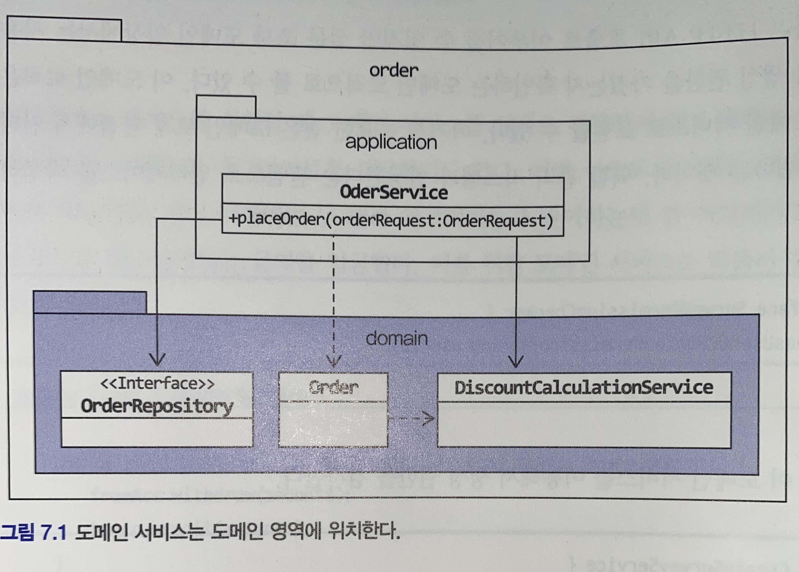

- 도메인 서비스의 개수가 많거나 엔티티나 밸류와 같은 다른 구성요소와 명시적으로 구분하고 싶다면 domain 패키지 밑에 domain.model, domain.service, domain.repository와 같이 하위 패키지를 구분하여 위치시켜도 된다.


#### 7.2.4 도메인 서비스의 인터페이스와  클래스

- 도메인 서비스의 로직이 고정되어 있지 않은 경우 도메인 서비스 자체를 인터페이스로 구현하고 이를 구현한 클래스를 둘 수도 있다. 

  - 특히 도메인 로직을 외부 시스템이나 별도 엔진을 이용해서 구현할 때 인터페이스와 클래스를 분리하게 된다.

  - 예르를 들어 할인 금액 계산 로직을 룰 엔진을 이용해서 구현한다면 그림처럼 도메인 영역에는 도메인 서비스 인터페이스가 위치하고 실제 구현은 인프라스트럭처 영역에 위치한다.

    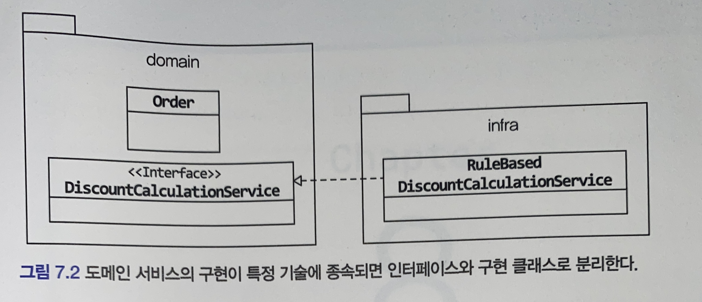

  - 그림과 같이 도메인 서비스의 구현이 특정 구현기술에 의존하거나 외부 시스템의 API를 실행한다면 도메인 영역의 도메인 서비스는 인터페이스로 추상화해야한다. 이를 통해 도메인 영역이 특정 구현에 종속되는 것을 방지할 수 있고 도메인 영역에 대한 테스트가 쉬워진다.


### 8. 애그리거트 트랜잭션 관리

### 8.1 애그리거트와 트랜잭션

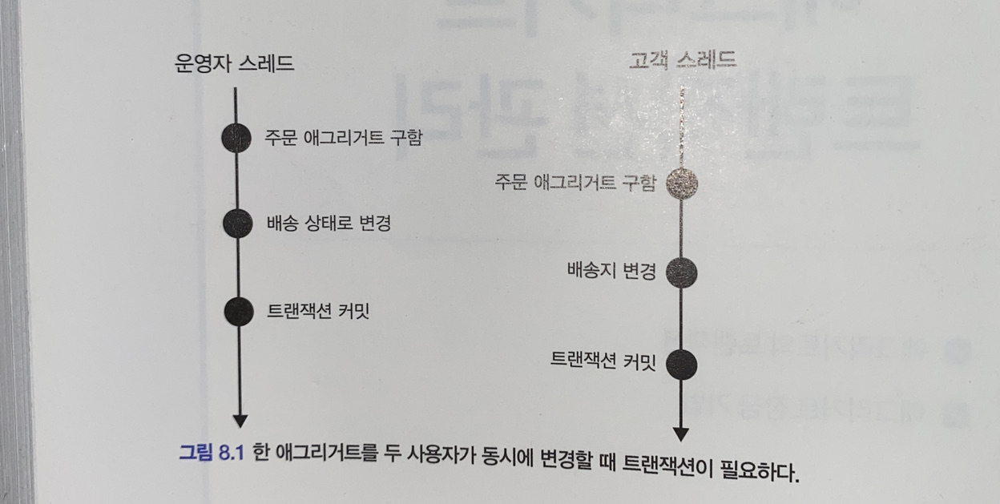

- 위의 그림은 운영자와 고객이 동시에 한 주문 애그리거트를 수정화는 과정을 보여준다. 트랜잭션마다 레포지토리는 새로운 애그리거트 객체를 생성하므로(생각 - 애그리거트가 객체를 받아오는 것이 아닌가?) 운영자 스레드와 고객 스레드는 같은 주문 애그리거트를 나타내는 다른 객체를 구하게 된다. (앞에서에 내용을 이어오면 같은 객체이지 않은가?)
  - 운영자 스레드와 고객 스레드는 개념적으로 동일한 애그리거트지만 물리적으로 서로 다른 애그리거트 객체를 사용한다. 때문에 운영자 스레드가 주문 애그리거트 객체를 배송상태로 변경하더라도 고객 스레드가 사용하는 주문 애그리거트 객체에는 영향을 주지 않는다.
  - 고객 스레드 입장에서 주문 애그리거트 객체는 아직 배송 상태 전 이므로 배송지 정보를 변경할 수 있다. 이 상황 에서 두 스레드는 각각 트랜잭션을 커밋할 때 수정한 내용을 DB에 반영한다. 이 시점에 배송 상태로 바뀌고 배송지 정보도 바뀌게 된다.
  - 허나 위의 순서의 문제점은 운영자는 기존 배송지 정보를 이용해서 배송 상태로 변경했는데, 그 사이 고객은 배송지 정보를 변경했다는 점이다. 즉, 애그리거트의 일관성이 깨지는 것이다. 
  - 일관성이 깨지는 문제가 발생하지 않도록 하려면 다음 두 가지 중 하나를 해야 한다.
    - 운영자가 배송지 정보를 조회하고 상태를 변경하는 동안, 고객이 애그리거트를 수정하지 못하게 막는다.
    - 운영자가 배송지 정보를 조회한 이후에 고객이 정보를 변경하면, 운영자가 애그리거트를 다시 조회한 뒤 수정하도록 한다.
  - 이 두 가지는 애그리거트 자체의 트랜잭션과 관련이 있다. DBMS가 지원하는 트랜잭션과 함께 애그리거트를 위한 추가적인 트랜잭션 처리 기법이 필요하다. 애그리거트에 대해 사용할 수 있는 트랜잭션 처리 방식에는 `선점 잠금(비관적 락) Pessimistic Lock`과 `비선점 잠금(낙관적 락) Optimistic Lock`인 두가지 방식이 있다.

### 8.2 선점 잠금 (비관적 락) - Perssimistic Lock

- 비관적 락은 먼저 애그리거트를 구한 스레드가 애그리거트 사용이 끝날 때 까지 다른 스레드가 해당 애그리거트를 수정하지 못하게 막는 방식이다.


- 위 그림에서 스레드1이 선점 잠금 방식으로 애그리거트틀 구한 뒤, 스레드 2가 같은 애그리거트를 구하려고 할 때, 스레드 2는 스레드1이 애그리거트에 대한 잠금을 해제할 때 까지 블로킹 된다.

- 스레드1이 애그리거를 수정하고 트랜잭션을 커밋하면 잠금을 해제한다. 이 순간 대기하고 있던 스레드2가 애그리거트에 접근하게 된다. <br>스레드1이 트랜잭션을 커밋한 뒤에 스레드2가 애그리거트를 구하게 되므로 스레드2는 스레드1이 수정한 애그리거트의 내용을 보게 된다.

- 한 스레드가 애그리거트를 구하고 수정하는 동안 다른 스레드가 수정할 수 없으므로 동시에 애그리거트를 수정할 때 발생하는 데이터 충돌 문제를 해소할 수 있다. 

  - 8.1에 발생한 문제를 해결하기위해 비관적 락을 적용하면 아래와 같이 동작한다.

    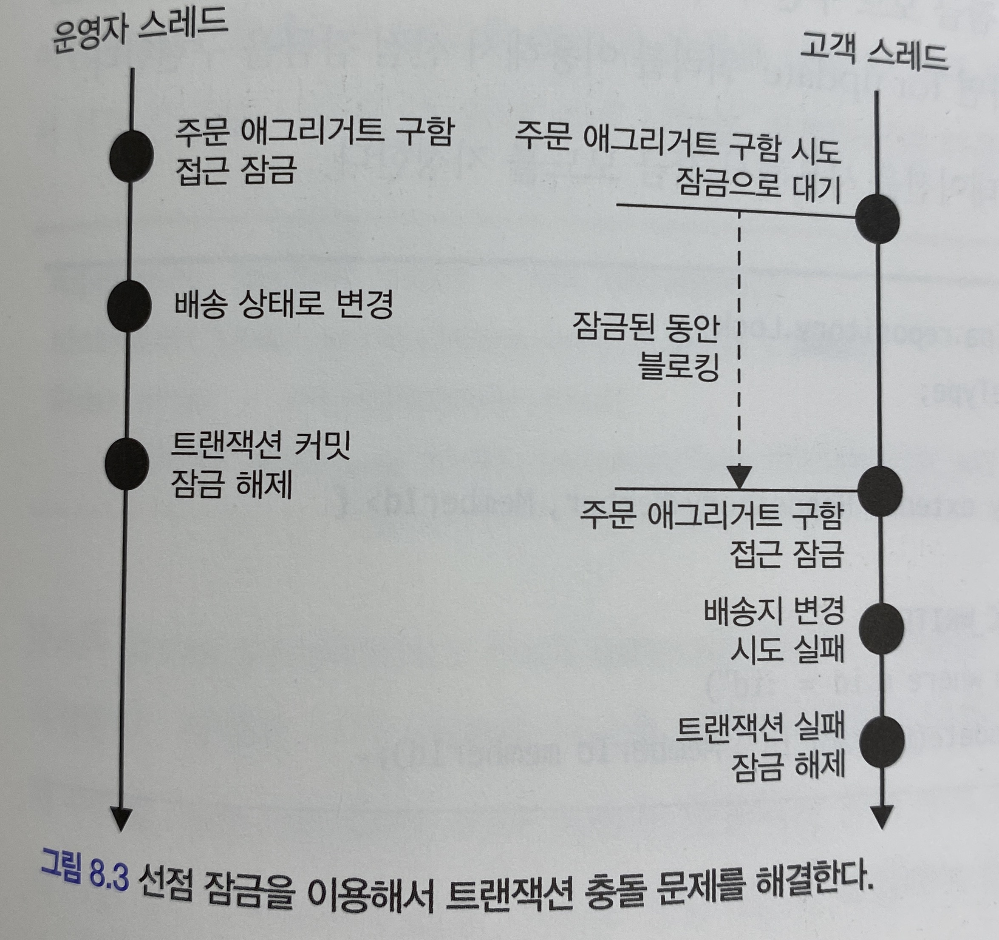

  1. 운영자 스레드가 주문 애그리거트를 구하면서 잠금 진행
  2. 고객 스레드가 같은 주문 애그리거트에 접근 시도, 허나 잠금으로 대기
  3. 운영자 스레드가 배송상태 변경, 트랜재션 커밋 및 잠금 해제
  4. 트랜잭션 잠금 해제와 동시에 고객 스레드 주문 애그리거트 구함 및 잠금 진행
  5. 이미 배송 상태로 변경된 애그리거트이므로, 배송지 변경실패로 인한 트랜잭션 실패
  6. 잠금 해제

- 선점 잠금은 보통 DBMS가 제공하는 행단위 잠금을 사용해서 구현한다. 오라클을 비롯한 다수의 DBMS가 for update와 같은 쿼리를 사용해서 특정 레코드에 한 커넥션만 접근할 수 있는 잠금장치를 제공한다.

- JPA EntityManager는 LockModType을 인자로 받는 find() 메서드를 제공한다. `LockModeType.PESSIMISTIC_WRITE`를 값으로 전달하면 해당 엔티티와 매핑된 테이블을 이용해서 선점 잠금 방식을 적용할 수 있다.

  ~~~java
  entityManager.find(Order.class, orderId, LockModeType.PESSIMISTIC_WRITE);
  ~~~

- JPA 프로바이더와 DBMS에 따라 잠금 모드 구현이 다르다. 하이버네이트의 경우 PESSIMISTC_WRITE를 잠금 모드로 사용하면 'for update'쿼리를 이용해서 선점 잠금을 구현한다.

- 스프링 데이터 JPA는 @Lock 애노테이션을 사용해서 잠금 모드를 지정한다.

  ~~~java
  @Lock(LockModeType.PESSIMISTIC_WRITE)
  Optional<Order> findById(Long id);
  ~~~


#### 8.2.1 선점 잠금과 교착 상태

- 선점 잠금 기능을 사용할 때 잠금 순서에 따른 교착 상태(deadlock)가 발생하지 않도록 주의해야 한다. 

  - 예를 들어, 다음과 같은 순서로 두 스레드가 잠금 시도를 한다고 할 때

    	1. 스레드1: A 애그리거트에 대한 선점 잠금 구함
    	1. 스레드2: B 애그리거트에 대한 선점 잠금 구함
    	1. 스레드1: B 애그리거트에 대한 선점 잠금 시도 
    	1. 스레드2: A 애그리거트에 대한 선점 잠금 시도

  - 이 순서에 따르면 스레드1은 영원히 B 애그리거트에 대한 잠금을 구할 수 없다. 왜냐하면 스레드2가 B 애그리거트에 대한 잠금을 이미 선점하고 있기 때문이다. <br>동일한 이유로 스레드 2는 A 애그리거트에 대한 잠금을 구할 수 없다. 

    - 두 스레드는 상대방 스레드가 먼저 선점한 잠금을 구할 수 없어 더 이상 다음 단계를 진행하지 못하게 된다. 즉, 스레드1과 스레드2는 교착상태에 빠진다. 
    - 선점 잠금에 따른 교착 상태는 상대적으로 사용자 수가 많을 때 발생할 가능성이 높고, 사용자 수가 많아지면 교착 상태에 빠지는 스레드는 더 빠르게 증가한다. 더 많은 스레드가 교착상태에 빠질수록 시스템은 아무것도 할 수 없는 상태가 된다.

  - 이런 문제가 발생하지 않도록 하려면 잠금을 구할 때 최대 대기 시간을 지정해야 한다. JPA에서 선점 잠금을 시도할 때 최대 대기 시간을 지정하려면 힌트를 사용한다.

    ~~~java
    Map<Stirng, Object> hints = new HashMap();
    hints.put("javax.persistence.lock.timeout", 2000);
    entityManger.find(Order.class, orderId, LockModeType.PESSIMISTC_WRITE, hints);
    ~~~

  - JPA의 "javax.persistence.lock.timeout" 힌트는 잠금을 구하는 대기 시간을 밀리초 단위로 지정한다. 지정한 시간이내에 잠금을 구하지 못하면 익셉션을 발생시킨다.

    - 힌트를 사용할 때 주의할 점은 DBMS에 따라 힌트가 적용되지 않을 수도 있다. 힌트를 이용할 때에는 사용중인 DBMS가 관련 기능을 지원하는지 확인해야 한다.

  - 스프링 데이터 JPA는 @QueryHints 애너테이션을 사용해서 쿼리 힌트를 지정할 수 있다.

    ~~~java
    @Lock(LockModeType.PESSIMISTIC_WRITE)
    @QueryHints({
      @QueryHint(name = "javax.persistence.lock.timeout", value = "2000")
    })
    Optional<Order> findByIdForUpdate(Long id);
    ~~~

  > DBMS에 따라 교착 상태에 빠진 커넥션을 처리하는 방식이 다르다. 쿼리별로 대기 시간을 지정할 수 있는 DBMS가 있고 커넥션 단위로만 대기 시간을 지정할 수 있는 DBMS도 있다. 따라서 선점 잠금을 사용하려면 사용하는 DBMS에 대해 JPA가 어떤 식으로 대기 시간을 처리하는지 반드시 확인해야 한다.


### 8.3 비선점 잠금(낙관적 락) - Optimistick Lock

- 선점 잠금이 강력해 보이긴 하지만 선점 잠금으로 모든 트랜잭션 충돌 문제가 해결되는 것은 아니다.


	1. 운영자는 배송을 위해 주문 정보를 조회한다. 시스템은 정보를 제공한다. (여기서 잠금을 하지만 이미 정보를 제공받을 때 커밋이 되면서 잠금이 해제 됨)
	1. 고객이 배송지 변경을 위해 변경 폼을 요청한다. 시스템은 변경 폼을 제공한다. 
	1. 고객이 새로운 배송지를 입력하고 폼을 전송하여 배송지를 변경한다. (1번에서 이미 잠금이 해제되었기 때문에 3번에서 수정이 가능하게 됨)
	1. 운영자가 1번에서 조회한 주문 정보를 기준으로 배송지를 정하고 배송 상태 변경을 요청한다. 

- 여기에서 문제는 운영자가 배송지 정보를 조회하고 배송 상태로 변경하는 사이에 고객이 배송지를 변경한다는 것이다.

  - 운영자는 고객이 변경하기 전 배송지 정보를 이용하여 배송 준비를 한 뒤에 배송 상태로 변경하게된다. 즉 배송 상태 변경 전에 배송지를 한번 더 확인하지 않으면 운영자는 다른 배송지로 물건을 발송하게 되고, 고객은 배송지를 변경했음에도 불구하고 엉뚱한 곳으로 물건을 받는 상황이 발생한다.

  - 이 문제는 섬점 잠금 방식으로는 해결할 수 없다. 이 때 필요한 것이 비선점 잠금이다.

- 비선점 잠금은 동시에 접근하는 것을 막는 대신 변경한 데이터를 실제 DBMS에 반영하는 시점에 변경 가능 여부를 확인하는 방식이다.

- 비선점 잠금을 구현하라면 애그리거트에 버전으로 사용할 숫자 타입 프로퍼티를 추가해야 한다. 

  - 애그리거트를 수정할 때 마다 버전으로 사용할 프로퍼티 값이 1씩 증가하는데, 이 때 다음과 같은 쿼리를 사용한다.

    ~~~sql
    update aggtable set version + 1, colx = ?, coly = ?
    where aggid = ? and version = 현재버전
    ~~~

  - 이 쿼리는 수정할 애그리거트와 매핑되는 테이블의 버전 값이 현재 애그리거트의 버전과 동일한 경우에만 데이터를 수정한다. 그리고 수정에 성공하면 버전값을 1 증가 시킨다. 다른 트랜잭션이 먼저 데이터를 수정해서 버전 값이 바뀌면 데이터 수정에 실패하게 된다.

    

    

- JPA는 버전을 이용한 비선점 잠금 기능을 지원한다. 다음과 같이 버전으로 사용할 필드에 @Version 애너테이션을 붙이고 매핑되는 테이블에 버전을 저장할 칼럼을 추가하면 된다.

  ~~~java
  @Entity
  ...
  public class Order {
  	@Id
  	Long id;
  	
  	@Version
    private Integer version;
  }
  ~~~

- JPA는 엔티티가 변경되어 UPDATE 쿼리를 실행할 때, @Version에 명시한 필드를 이용해서 비선점 잠금 쿼리를 실행한다. 즉, 애그리거트 객체의 버전이 10이면 UPDATE 쿼리를 실행할 때 다음과 같은 쿼리를 사용해서 버전이 일치하는 경우에만 데이터를 수정한다.

  ~~~java
  UPDATE purchase_order SET .. 생략, version = version + 1
  WHERE id = ? and version = 10
  ~~~

- 응용 서비스는 버전에 대해 알 필요가 없다. 레포지토리에서 필요한 애그리거트를 구하고 알맞은 기능만 실행하면 된다. 기능 실행 과정에서 애그리거트 데이터가 변경되면 JPA는 트랜잭션 종료 시점에 비선점 잠금을 위한 쿼리를 실행한다.
- 비선점 잠금을 위한 쿼리를 실행할 때 쿼리 실행 결과로 수정된 행의 개수가 0이면 이미 누군가가 앞서 데이터를 수정한 것이다. 이는 트랜잭션이 충돌한 것이므로 트랜잭션 종료 시점에 익셉션이 발생한다.
- 표현 영역의 코드는 이 익셉션이 발생했는지에 따라 트랜잭션 충돌이 일어났는지 확인할 수 있다

- 그림 8.4가 비선점 잠금을 통해 해결되는 과정 (version은 1로 가정한다.)
  1. 운영자가 주문 정보를 조회한다. (version = 1)
  2. 주문자가 주문 정보를 조회한다. (version = 1)
  3. 주문자가 주문 배송지 정보를 수정한다. (version = 1)
     1. 주문 배송지 정보 수정 쿼리를 실행한다. 이 때 주문자가 가지고 있는 애그리거트의 version과 DB에 저장되어 있는 애그리거트의 verison을 비교한다. 둘다 1로 동일하다.
     2. 주문 배송지 정보가 수정이 되면서, version이 1증가해 2가 된다. (version = 2)
  4. 운영자가 주문상태를 수정한다. (version = 1, db version = 2)
     1. 주문 상태 정보 수정 쿼리를 실행한다. 이 때 운영자가 가지고 있는 애그리거트의 version과 DB에 저장되어 있는 애그리거트의 version을 비교한다. 운영자 version은 1이고 DB version은 2이다.
     2. 버전의 정보가 다르다. 주문 상태 정보 수정 쿼리는 실패하고 `OptimistickLockingFaulureException이` 발생한다.
- 위와 같은 방법을 통해 주문 자가 배송으로 상태르 변경할 때, 이상한 주소로 주문 배송을 막을 수 있다.


- 응용 서비스에 전달할 요청 데이터는 사용자가 전송한 버전값을 포함한다. 예를 들어 배송상태 변경을 처리하는 응용 서비스가 전달받는 데이터는 다음과 같이 주문번호와 함께 해당 주문을 조회한 시점의 버전 값을 포함해야 한다.

  ~~~java
  public class StartShippingRequest {
  	private String orderNumber;
  	private Long version;
  }
  ~~~

- 응용 서비스는 전달받은 버전값을 이용해서 애그리거트 버전과 일치하는지 확인하고, 일치하는 경우에만 기능을 수행한다.

  ~~~java
  public class StartShippingService {
  	//@PreAuthorize("hasRole('ADMIN')") 책에서는 서비스단에서 권한검사를 하는데 이게 맞는건가?
    @Transactional
    public void startShipping(StartShippingCommand command) {
      Order order = orderRepository.findById(command.getId()).orElseThrow(NoOrderException::new);
      if (!order.matchVersion(command.getVersion())) {
        throw new VersionConflictException();
      }
  
      order.changeShipped();
    }
  }
  ~~~

- Order#matchVersion(long version) 메서드는 현재 애그리거트의 버전과 인자로 전달받은 버전이 일치하면 true를 리턴하고 그렇지 않으면 false를 리턴하도록 구현한다.
- matchVerison()의 결과가 true가 아니면 버전이 일치하지 않는 것이므로 사용자가 이전 버전의 애그리거트 정보를 바탕으로 상태 변경을 요청한 것이다. 따라서 응용 서비스는 버전이 충돌했다는 익셉션을 발생시켜 표현 계층에 이를 알린다.
- 표현 계층은 버전 충돌 익셉션이 발생하면 버전 충돌을 사용자에게 알려 사용자가 알맞은 후속 처리를 할 수 있도록 한다.
- 이 코드는 비선점 잠금과 관련해서 발생하는 두 개의 익셉션을 처리하고 있다. 하나는 스프링 프레임워크가 발생시키는 `OptimisticLockingFailureException`이고 다른 하나는 응용 서비스에서 발생시키는 `VersionConflicException` 이다. 이 두 익셉션은 개발자 입장에서는 트랜잭션 충돌이 발생한 시점을 명확하게 구분해 준다. 
  - `VersionConflictException`은 이미 누군가가 애그리거트를 수정했다는 것을 의미한다.
  - `OptimisticLockingFailureException`은 누군가가 거의 동시에 애그리거트를 수정했다는 것을 의미한다.
- 버전 충돌 상황에 대한 구분이 명시적으로 필요 없다면 응용 서비스에서 프레임워크용 익셉션을 발생시키는 것도 고려할 수 있다.
  - `VersionConflictException` 이렇게 따로 생성한 Exception이 아닌 `OptimisticLockingFailureException`을 발생시키는 것을 의미한다.


#### 8.3.1 강제 버전 증가

- 애그리거트에 애그리거트 루트 외에 다른 엔티티가 존재하는데 기능 실행 도중 루트가 아닌 다른 엔티티의 값만 변경된다고 하자. 이 경우 JPA는 루트 엔티티의 버전 값을 증가시키지 않는다. 

  - 연관된 엔티티의 값이 변경된다고 해도 루트 엔티티 자체의 값은 바뀌는 것이 없으므로 루트 엔티티의 버전 값은 갱신하지 않는 것이다.
  - 그런데 이런 JPA 특징은 애그리거트 관점에서 보면 문제가 된다. 비록 루트 엔티티의 값이 바뀌지 않았더라도 애그리거트의 구성요소 중 일부 값이 바뀌면 논리적으로 그 애그리거트는 바뀐 것이다.
  - 따라서 애그리거트 내에 어떤 구성요소의 상태가 바뀌면 루트 애그리거트의 버전값이 증가해야 비선점 잠금이 올바르게 동작한다.

- JPA는 이런 문제를 처리할 수 있도록 EntityManager.find() 메서드로 엔티티를 구할 때 강제로 버전 값을 증가시키는 잠금 모드를 지원한다. 다음 예는 비선점 강제 버전 증가 잠금 모드를 사용해서 엔티티를 구하는 코드이다.

  ~~~java
  @Repository
  public class JpaOrderRepository implements OrderREpository {
  	@PersistenceContext
  	private EntityManger entityManger;
  	
  	@Override
  	public Order findByIdOptimisticLockMode(OrderNo id) {
  		return entityManger.find(
  		Order.class, id, LockModeType.OPTIMISTIC_FORCE_INCREMENT);
  	}
  }
  ~~~

- `LockModeType.OPTIMISTIC_FOCE_INCREMENT`를 사용하면 해당 엔티티의 상태가 변경되었는지에 상관 없이 트랜잭션 종료 시점에 버전 값 증가 처리를 한다. 이 잠금 모드를 사용하면 애그리거트 루트 엔티티가 아닌 다른 엔티티나 밸류가 변경되더라도 버전 값을 증가 시킬 수 있으므로 비선점 잠금 기능을 안전하게 적용할 수 있다.

  > 여기서 궁금한점? - 만약 변경이 없는데도, 해당 메서드로만 읽어오게 되면 그것은 문제가 아닌가? 뭐, 일반 조회를할 때, 기본 find() 함수를 호출하면 되지만, 잘못 코드를 작성하여서 해당 메소드를 쓰게 되면 어떻게 될것인가?

- 스프링 데이터 JPA를 사용하면 @Lock 에너테이션을 사용해서 지정하면 된다.


### 8.4 오프라인 선점 잠금 - Offline Pessmistic Lock

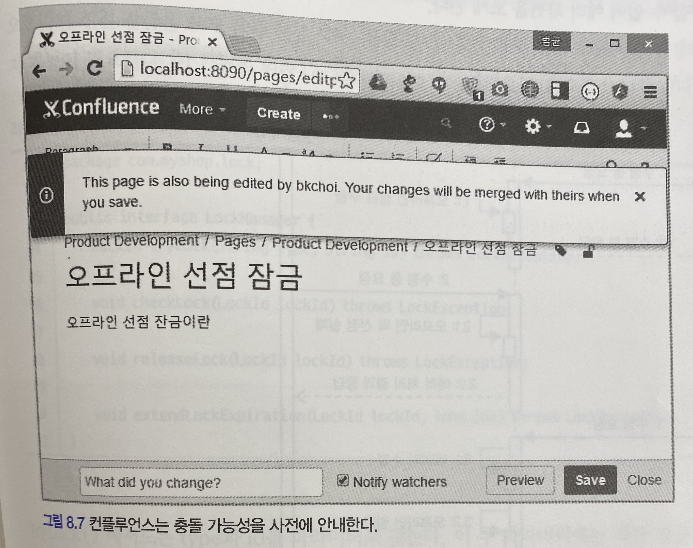

- 컨플루언스는 사전에 충돌 여부를 알려주지만 동시에 수정하는 것을 막지는 않는다. 더 엄격하게 데이터 충돌을 막고 싶다면 누군가 수정화면을 보고 있을 때 수정 화면 자체를 실행하지 못하도록 해야 한다.
- 한 트랜잭션 범위에서만 적용되는 선점 잠금 방식이나, 나중에 버전 충돌을 확인하는 비선점 잠금 방식으로는 이를 구현할 수 없다. 이 때 필요한 것이 오프라인 선점 잠금 방식이다.

- 단일 트랜잭션에서 동시 변경을 막는 선점 잠금 방식과 달리 오프라인 선점 잠금은 여러 트랜잭션에 걸쳐 동시 변경을 막는다. 첫 번째 트랜잭션을 시작할 때 오프라인 잠금을 선점하고, 마지막 트랜잭션에서 잠금을 해체한다. 잠금을 해체하기 전까지 다른 사용자는 잠금을 구할 수 없다.

  - 예를 들어 수정 기능을 진행할 때, 보통 수정 기능은 두개의 트랜잭션으로 구성된다. 

  - 첫 번째 트랜잭션은 폼을 보여주고, 두번째 트랜잭션은 데이터를 수정한다. 

  - 오프라인 선점 잠금을 사용하면 아래의 그림과 같이 

    - 과정 1처럼 폼 요청 과정에서 잠금을 선점하고 
    - 과정 3처럼 수정 과정에서 잠금을 해제 한다. 
    - 이미 잠금을 선점한 상태에서 다른 사용자가 폼을 요청하면 과정 2처럼 잠금을 구할 수 없어 에러 화면을 보게 된다.

    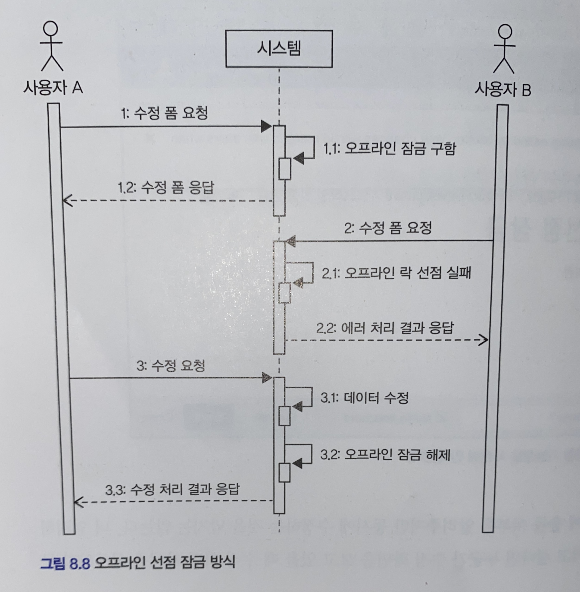

  - 그림에서 사용자 A가 과정 3의 수정 요청을 수행하지 않고 프로그램을 종료하면 어떻게 될까? 

    - 이 경우 잠금을 해제하지 않으므로 다른 사용자는 영원히 잠금을 구할 수 없는 상황이 발생한다. 
    - 이런 사태를 방지하기 위해 오프라이 선점 방식은 잠금 유효 시간을 가져야 한다. 유효 시간이 지나면 자동으로 잠금을 해제해서 다른 사용자가 잠금을 일정 시간 후에 다시 구할 수 있도록 해야한다.

  - 사용자 A가 잠금 유효 시간이 지난 후 1초 뒤에 3번 과정을 수행했다고 가정하자. 잠금이 해제 되어 사용자 A는 수정에 실패하게 된다. 이런 상황을 만들지 않으려면 일정 주기로 유효시간을 증가시키는 방식이 필요하다. 예를 들어 수정 폼에서 1분 단위로 Ajax 호출을 해서 잠금 유효 시간을 1분씩 증가시키는 방법이 있다.


#### 8.4.1 오프라인 선전 잠금을 위한 LockManager 인터페이스와 관련 클래스

- 오프라인 선점 잠금은 크게 잠금 선점 시도, 잠금 확인, 잠금 해제, 잠금 유효시간 연장의 네 가지 기능이 필요하다.

  - LockManager 인터페이스 

  ~~~java
  package com.example.ddd_start.common.domain;
  
  import java.util.concurrent.locks.Lock;
  
  public interface LockManager {
  
    String tryLock(String type, String id) throws LockException;
  
    void checkLock(String lockId) throws LockException;
  
    void releaseLock(String lockId) throws LockException;
  
    void extendLockExpiration(String lockId, Long inc) throws Lock;
  
  }
  ~~~

  - tryLock(): type과 id를 파라미터로 갖으며, type은 잠글 대상 타입, id는 식별자를 의미한다.
    - 예를 들어 실별자가 10인 Article에 대해 잠금을 구하고 싶다면 tryLock()을 실행할 때 'domain.Article'을 type 값으로 주고 '10'을 id 값으로 주면된다.
    - 리턴으로는 잠금을 식별할 때 사용한 LockId를 리턴한다. 잠금을 구하면 잠금을 해제하거나, 잠금이 유효한지 검사하거나 잠금 유효시간을 연장할 때 LockId를 사용한다.

  - LockId 클래스

  ~~~java
  package com.example.ddd_start.common.domain;
  
  import lombok.Getter;
  import lombok.RequiredArgsConstructor;
  
  @Getter
  @RequiredArgsConstructor
  public class LockId {
  
    private final String value;
  
  }
  ~~~

  - 오프라인 선점 잠금이 필요한 코드는 LockManager#tryLock()을 이용해서 잠금을 시도한다. 
  - 잠금에 성공하면 tryLock()은 LockId를 리턴한다. 이 LockId는 다음에 잠금을 해제할 때 사용한다. LockId가 없으면 잠금을 해제할 수 없으므로 LockId를 어딘가에 보관해야 한다.

- 컨트롤러가 오프라인 선점 잠금 기능을 이용해서 데이터 수정 폼에 동시에 접근하는 것을 제어하는 코드의 예이다.

  ~~~java
  // 서비스: 서비스는 잠금 ID를 리턴한다.
  public DataAndLockId getDataWithLock(Long id){
  	//1. 오프라인 선점 잠금 시도
  	LockId lockId = lockManager.tryLock("data", id);
  	//2. 기능 실행
  	Data data = someDao.select(id);
  	return new DataAndLockId(data, lockId);
  }
  
  //컨트롤러: 서비스가 리턴한 잠금ID를 모델로 뷰에 전달한다.
  @RequestMapping("/some/edit/{id}")
  public String editForm(@PathVariable("id") Long id, ModelMap model) {
  	DataAndLockId dl = dataService.getDataWithLock(id);
  	model.addAttribute("data", dl.getData());
  	//3. 잠금 해제에 사용할 LockId를 모델에 추가
  	model.addAttribute("lockId", dl.getLockId());
  	return "editForm";
  }
  ~~~
  
  	- 잠금을 선점하는데 실패하면 LockException이 발생한다. 이때는 다른 사용자가 데이터를 수정 중이니 나중에 다시 시도하라는 안내화면을 보여주면 된다.

 - 잠금을 해제하는 코드는 다음과 같이 전달받은 LockId를 이용한다.

   ~~~java
   //서비스: 잠금을 해제한다.
   public void edit(EditRequest editReq, LockId lockId){
   	//1. 잠금 선점 확인
   	lockManager.checkLock(lockId);
   	
   	//2. 기능 실행
   	....
   	
   	
   	//3. 잠금 해제
   	lockManager.releaseLock(lockId);
   }
   
   //컨트롤러: 서비스를 호출할 때 잠금 ID를함께 전달
   @PostMapping(value ="/some/edit/{id}")
   public String edit(@PathVariable("id") Long id, 
   	@ModelAttribute("editReq") EditRequest editReq,
   	@RequestParam("lid") String lockIdValue) {
     
     	editReq.setId(id);
       someEditService.edit(editReq, new LockId(lockIdValue));
   		return "editSuccess";
   }
   ~~~

- 서비스 코드에서 LockManager#checkLock() 메서드를 가장 먼저 실행하는데, 잠금을 선점한 이후에 실행하는 기능은 다음과 같은 상황을 고려하여 반드시 주어진 LockId를 갖는 잠금이 유효한지 확인해야 한다.
  - 잠금 유효 시간이 지났으면 이미 다른 사용자가 잠금을 선점한다.
  - 잠금을 선점하지 않은 사용자가 기능을 실행했다면 기능 실행을 막아야한다.


#### 8.4.2 DB를 이용한 LockManager 구현

- 잠금 정보를 저장할 테이블과 인덱스를 생성한다.

  ~~~sql
  create table locks (
      type varchar(255),
      id varchar(255),
      lock_id varchar(255),
      expiration_time datetime,
      primary key (type, id)
  ) character set utf8;
  
  create unique index locks_idx on locks(lock_id);
  ~~~

- Order 타입의 1번 식별자를 갖는 애그리거트에 대한 잠금을 구하고 싶다면 다음의 insert 쿼리를 잉요해서 테이블에 데이터를 삽입하면 된다.

  ~~~sql
  insert into locks values ('Order', '1', '생성한 lockid', '2016-03-28 09:10:00');
  ~~~

- type과 id 칼럼을 주인키로 지정해서 동시에 두 사용자가 특정 타입 데이터에 대한 잠금을 구하는 것을 방지했다.

- 각 잠금마다 새로운 LockId를 사용하므로 lockid 필드를 유니크 인덱스로 설정했다. 잠금 유효 시간을 보관하기 위해 expiration_time 칼럼을 사용한다.

  ~~~java
  @Entity
  @Table(name = "locks")
  @Getter
  @AllArgsConstructor
  @NoArgsConstructor
  public class LockData {
  
    @Id
    private LockDataId lockDataId;
    @Embedded
    @AttributeOverride(name = "value", column = @Column(name = "lockId"))
    private LockId lockId;
    private Instant expiration_time;
    
    public Boolean isExpired() {
      return expiration_time.isBefore(Instant.now());
    }
  }
  ~~~

- 스프링 JdbcTemplate을 이용한 SpringLockManger의 tryLock() 구현 코드 -> (이것은 서비스에 위치해야 하는가? 아니면 인프라에 위치해야 하는것인가? 트랜잭션을 관리하는 것은 서비스의 역할인데 그것이 궁금하다.)

  ~~~java
  @Component
  public class SpringLockManager implements LockManager {
  
    private static final long LOCK_TIME_OUT = 1;
    private JdbcTemplate jdbcTemplate;
  
    private RowMapper<LockData> lockDataRowMapper = (rs, rowNum) ->
        new LockData(rs.getObject(1, LockDataId.class),
            rs.getObject(2, LockId.class),
            rs.getObject(3, Instant.class));
  
    @Transactional(propagation = Propagation.REQUIRES_NEW)
    @Override
    public LockId tryLock(String type, String id) throws LockException {
      checkAlreadyLocked(type, id);
      LockId lockId = new LockId(UUID.randomUUID().toString());
      locking(type, id, lockId);
      return lockId;
    }
  
    private void checkAlreadyLocked(String type, String id) {
      List<LockData> locks = jdbcTemplate.query(
          "select * from locks where type = ? and id = ?",
          lockDataRowMapper, type, id);
      Optional<LockData> lockData = handleExpiration(locks);
      if (lockData.isPresent()) {
        throw new AlreadyLockException();
      }
    }
  
    private Optional<LockData> handleExpiration(List<LockData> locks) {
      if(locks.isEmpty()) return Optional.empty();
  
      LockData lockData = locks.get(0);
      if (lockData.isExpired()) {
        jdbcTemplate.update(
            "delete  from locks where type =? and id = ?",
            lockData.getLockDataId().getType(), lockData.getLockDataId().getId()
        );
        return Optional.empty();
      } else {
        return Optional.of(lockData);
      }
    }
  
    private void locking(String type, String id, LockId lockId) {
      try {
        int updatedCount = jdbcTemplate.update(
            "insert into locks values (?, ?, ?, ?)",
            type, id, lockId.getValue(), Instant.now().plus(LOCK_TIME_OUT, ChronoUnit.MINUTES));
  
        if (updatedCount == 0) {
          throw new LockingFailException();
        }
      } catch (DuplicateKeyException e) {
        throw new LockingFailException();
      }
    }
  }
  ~~~

- 스프링 JdbcTemplate을 이용한 SpringLockManager의 나머지 구현 코드

  ~~~java
  {
  //...
  	@Transactional(propagation = Propagation.REQUIRES_NEW)
    @Override
    public void checkLock(LockId lockId) throws LockException {
      Optional<LockData> lockData = getLockData(lockId);
      if (!lockData.isPresent()) {
        throw new NoLockException();
      }
    }
  
    private Optional<LockData> getLockData(LockId lockId) {
      List<LockData> lockData = jdbcTemplate.query(
          "select * from locks where lock_id = ?",
          lockDataRowMapper, lockId.getValue());
  
      return handleExpiration(lockData);
    }
  
    @Transactional(propagation = Propagation.REQUIRES_NEW)
    @Override
    public void releaseLock(LockId lockId) throws LockException {
      jdbcTemplate.update(
          "delete from locks where lock_id = ?", lockId.getValue());
    }
  
    @Override
    public void extendLockExpiration(LockId lockId, Long inc) throws LockException {
      Optional<LockData> lockDataOpt = getLockData(lockId);
      LockData lockData = lockDataOpt.orElseThrow(NoLockException::new);
  
      jdbcTemplate.update(
          "update locks set expiration_time = ? where type =? and id = ?",
          lockData.getExpiration_time().plus(inc, ChronoUnit.MINUTES),
          lockData.getLockDataId().getType(), lockData.getLockDataId().getId());
    }
  }
  ~~~


### 9. 도메인 모델과 바운디드 컨텍스트

#### 9.1 도메인 모델과 경계

- 처음 도메인을 만들 때, 도메인을 완벽하게 표현하는 단일 도메인을 만드는 함정에 빠지기 쉽다.

  - 한 도메인으로 하위 도메인을 모두 표현하려고 하면 오히려 모든 하위 도메인에 맞지 않은 모델을 만들게 된다.

  - ex) 상품이라는 모델에 대하여 이름은 같으나 각각 의미하는 바는 다르다.
    - 카탈로그에서의 상품 - 상품 상세정보, 이미지, 가격 등의 상품 정보
    - 배송에서의 상품 - 실제 배송되고 있는 상품
    - 재고에서의 상품 - 창고에서 관리하기 위한 상품

- 논리적으로는 같은 존재처럼 보이지만 하위 도메인에 따라 다른 용어를 사용하는 경우도 있다.

  - ex) 
    - 카탈로그 도메인에서의 상품이, 검색 도메인에서는 문서로 불리기도 한다.
    - 시스템을 사용하는 사람을 회원 도메인에서는 회원이라고 부르지만, 주문 도메인에서는 주문자라고 부르고, 배송 도메인에서는 보내는 사람이라고 부른다.

​			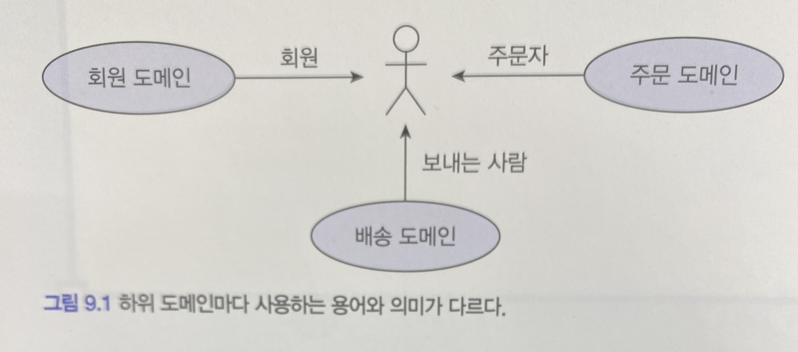

- 하위 도메인마다 같은 용어라도 의미가 다르고 같은 대상이라도 지칭하는 용어가 다를 수 있기 때문에 한 개의 모델로 모든 하위 도메인을 표현하려는 시도는 올바른 방법이 아니다.

  > 질문1. 그렇다면 지칭하는 용어가 다르다면 각각의 용어에 맞게 모델을 만드는 것이 맞을까? 아니면 파라미터 명을 의미에 맞게 짓는게 맞을까? 
  >
  > 질문2. 지칭하는 용어가 같다면, 각각의 도메인 모델을 생성해주는 것이 맞는것인가? 이경우에는 Entity로 가져가야 하는 것인가? 또는 Value로 가져가야 하는 것인가?

- 하위 도메인마다 사용하는 용어가 다르기 때문에 올바른 도메인 모델을 개발하려면 하위 도메인마다 모델을 만들어야 한다. (질문1의 답인 것 같다.)
  - 각 모델은 명시적으로 구분되는 경계를 가져서 섞이지 않도록 해야 한다. 
  - 여러 하위 도메인의 모델이 섞이기 시작하면 모델의 의미가 약해질 뿐만 아니라, 여러 도메인의 모델이 서로 얽히기 때문에 각 하위 도메인별로 다르게 발전하는 요구사항을 모델에 반영하기 어려워진다.
- 모델은 특정한 컨텍스트(문맥) 하에서 완전한 의미를 갖는다. 같은 제품이라도 카탈로그 컨텍스트와 재고 컨텍스트에서 의미가 서로다르다.
- 구분되는 경계를 갖는 컨텍스트를 DDD에서는 **바운디드 컨텍스트**라고 부른다.


#### 9.2 바운디드 컨텍스트

- 바운디드 컨텍스트는 모델의 경계를 결정하며 한개의 바운디드 컨텍스트는 논리적으로 한 개의 모델을 갖는다.

  - 바운디드 컨텍스트는 용어를 기준으로 컨텍스트를 분리할 수 있다. 
  - 바운디드 컨텍스트는 실제로 사용자에게 기능을 제공하는 물리적 시스템으로, 도메인 모델은 이 바운디드 컨텍스트 안에서 도메인을 구현한다.

- 이상적으로느 하위 도메인과 바운디드 컨텍스트가 1대1 관걔를 가지는 것이 좋다. 허나 현실은 그렇지 않다.

  - 바운디드 컨텍스트는 기업의 팀 조직 구조에 따라 결정되기도 한다.

  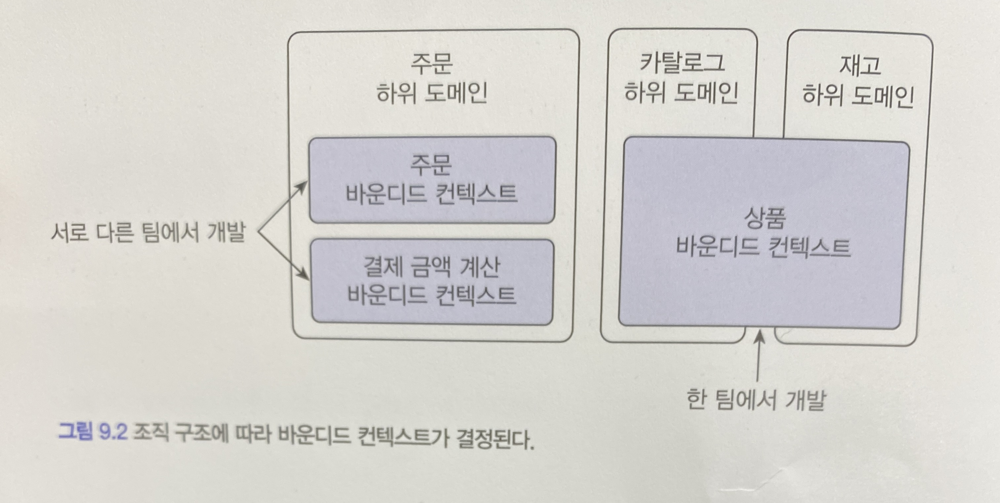

  - 규모가 작은 기업은 하나의 시스템에서 회원, 카탈로그, 재고, 구매, 결제와 관련된 모든 기능을 제공한다. 여러 하위 도메인을 한개의 바운디드 컨텍스트에서 구현한다.

    - 여러 하위 도메인을 하나의 바운디드 컨텍스트에서 개발할 때, 주의할 점은 하위 도메인의 모델이 섞이지 않도록 하는 것이다.

    - 비록 한개의 바운디드 컨텍스트가 여러 하위 도메인을 포함하더라도 하위 도메인 마다 구분되는 패키지를 갖도록 구현해야 하며, 이렇게 함으로써 하위 도메인을 위한 모델이 서로 뒤섞이지 않고 하위 도메인 마다 바운디드 컨텍스트를 갖는 효과를 낼 수 있다.

      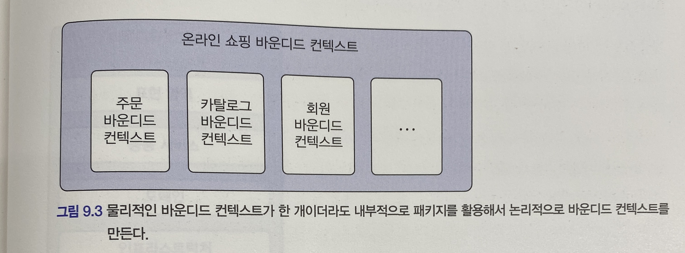

> 질문3. 도메인 모델 이 바운디드 컨텍스트안에 속하는 것인가? 아니면 바운디드 컨텍스트가 도메인 모델안에 속하는 것인가?

- 바운디드 컨텍스트는 도메인 모델을 구분하는 경계가 되기 때문에 바운디드 컨텍스트는 구현하는 하위 도메인에 알맞은 모델을 포함한다.

  - 같은 상품이라도 카탈로그 바운디드 컨텍스트의 상품과 재고 바운디드 컨텍스트의 상품은 각 컨텍스트에 맞는 모델을 갖는다.

  - 회원의 Member는 애그리거트 루트이지만 주문의 Orderer는 밸류가 된다.

  - 카탈로그의 Product는 상품이 속할 Category와 연관을 갖지만 재고의 Product는 카탈로그의 Category와 연관을 맺지 않는다.

    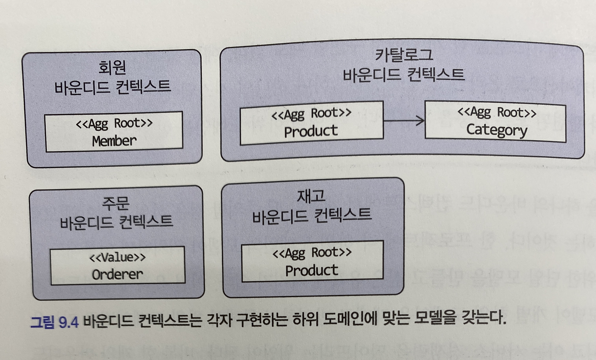

#### 

#### 9.3 바운디드 컨텍스트 구현

- 바운디드 컨텍스트가 도메인 모델만 포함하는 것은 아니다. 바운디드 컨텍스는 도메인 기능을 사용자에게 제공하는 데 필요한 표현 영역, 응용 서비스, 인프라스트럭처 영역을 모두 포함한다. 도메인 모델의 데이터 구조가 바뀌면 DB 테이블 스키마도 함께 변경해야 하므로 테이블도 바운디드 컨텍스트에 포함된다.

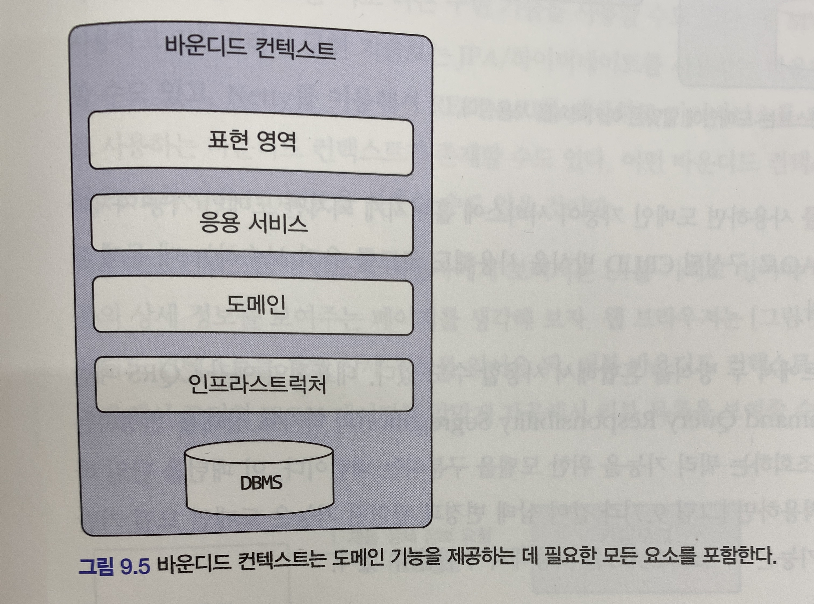

- 모든 바운디드 컨텍스트를 반드시 도메인 주도로 개발할 필요는 없다.
  - 도메인이 단순하다면 DAO와 데이터 중심의 밸류객체를 이용해서 기능을 구현해도 기능을 유지보수하는데 큰 문제는 없다.
  - 서비스-DAO 구조를 사용하면 도메인 기능이 서비스에 흩어지게 되지만 도메인 기능 자체가 단순하면 서비스-DAO로 구성된 CRUD 방식을 사용해도 코드를 유지 보수하는데 문제 되지 않는다고 한다. - 책의 필자

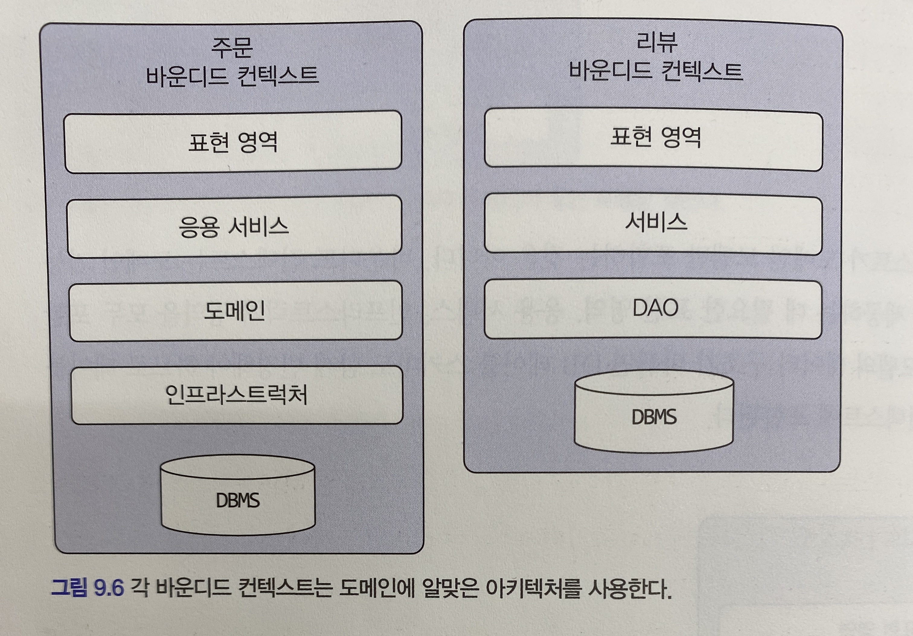

- 한 바운디드 컨텍스트에서 두 방식을 혼합새서 사용할 수도 있다.

  - 대표적인 예가 CQRS 패턴이며, CQRS는 Command Query Responsibility Segregation의 약자로 상태를 변경하는 명령 기능과 내용을 조회하는 쿼리 기능을 위한 모델을 구분하는 패턴이다.

  - 이 패턴을 단일 바운디드 컨텍스트에 적용하면 아래의 그림과 같이 상태 변경과 관련된 기능은 도메인 모델 기반으로 구현하고, 조회 기능은 서비스-DAO를 이용해서 구현할 수 있다.

    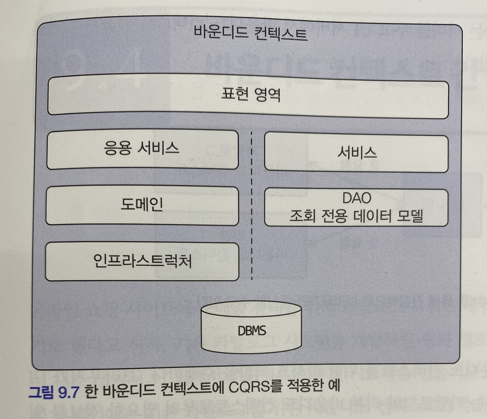

- 각 바운디드 컨텍스트는 서로 다른 구현 기술을 사용할 수도 있다.

  - 웹 MVC는 스프링 MVC를 사용하고 레포지토리 구현 기술로는 JPA/하이버네이트를 사용하는 바운디드 컨텍스트가 존재할 수도 있다. 
  - Netty를 이용해서 RESET API를 제공하고, 마이바티스를 레포지토리 구현 기술로 사요하는 바운디드 컨텍스트가 존재할 수도 있다.
  - 어떤 바운디드 컨텍스트는 RDBMS 대신 몽고DB와 같은 NoSQL을 사용할 수도 있을 것이다.

- 바운디드 컨텍스트가 반드시 사용자에게 보여지는 UI를 가지고 있어야 하는 것은 아니다. 

  - 아래의 그림과 같이 카탈로그 바운디드 컨텍스트를 통해 상세 정보를 읽어온 뒤, 리뷰 바운디드 컨텍스트의 REST API를 직접 호출해서 로딩한 JSON 데이터를 알맞게 가공해서 리뷰 목록을 보여줄 수도 있다.

  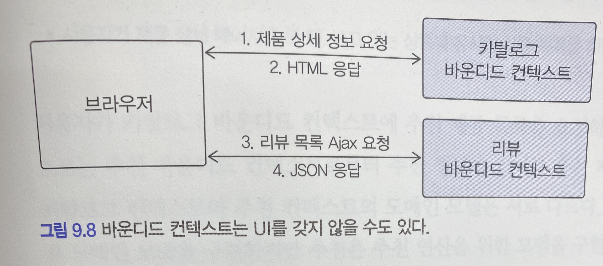

  - 아래의 그림과 같이 UI를 처리하는 서버를 두고, UI 서버에서 바운디드 컨텍스트와 통신해서 사용자 요청을 처리하는 방법도 있다.

    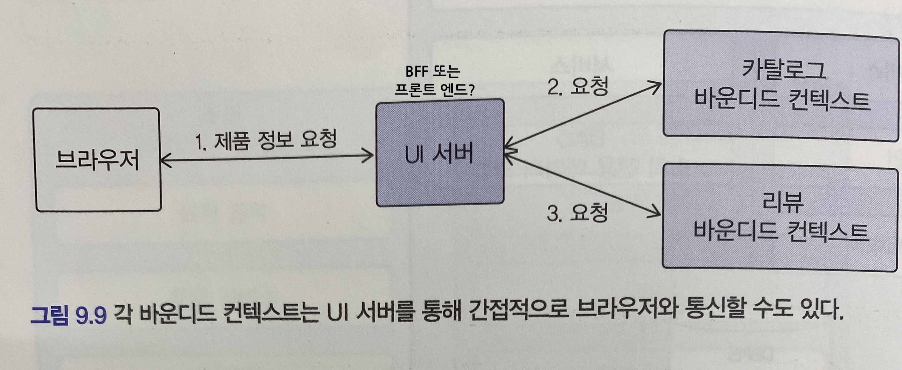

  - 이 구조에서 UI 서버는 각 바운디드 컨텍스트를 위한 파사트 역할을 수행한다. 브라우저가 UI서버에 요청을 하면 UI 서버는 카탈로그와 리뷰 바운디드 컨텍스트로 부터 필요한 정보를 읽어와 조합한 뒤, 브라우제어 응답을 제공한다.


#### 9.4 바운디드 컨텍스트 간 통합

- 온라인 쇼핑 사이트에서 매출 증대를 위해 카탈로그 하위 도메인에 개인화 추천 기능을 도입한다고 하자.

  - 개인화 추천기능은 기존에 카탈로그를 개발한 팀이 아닌 추천 기능을 개발하기 위한 새로운 팀을 꾸려서 진행한다.

  - 이렇게 되면 카탈로그 하위 도메인에는 기존 카탈로그를 위한 바운디드 컨텍스트와 추천 기능을 위한 바운디드 컨텍스트가 생긴다.

    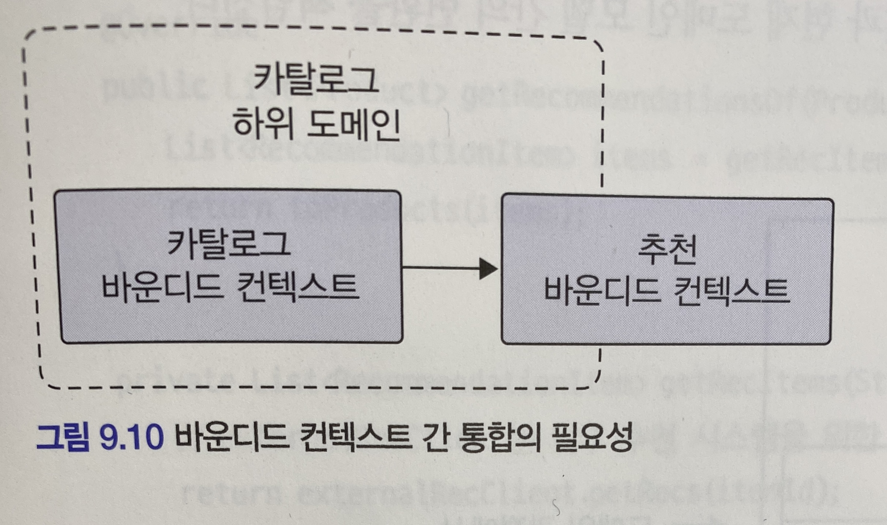

  - 두 팀이 관련된 바운디드 컨텍스트를 개발하면 자연스럽게 두 바운디드 컨텍스트 간 통합이 발생한다. 

    - 통합이 필요한 기능: 사용자가 제품 상세 페이지를 볼 때, 보고 있는 유사한 상품 목록을 하단에 보여준다.

  - 사용자가 카탈로그 바운디드 컨텍스트에 추천 제품 목록을 요청하면, 카탈로그 바운디드 컨텍스트는 추천 바운디드 컨텍스트로부터 추천 정보를 읽어와 추천 제품 목록을 제공한다.

    - 이 때 카탈로그 컨텍스트와 추천 컨텍스트의 도메인 모델은 서로 다르다. 카탈로그는 제품을 중심으로 도메인 모델을 구현하지만, 추천은 추천 연산을 위한 모델을 구현한다.
    - 카탈로그 시스템은 추천 시스템으로부터 추천 데이터를 받아오지만, 카탈로그 시스템에서는 추천의 도메인 모델을 사용하기보다는 카탈로그 도메인 모델을 사용해서 추천 상품을 표현해준다.

    ~~~java
    /**
    * 상품 추천 기능을 표현하는 도메인 서비스
    */
    public interface ProductRecommendationService {
    	List<Prodcut> getRecommendationsOf(ProductId id);
    }
    ~~~

    - 도메인 서비스를 구현한 클래스는 인프라스트럭처 영역에 위치한다. 이 클래스는 외부시스템과의 연동을 처리하고, 외부 시스템의 모델과 현재 도메인 모델간의 변환을 책임진다.
  
      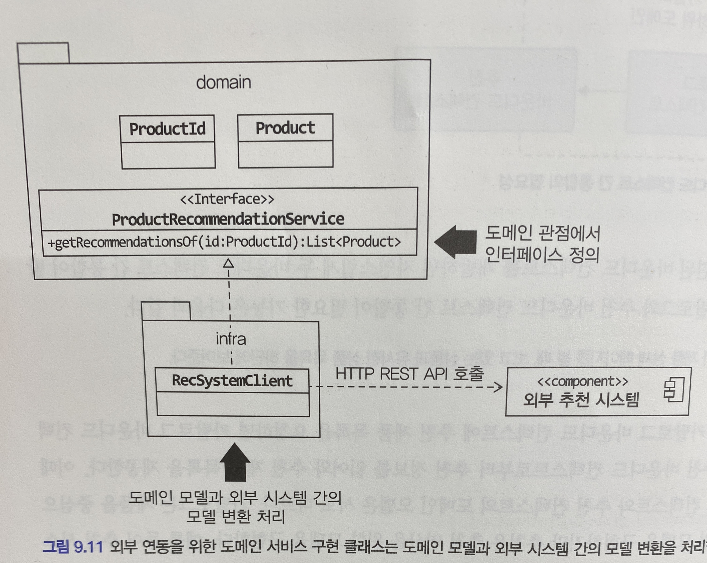
  
    - 위의 그림과 같이 RecSystemClient는 외부 추천 시스템이 제공하는 REST API를 이용해서 특정 상품을 위한 추천 상품 목록을 로딩한다.
  
    - 이 REST API가 제공하는 데이터는 추천 시스템의 모델을 기반으로 하고 있기 때문에 API 응답은 다음과 같이 카탈로그 도메인 모델과 일치하지 않는 데이터를 제공할 것이다.
  
      ~~~json
      [
      	{
      		"itemId": "PROD-1000",
      		"type": "PRODUCT",
      		"rank": 100
      	},
      	{
      		"itemId": "PROD-1001",
      		"type": "PRODUCT",
      		"rank": 54
      	}
      ]
      ~~~
  
    - RecSystemClient는 REST API로부터 데이터를 읽어와 카탈로그 도메인에 맞는 상품 모델로 변환한다.
  
      ~~~java
      public class RecSystemClient implements ProductRecommendationService{
      
        private ProductRepository productRepository;
      
        @Override
        public List<Product> getRecommendationsOf(Long productId) {
          List<RecommendationItem> items = getRecItems(productId);
          return toProducts(items);
        }
      
        private List<RecommendationItem> getRecItems(String itemId) {
          //externalRecClient는 외부 추천 시스템을 위한 클라이언트라고 가정
          return externalRecClient.getRecs(itemId);
        }
      
        private List<Product> toProducts(List<RecommendationItem> items) {
          return items.stream()
              .map(item -> toProductId(item.getItemId))
              .map(prodId -> productRepository.findById(prodId))
              .collect(Collectors.toList());
        }
      
        private Long toProductId(String itemId) {
          return productRepository.findByExternalId(itemId).getId;
        }
      }
      ~~~
  
    - getRecItems를 통해 외부 추천 시스템으로부터 추천 상품 목록을 가져온뒤, toProducts를 통해 추천 상품 id를 가지고, 카테고리 바운디드에서 상품정보를 찾아서 반환해준다.
  
  - 두 모델 간의 변환 과정이 복잡하면 변환 처리를 위한 별도 클래스를 만들고 이 클래스에버 변환을 처리해도 된다.
  
    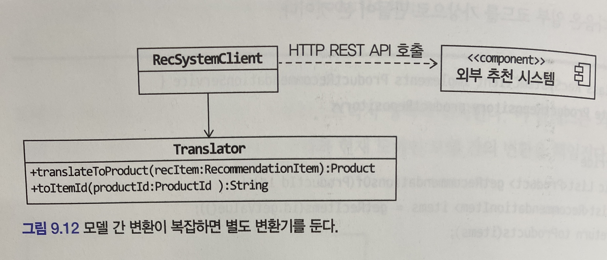
  
  - REST API를 호출하는 것(또는 요새 유행하는 rpc 인지 grpc인지도 해당할 것 같다)은 두 바운디드 컨텍스트를 직접 통합하는 방법이다. 직접 통합하는 대신 간접적으로 통합하는 방법도 있다.
  
  - 대표적인 간접 통합 방식이 메시지 큐를 사용하는 것이다.
  
    - 추천 시스템은 사용자가 조회한 상품 이력이나 구매 이력과 같은 사용자 활동 이력을 필요로 하는데 이 내역을 전달할 때 메시지 큐를 사용할 수 있다.
  
    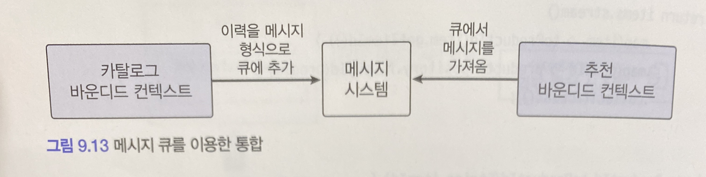
  
  - 위의 그림에서 카탈로그 바운디드 컨텍스트는 추천시스템이 필요로 하는 사용자 활동 이력을 메시지 큐에 추가한다.
  
    - 메시지 큐는 비동기로 처리하기 때문에 카탈로그 바운디드 컨텍스트는 메시지를 큐에 추가한 뒤에, 추천 바운디드 컨텍스트가 메시지를 처리할 때까지 기다리지 않고 바로 이어서 자신의 처리를 계속한다.
  
  - 각각의 바운디드 컨텍스트를 담당하는 팀은 주고 받을 데이터 형식에 대해 협의해야 한다.
  
    - 메시지 시스템을 카탈로그 측에서 관리하고 있다면, 큐에 담기는 메시지는 아래와 같이 카탈로그 도메인을 따르는 데이터를 담을 것이다.
  
    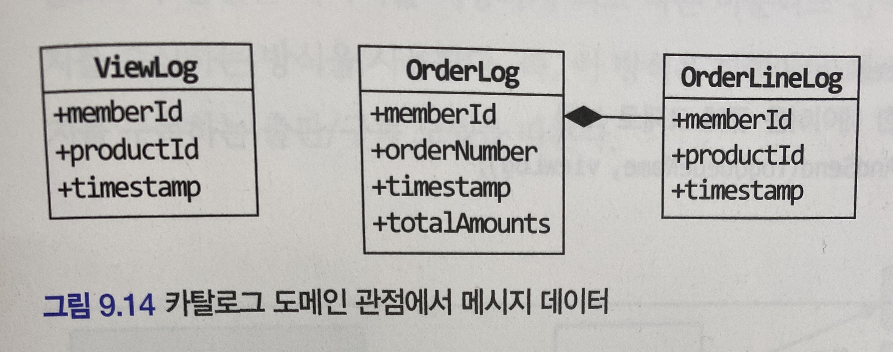
  
    - 추천 바운디드 컨텍스트 관점에서 접근하면 아래와 같이 메시지 데이터 구조를 잡을 수 있다.
  
      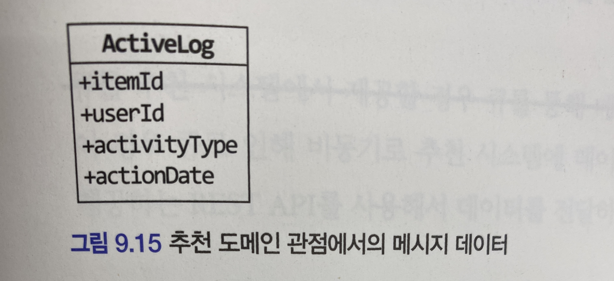
  
  - 어떤 도메인 관점에서 모델을 사용하느냐에 따라 두바운디드 컨텍스트의 구현코드가 달라지게 된다.
  
    - 카탈로그 도메인 관점에서 큐에 저장할 메시지를 생성하면, 카탈로그 기준의 데이터를 그대로 메시지 큐에 저장한다.
  
      ~~~java
      //상품 조회 관련 로그 기록 코드
      public class ViewLogService{
      
          private MessageClient messageClient;
      
          public void appendViewLog(Long memberId, Long productId, Date time) {
            messageClient.send(new ViewLog(memberId, productId, time));
          }
        }
      
        //messageClient
        public class RabbitMqClient implements MessageClient {
      
          private RabbitTemplate rabbitTemplate;
      
          @Override
          public void send(ViewLog viewLog) {
            //카탈로그 기준으로 작성한 데이터를 큐에 그대로 보관
            rabbitTemplate.convertAndSend(logQueuName, viewLog)
          }
        }
      ~~~
  
    - 카탈로그 도메인 모델을 기준으로 메시지를 전송하므로 추천 시스템은 자신의 모델에 맞게 메시지를 변환해서 처리해야 한다.
  
    - 반대로 추천 시스템을 기준으로 카탈로그 쪽에서 메시지 큐에 저장하기로 했다면, 카탈로그 쪽 코드는 다음과 같이 바뀔 것이다.
  
      ~~~java
      //상품 조회 관련 로그 기록 코드
        public class ViewLogService{
      
          private MessageClient messageClient;
      
          public void appendViewLog(Long mebmerId, Long productId, Date time) {
            messageClient.send(new ActivityLog(productId, mebmerId, ActivityType.VIEW, time));
          }
        }
      
        //messageClient
        public class RabbitMQClient implements MessageClient {
      
          private RabbitTemplate rabbitTemplate;
      
          @Override
          public void send(ActivityLog activityLog) {
            rabbitTemplate.convertAndSend(logQueueName, activityLog);
          }
        }
      ~~~
  
  - 두 바운디드 컨텍스트를 개발하는 팀은 메시징 큐에 담을 데이터의 구조를 협의하게 되는데, 그 큐를 누가 제공하느냐에 따라 데이터 구조가 결정된다.
  
    - 예를들어 카탈로그 시스템에서 큐를 제공한다면 큐에 담기는 내용은 카탈로그 도메인을 따른다. 
  
    - 카탈로그 도메인은 메시징 큐에 카탈로그와 관련된 메시지를 저장하게 되고 다른 바운디드 컨텍스트는 이 큐로부터 필요한 메시지를 수신하는 방식을 사용한다.
  
    - 즉 이방식은 한쪽에서 메시지를 출판하고 다른 쪽에서 메시지를 구독하는 출판/구독 모델을 따른다.
  
      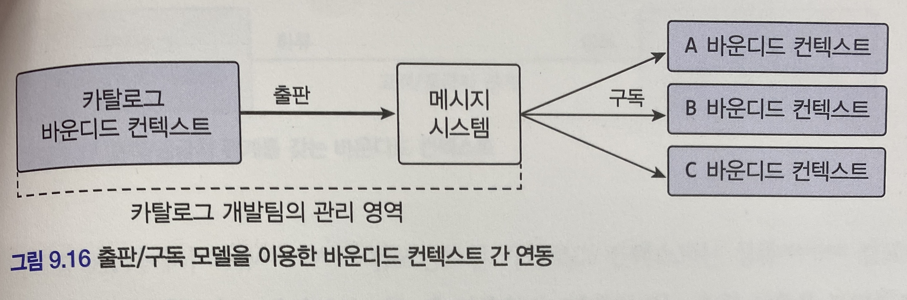
  
     - 큐를 추천 시스템에서 제공할 경우 큐를 통해 메시지를 추천 시스템에 전달하는 방식이 된다.
  
     - 이경우 큐로 인해 비동기로 추천시스템에 데이터를 전달하는 것을 제외하면, 추천 시스템이 제공하는 REST API를 사용해서 데이터를 전달하는 것과 차이가 없다.
  
       > 질문: 도대체 이게 무슨말인가? - 자기가 자신의 메시지를 또 자신한테 보내는 것을 의미하는가?
  
  > 참고: 마이크로서비스와 바운디드컨텍스트
  >
  > 마이크로서비스 아키텍처가 단순 유행을 지나 많은 기업에서 자리를 잡아가고 있다. 넥플릭스나 아마존 같은 선도 기업뿐만아니라, 많은 기업이 마이크로서비스 아키텍처를 수요하는 추세다. 
  >
  > 마이크로서비스는 애플리케이션을 작은 서비스로 나누어 개발하는 아키텍처 스타일이다. 개별 서비스를 독립된 프로세스로 실행하고 각 서비스가 REST API나 메시징을 이용해서 통신하는 구조를 갖는다.
  >
  > 이런 마이크로서비스의 특징은 바운디드 컨텍스트와 잘 어울린다. 각 바운디드 컨텍스트는 모델의 경계를 형성하는데, 바운디드 컨텍스트를 마이크로서비스로 구현하면 자연스럽게 컨텍스트별로 모델이 분리된다.
  >
  > 코드로 생각하면 마이크로서비스마다 프로젝트를 생성하므로 바운디드 컨텍스트마다 프로젝트를 만들게 된다. 이것은 코드 수준에서 모델을 분리하여 두 바운디드 컨텍스트의 모델이 섞이지 않도록 해준다.


#### 9.5 바운디드 컨텍스트 간 관계

- 바운디드 컨텍스트는 어떤 식으로든 연결되기 때문에 두 바운디드 컨텍스트는 다양한 방식으로 관계를 맺는다. 

- 두 바운디드 컨텍스트 간 관계 중 가장 흔한 관계는 한쪽에서 API를 제공하고 다른 한쪽에서 그 API를 호출하는 관계이다. REST API가 가장 대표적이다.

  - 이 관계에서 API를 사용하는 바운디드 컨텍스트는 API를 제공하는 바운디드 컨텍스트에 의존하게 된다.

    

  - 위의 그림에서 하류 컴포넌트인 카탈로그 컨텍스트느 상류 컴포넌트인 추천 컨텍스트가 제공하는 데이터와 기능에 의존한다.
  - 카탈로그는 추천 상품을 보여주기 위해 추천 바운디드 컨텍스트가 제공하는 REST API를 호출한다. 추천 시스템이 제공하는 REST API의 인터페이스가 바뀌면 카탈로그 시스템의 코드도 바뀌게 된다.
    - 상류 컴포넌트: 서비스 공급자
    - 하류 컴포넌트: 서비스를 사용하는 고객
  - 상류팀과 하류팀은 상호 협력이 필수적이므로, 개발 계획을 서로 공유하고 일정을 협의해야 한다.

- 상류 시스템은 REST API를 제공하거나, 프로토콜 버퍼와 같은 것을 이용해서 서비스를 제공할 수도 있다.

- 상류 팀의 고객인 하류 팀이 다수 존재하면 상류 팀은 여러 하류팀의 요구사항을 수용할 수 있는 API를 만들고 이를 서비스 형태로 공개해서 서비스의 일관성을 유지할 수 있다.

  - 이런 서비스를 가리켜 공개 호스트 서비스라고 한다.
  - 가장 대표적인 예가 검색이다.

  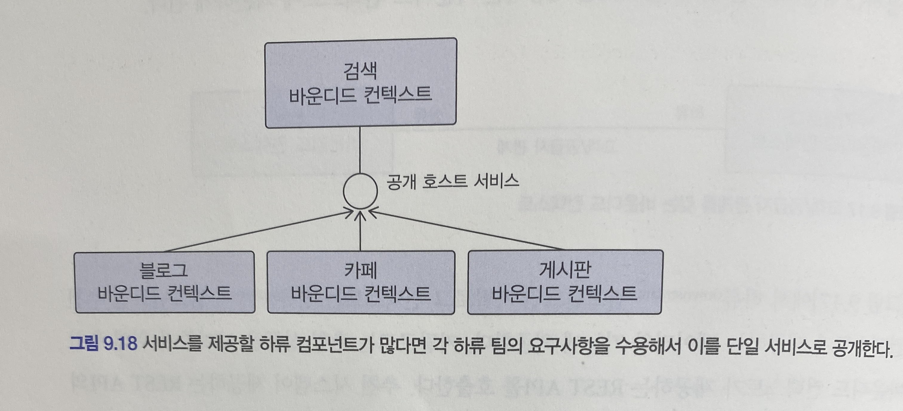

- 상류 컴포넌트의 서비스는 상류 바운디드 컨텍스트의 도메인 모델에 따른다. 따라서 하류 컴포넌트는 상류 서비스의 모델이 자신의 도메인 모델에 영향을 주지 않도록 완충 지대를 만들어야 한다.

  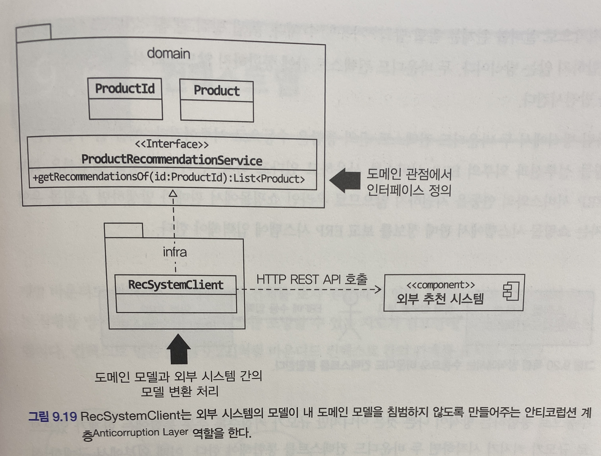

- 위의 그림은 RecSystemClient는 외부 시스템과의 연동을 처리하고, 외부 시스템의 도메인 모델이 내 도메인 모델에 침범하지 않도록 막아주는 역할을 한다.

  - 자신의 도메인 모델이 깨지는 것을 막아주는 안티코럽션 계층이 된다.
  - 이 계층에서 두 바운디드 컨텍스트간의 모델 변환을 처리해주기 때문에, 다른 바운디드 컨텍스트의 모델에 영향을 받지 않고 내 도메인 모델을 유지할 수 있다.

- 두 바운디드 컨텍스트가 같은 모델을 공유하는 경우도 있다.

  - 예를 들면 `운영자를 위한 주문관리 도구를 개발하는 팀`과 `고객을 위한 주문서비스를 개발하는팀`이 다르지만 주문을 표현하는 모델을 공유함으로써 주문과 관련된 중복 설계를 막을 수 있다.

  - 두 팀이 공유하는 모델을 공유 커널이라고 부른다.
    - 공유커널의 장점은 중복을 줄여준다.
    - 공유커널의 단점은 한모델을 공유하기 때문에 한 팀에서 임의로 모델을 변경하면 안되며, 두팀이 밀접한 관계를 유지해야 한다.

- 서로 통합하지 않는 방식은 독릭 방식이다.

  - 두 바운디드 컨텍스트 간에 통합하지 않으므로 서로 독립적으로 모델을 발전시킨다. (귀찮아도 이방식이 제일 괜찮을 것 같다)

  - 독립 방식에서 두 바운디드 컨텍스트 간의 통합은 수동으로 이루어진다. 

    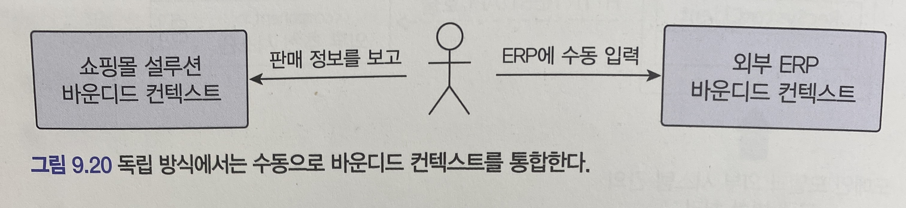

  - 수동으로 통합하는 방식은 나쁘지 않지만 규모가 커지면 한계가 있으므로, 규모가 커지기 시작하면 두 바운디드 컨텍스트를 통합해야 한다.

    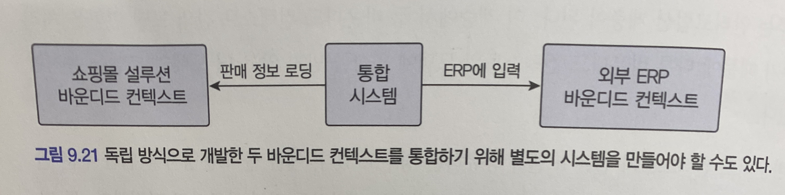


#### 9.6 컨텍스트 맵

- 개별 컨텍스트에만 몰입하는 상황을 방지하기 위해, 전체 비즈니스를 조망할 수 있는 지도가 필요하다. -> 그것이 바로 컨텍스트 맵이다.
  - 컨텍스트 맵은 바운디드 컨텍스트 간의 관계를 표시한 것이다.


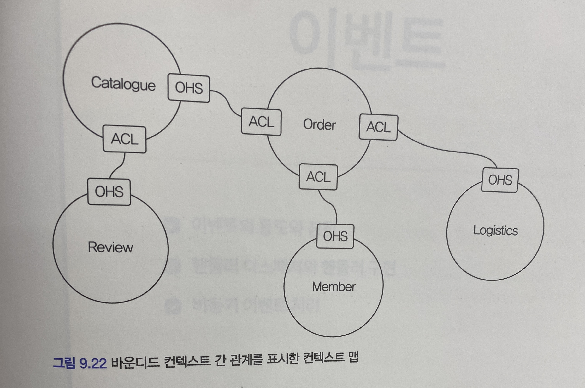

- 바운디드 컨텍스트의 장점
  - 컨텍스트간의 경계가 명확하게 드러난다.
  - 서로 어떤 관계를 맺는지 알 수 있다.
  - 주요 애그리거트를 함께 표시하면 모델에 대한 관계가 더 명확히 드러난다.
- 위의 그림은 오픈 호스트 서비스(OHS)와 안티 코럽션 계층(ACL)만 표시했는데 하위 도메인이나 조직 구조를 함께 표시하면 도메인을 포함한 전체 관계를 이해하는데 도움이 된다.
- 컨텍스트 맵은 시스템의 전체 구조를 보여준다.
  - 하위 도메인과 일치하지 않는 바운디드 컨텍스트를 찾아 도메인에 맞게 바운디드 컨텍스트를 조절하고, 사업의 핵심 도메인을 위해 조직 역량을 어떤 바운디드 컨텍스트에 집중할지 파악하는데 도움을 준다.
